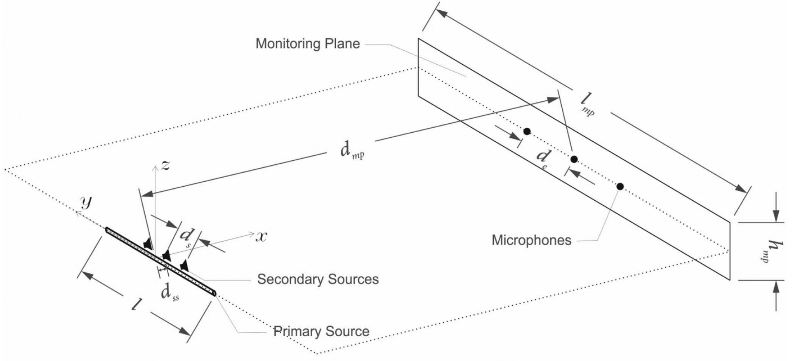

::: {.titlepage}
::: {.center}
[]{.smallcaps}

[Doctoral Thesis]{.smallcaps}\
\

\

::: {.flushleft}
*Author:*\

:::

::: {.flushright}
*Supervisors:*\
:::

\

*A thesis submitted in fulfillment of the requirements\
for the degree of*\
*in the*\
\
\

\
:::
:::

::: {.declaration}
I, , declare that this thesis entitled, "" and the work presented in it
are my own. I confirm that:

-   this work was done wholly or mainly while in candidature for a
    research degree at this University;

-   where any part of this thesis has previously been submitted for a
    degree or any other qualification at this University or any other
    institution, this has been clearly stated;

-   where I have consulted the published work of others, this is always
    clearly attributed;

-   where I have quoted from the work of others, the source is always
    given. With the exception of such quotations, this thesis is
    entirely my own work;

-   I have acknowledged all main sources of help;

-   where the thesis is based on work done by myself jointly with
    others, I have made clear exactly what was done by others and what I
    have contributed myself.\

Signed:\

------------------------------------------------------------------------

Date:\

------------------------------------------------------------------------
:::

::: {.frontmatterpage}
List of Publications [\[chap:publication\]]{#chap:publication
label="chap:publication"} Much of this work has either been published or
submitted for publication as journal papers and conference proceedings.
The list is as follows:

##### In journals

::: {.outline}
**Jiaxin Zhong**, Ray Kirby, and Xiaojun Qiu. . In: *The Journal of the
Acoustical Society of America* 149.3 (2021), pp. 1524--1535. **Jiaxin
Zhong** and Xiaojun Qiu. . In: *Journal of Theoretical and Computational
Acoustics* (2020), p. 2050026. **Jiaxin Zhong**, Shuping Wang, Ray
Kirby, and Xiaojun Qiu. . In: *The Journal of the Acoustical Society of
America* 148.4 (2020), pp. 2327--2336. **Jiaxin Zhong**, Shuping Wang,
Ray Kirby, and Xiaojun Qiu. . In: *The Journal of the Acoustical Society
of America* 148.1 (2020), pp. 226--235. **Jiaxin Zhong**, Ray Kirby, and
Xiaojun Qiu. . In: *The Journal of the Acous- tical Society of America*
147.5 (2020), pp. 3502--3510. **Jiaxin Zhong**, Ray Kirby, and Xiaojun
Qiu. . In: *The Journal of the Acoustical Society of America* 147.3
(2020), pp. 1577--1580. **Jiaxin Zhong**, Ray Kirby, Mahmoud Karimi, and
Haishan Zou. . In: *The Journal of the Acoustical Society of America*
(2021), submitted. **Jiaxin Zhong**, Ray Kirby, Mahmoud Karimi, Haishan
Zou, and Xiaojun Qiu. . In: *The Journal of the Acoustical Society of
America* (2021), submitted. **Jiaxin Zhong**, Tao Zhuang, Ray Kirby,
Mahmoud Karimi, Haishan Zou, and Xiaojun Qiu. . In: *The Journal of the
Acoustical Society of America* (2021), submitted.
:::

##### In conference proceedings

::: {.outline}
**Jiaxin Zhong**, Tong Xiao, Benjamin Halkon, Ray Kirby, and Xiaojun
Qiu. . In: *InterNoise 2020*. Seoul, Korea, 2020.
:::

The following publications are also outcomes during the PhD candidature,
but not included in this thesis:

##### In journals

::: {.outline}
**Jiaxin Zhong**, Baicun Chen, Jianchen Tao, and Xiaojun Qiu. . In: *The
Journal of the Acoustical Society of America* 147.5 (2020), pp.
3397--3407. **Jiaxin Zhong**, Jiancheng Tao, and Xiaojun Qiu. . In: *The
Journal of the Acoustical Society of America* 146.6 (2019), pp.
4075--4085. Shuping Wang, **Jiaxin Zhong**, Xiaojun Qiu, and Ian
Burnett. . In: *Applied Acoustics* 169 (2020), p. 107471.
:::

##### In conference proceedings

::: {.outline}
**Jiaxin Zhong**, Jiancheng Tao, and Xiaojun Qiu. . In: *The 18th
Asia-Pacific Vibration Conference*. Sydney, Australia, 2019. Xiaojun
Qiu, Qiaoxi Zhu, Shuping, and **Jiaxin Zhong**. . In: *Proceedings of
the 23rd International Congress on Acoustics*. Aachen, Germany, 2019.
:::
:::

::: {.acknowledgements}
Throughout the preparing and writing of this thesis, I have received a
great deal of support and assistance.

First of all, I would like to thank my principal supervisor, A/Prof. Ray
Kirby, and my co-supervisor, Dr. Mahmoud Karimi, whose expertise is
invaluable in supervising my research and writting academic articles.
Your insightful feedback and comments pushed me to sharpen my thinking
and brought my work to a high level. I would also like to express my
sincere gratitude to my previous principal supervisor, Prof. Xiaojun
Qiu, for his guidance, encouragement, and support during my PhD
candidature. I am grateful to my teammates at UTS, Dr. Benjamin Halkon,
Dr. Sipei Zhao, Dr. Shuping Wang, Dr. Qiaoxi Zhu, Dr. Somanath Pradhan,
Mr. Tong Xiao, Mr. Mitchell Cullen, for their valuable assistance and
suggestions on my research work. Thanks to all staff members of the
School of Mechanical and Mechatronic Engineering for always being
friendly and helpful. The financial support from the Australian Research
Council through the Linkage Project (LP160100616) is acknowledged.

Furthermore, I would like to thank Dr. Haishan Zou, A/Prof. Jianchen
Tao, and Prof. Jing Lu in Nanjing University for their kind support when
I was stuck in China during the COVID-19 pandemic. I thank you for
giving the access to acoustics labs in Nanjing University. Without your
support, I cannot conduct experiments to finish my thesis.

Finally, I would like to express my endless gratitude to my parents, Mr.
Ruiliang Zhong and Ms. Weiguo Liao, for their wise counsel, sympathetic
ear, and unconditional support. You are always there for me.
:::

::: {.frontmatterpage}
List of Abbreviations

  **Abbreviation**   **Full**
  ------------------ ---------------------------------------------------
  2D                 Two-dimensional
  3D                 Three-dimensional
  ANB                Active Noise Barrier
  ANC                Active Noise control
  CWE                Cylindrical Wave Expansion
  DFW                Difference Frequency Wave
  DSB                Double Sideband
  FFT                Fast Fourier Transform
  FxLMS              Filtered-$x$ Least Mean Square
  GBE                Gaussian Beam Expansion
  IL                 Insertion Loss
  KZK                Khokhlov-Zabolotskaya-Kuznetsov
  LDV                Laser Doppler Vibrometer
  NR                 Noise Reduction
  PAA                Parametric Acoustic Array
  PAL                Parametric Array Loudspeaker
  PMUT               Piezoelectric Micromachined Ultrasonic Transducer
  PNC                Passive Noise Control
  PWE                Plane Wave Expansion
  SWE                Spherical Wave Expansion
  SPL                Sound Pressure Level
  SRT                Square Root
  VSB                Virtual Sound Barrier
:::

::: {.frontmatterpage}
List of Symbols

  **Symbol**                                **Description**
  ----------------------------------------- -------------------------------------------------------------------------------------------------------------------------------
  $\mqty(a & b & c \\ d & e & f)$           Wigner $3j$ symbol
  $a$                                       radius of the circular transducer or PAL
  $A_n$                                     GBE coefficients
  $B_n$                                     GBE coefficients
  $\dd^3 \vb{r}$                            the volume element $\dd x \dd y \dd y$
  $\calD(\vartheta, k)$                     the directivity at the angle of $\vartheta$ and the wavenumber of $k$
  $\exp(x)$                                 exponential function
  $f_1, f_2$                                higher and lower ultrasonic frequencies, respectively
  $f\subt{a}$                               audio frequency
  $f\subt{u}$                               average ultrasonic frequency
  $g(\vb{r}_1,\vb{r}_2,k)$                  the Green's function in a free field between the points $\vb{r}_1$ and $\vb{r}_2$ at a wavenumber of $k$
  $g\subt{2D}(\bm{\rho}_1,\bm{\rho}_2,k)$   the 2D Green's function in a free field between the points $\bm{\rho}_1$ and $\bm{\rho}_2$ at a wavenumber of $k$
  $G(\vb{r}_1,\vb{r}_2,k)$                  the Green's function in an arbitrary acoustic environment between the points $\vb{r}_1$ and $\vb{r}_2$ at a wavenumber of $k$
  $j_n(z)$                                  spherical Bessel function of the first kind with an argument of $z$ of order $n$
  $J_n(z)$                                  Bessel function of the first kind with an argument of $z$ of order $n$
  $\calJ$                                   cost function for the ANC system
  $k_1,k_2$                                 the wavenumber of ultrasound at higher and lower ultrasonic frequencies, respectively
  $k\subt{a}$                               the wavenumber of audio sound at the frequency of $f\subt{a}$
  $h_n(z)$                                  spherical Hankel function of the first kind with an argument of $z$ of order $n$
  $H_n(z)$                                  Hankel function of the first kind with an argument of $z$ of order $n$
  $\rmi$                                    imaginary unit
  $\vb{I}$                                  the identity matrix
  $l$                                       Index distinguishing different modes
  $\scrL$                                   Lagrangian density
  $m$                                       Index distinguishing different modes
  $n$                                       Index distinguishing different modes
  $N\subt{e}$                               the number of error sensors in ANC systems
  $N\subt{p}$                               the number of primary sources in ANC systems
  $N\subt{s}$                               the number of secondary sources in ANC systems
  $O$                                       orgin of coordinate systems
  $p(\vb{r}, k)$                            the sound pressure field at the field point $\vb{r}$ and the wavenumber $k$
  $P$                                       pressure
  $\calQ(\vb{r})$                           the virtual source denstiy at point $\vb{r}$ for audio sound generated by a PAL
  $\vb{r}$                                  field point position; vector from origin to point with coordinates $(x,y,z)$
  $\vb{r}\subt{s}$                          position on the transducer surface
  $r\subt{v,<}$                             $\min(r,r\subt{v})$
  $r\subt{v,>}$                             $\max(r,r\subt{v})$
  $\calR$                                   the radial component for audio sound generated by a PAL
  $\scrR$                                   Rayleigh distance; pressure-amplitdue reflection coefficient
  $S$                                       the radiation surface of a planar source
  $t$                                       time
  $\scrT$                                   pressure amplitude transmission coefficient
  $\vb{v}(\vb{r}, k)$                       the velocity field (also known as acoustic particle velocity vector) at the field point $\vb{r}$ and the wavenumber $k$
  $\vb{v}_x, \vb{v}_y ,\vb{v}_z$            the components of the velocity field $\vb{v}$ in $x$, $y$, and $z$ direction, respectively
  $V$                                       the volume of the virtual audio sound source
  $(x,y,z)$                                 rectangular (also known as Cartesian) coordinates
  $Y_n(z)$                                  Bessel function of the second kind with an argument of $z$ of order $n$

**Greek letters**

  **Symbol**            **Description**
  --------------------- ---------------------------------------------------------------------------------------------------------------------
  $\alpha$              pure-tone sound attenuation acoefficient for atmospheric absorption, describing amplitude decay with distance, Np/m
  $\delta_{mn}$         Kronecker delta function; the value is 0 if $m\neq n$, and 1 if $m=n$
  $\oldeps$             error function
  $\eps_n$              Neumann factor
  $\theta$              zenith (also known as polar) angle in spherical coordinates
  $\Gamma(\cdot)$       Gamma function
  $\rho$                the polar radius in cylindrical coordinates $(\rho,\phi,z)$
  $\bm{\rho}$           the transverse coordinate vector $(x,y)$
  $\tau$                retarded time
  $\Phi(\vb{r}, k)$     the velocity potential field at the field point $\vb{r}$ and the wavenumber $k$
  $\omega$              angular frequency
  $\omega_1,\omega_2$   the angular frequency of ultrasound
  $\omega\subt{a}$      the angular frequency of audio sound

**Other symbols**

  **Symbol**       **Description**
  ---------------- ---------------------------------
  $\grad$          Gradient operator
  $\grad^2$        Laplace operator
  $\grad^2_\bot$   the transverse Laplace operator
  $n!$             factorial of $n$

**Constants**

  **Symbol**                     **Description**
  ------------------------------ ----------------------------------
  $c_{0} = \SI{343}{m/s}$        linear speed of sound at ??
  $\rho_0 = \SI{1.21}{kg/s^3}$   linear ambient density of air
  $\beta= 1.2$                   the nonlinear coefficient in air
  $\uppi = 3.1415926$            Pi
:::

# Introduction {#chap:intro}

## Background and motivation

The noise pollution becomes more and more serious nowadays due to the
development of the transportation systems (e.g., cars, airplanes, ships,
trains), manufacturing plants (e.g., transformer stations), electrical
appliances (e.g., vacuum cleaners, refrigerators, air-conditioners), and
so on. Noise can be mitigated at three different stages: at the noise
source, in the wave propagation path, and at the human ear (receiver).
Different noise control techniques have been proposed to control the
noise at different stages.

The passive noise control (PNC) techniques include the installation of
enclosures for noise sources, building sound barriers and insulation
walls in the wave propagation path
[@Kurze1974NoiseReductionBarriers; @Tong2015FullScaleField], and wearing
earplugs and earmuffs around the human ears. Although PNC techniques are
effective over a wide frequency range, they are not practical for low
frequency noise. Active noise control (ANC) is a method to mitigate
noise at target regions by introducing additional secondary loudspeakers
[@Nelson1992ActiveControlSound]. It provides a better solution to
control low frequency noise compared to PNC techniques. The theory and
physical mechanism of ANC methods have been well established and
investigated, and many applications are arisen.

For example, at the noise source, the active enclosure consisting of
arrays of loudspeakers can reduce the global sound power radiation from
the noise sources
[@Mangiante1977ActiveSoundAbsorption; @Qiu2002WaveformSynthesisAlgorithm].
In the propagation path for noise sound waves, the active noise barriers
(ANBs), where a number of loudspeakers are installed near the edge of
the barriers, have been proposed to improve the insertion loss (IL) in
the low frequency range
[@Han2007StudySoundIntensity; @Guo1998IncreasingInsertionLoss]. The
virtual sound barrier (VSB) system has been proposed to control the
sound field inside a closed region [@Qiu2019IntroductionVirtualSound],
and the implementations of ANC headrest systems
[@Elliott2018HeadTrackingExtends] and ANC headphones
[@Ang2017PerformanceActiveNoisecanceling] work effectively in cancelling
the noise at the human ears.

All ANC techniques employ additional loudspeakers (called ) to cancel
the noise at the target points (called ). As shown in Fig.
[\[fig:intro:389fsdp\]](#fig:intro:389fsdp){reference-type="ref"
reference="fig:intro:389fsdp"}, when a secondary source (denoted by a
cross mark) is used to cancel the noise radiated by a point source
(denoted by a circle mark) at a single location (denoted by a square
mark), the quiet zone (which is defined as the region where the noise
reduction is no less than 10 dB) is created near the target point.
However, it can be observed that the sound pressure in some other areas
increases due to the omnidirectional sound waves generated by the
traditional secondary loudspeakers, and this phenomenon is referred to
as the
[@Guo1997ActivelyCreatedQuiet; @Kidner2006FeasibilityStudyLocalised; @Tanaka2010ActiveNoiseControl].
As shown in Fig.
[\[fig:anc_change_dist\]](#fig:anc_change_dist){reference-type="ref"
reference="fig:anc_change_dist"}, placing the secondary source close to
the target point can mitigate the increase of total energy in the other
areas [@Joseph1994FieldZonesQuiet; @David1994NumericalStudiesActively],
but it brings extra obstructions to the target point.

{width="100%"}

{width="100%"}

{width="100%"}

{width="100%"}

Apart from the spillover effect, the crosstalk between secondary paths
in a multi-channel ANC system is also unavoidable if the traditional
omnidirectional loudspeakers are adopted as secondary sources. For a
binaural ANC system as shown in Fig.
[1.1](#fig:intro:tanaka2017model){reference-type="ref"
reference="fig:intro:tanaka2017model"}, two secondary sources are
introduced to mitigate the noise at two ears. When the secondary sources
are omnidirectional, the secondary field at each ear is the
superposition of the sound waves radiated by two secondary loudspeakers.
Except for 2 secondary paths between either source and the ipsilateral
ears, there are another 2 paths between either source and the
contralateral ears. The latter 2 paths bring extra computational cost in
the implementation of ANC systems [@Tanaka2017BinauralActiveNoise].

![Sketch of a binaural ANC system using two PALs. From
[@Tanaka2017BinauralActiveNoise].](Figures/pending/Tanaka2017-Model.jpg){#fig:intro:tanaka2017model
width="50%"}

Some studies have demonstrated the capabilities and potentials of using
directional loudspeakers to eliminate the spillover effect
[@Mangiante1977ActiveSoundAbsorption; @Chen2011ActiveNoiseBarrier; @Hu2019ActiveCancellationSound].
It is also a natural solution to use directional loudspeakers as
secondary sources in a multi-channel ANC system, so that the crosstalk
between secondary paths can be negligible
[@Tanaka2014MultichannelActiveNoise; @Tanaka2017BinauralActiveNoise].
Parametric array loudspeakers (PALs) are a kind of special loudspeakers,
which has an incredible sharp radiation directivity compared to existing
traditional loudspeakers, and is therefore a promising secondary sources
for ANC systems. The sharp directivity for PALs can be clearly
identified in a comparison of the sound field radiated by a PAL and a
traditional loudspeaker of the same radiation surface, as shown in Fig.
[\[fig:pal_sound_field_compare_to_traditional\]](#fig:pal_sound_field_compare_to_traditional){reference-type="ref"
reference="fig:pal_sound_field_compare_to_traditional"}. The advantage
of using PALs in ANC systems has been demonstrated in some studies
[@Tanaka2010ActiveNoiseControl; @Tanaka2011MathematicallyTrivialControl; @Tanaka2014MultichannelActiveNoise; @Tanaka2017BinauralActiveNoise].
For example, as shown in Fig.
[\[fig:anc_change_dist_pal\]](#fig:anc_change_dist_pal){reference-type="ref"
reference="fig:anc_change_dist_pal"}, it is clear the spillover effect
is reduced by replacing the traditional loudspeakers shown in Fig.
[\[fig:anc_change_dist\]](#fig:anc_change_dist){reference-type="ref"
reference="fig:anc_change_dist"} with PALs. However, the feasibility of
using multiple PALs as secondary sources to generate a large quiet zone
and cancel a broadband noise remains to be investigated.

{width="\\textwidth"}

{width="\\textwidth"}

{width="100%"}

{width="100%"}

For the applications in the field of ANC, it is necessarily to know the
physical properties of the sound waves generated by secondary sources in
various kinds of acoustic environments, such as the reflection from a
reflecting surface
[@Boodoo2015ReviewEffectReflective; @Tao2017PerformanceMultichannelActive; @Zhong2019IncreasingPerformanceActive; @Zhong2019IncreasingPerformanceActivea; @Zhong2020PerformanceActiveNoise],
transmission through a partition
[@Sas1995ActiveControlSound; @Tarabini2009ActiveControlNoisea; @Zhang2017PerformanceSnoringNoise],
and scattering by a human head
[@Lin2004ActiveControlRadiation; @Zou2008PerformanceAnalysisVirtual; @Liu2018ActiveControlStrategy; @Elliott2020ActiveControlSound].
When the traditional loudspeakers are adopted as secondary sources, they
are usually modelled as the point monopoles, the theory of which is
trivial and has been well developed. However, The generation of audio
sound by a PAL is a nonlinear process, and the theory is more
complicated than the traditional loudspeakers. Although the theoretical
research on predication models for the audio sound generated by a PAL
has continued to date (e.g.,
[@Shi2012ProductDirectivityModels; @Shi2015ConvolutionModelComputing; @Cervenka2013NonparaxialModelParametric; @Guasch2018FarfieldDirectivityParametric; @Cervenka2019VersatileComputationalApproach]
for details), there are still a lot to do to improve the calculation
efficiency and accuracy for PALs in different acoustic environments.

## Objectives

This thesis focuses on the investigation of prediction models, physical
properties of audio sound generated by a PAL, and the applications in
ANC systems as secondary sources. The objectives of this thesis lie in
the following three aspects in the field of PAL and ANC.

##### Objective 1

\
The accurate calculation of audio sound generated by a PAL is rather
time-consuming due to the evaluations of five-fold integrals
[@Cervenka2019VersatileComputationalApproach]. The existing method
employs the paraxial (Fresnel) approximation to simplify the
calculations which is inaccurate at wide angles from the radiation axis
of the PAL [@Cervenka2013NonparaxialModelParametric]. Therefore, it is
worth investigating whether it is possible to simplify the calculation
without additional approximations. The existing method is based on a
baffled model; however, it has been reported that audio sound can be
heard behind a PAL in free field (non-baffled model). It is necessarily
to develop a theoretical model which can predict the sound on both front
and back sides of a non-baffled PAL.

##### Objective 2

\
The audio sound generated by PALs can be treated as the superposition of
the sound generated by infinitely many virtual sources in space with the
source density proportional to the product of the sound pressure of
ultrasound. Therefore, the formation of the audio sound is accumulated
before the ultrasound being totally absorbed in air. There would be
interesting phenomena if the accumulation process is truncated by a
reflecting surface, blocked by a partition, or scattered by a sphere
(simulating a human head). The results and conclusions are also useful
for applications of PALs in ANC systems.

##### Objective 3

\
It has been reported that PALs can be used in ANC systems to create a
quiet zone around the target point without affecting the sound levels in
the other areas. However, the existing studies focus only on the control
of the pure tone or narrow band (upper limit is less than 2.5 kHz) noise
[@Tanaka2010ActiveNoiseControl; @Tanaka2014MultichannelActiveNoise; @Tanaka2011MathematicallyTrivialControl; @Tanaka2017BinauralActiveNoise].
The feasibility of applying PALs to reduce broader band noise up to 6
kHz remains to be investigated, as well as the feasibility of creating a
large quiet zone with multiple PALs.

## Thesis outline

The structure of the thesis is as follows:

##### Chapter [1](#chap:intro){reference-type="ref" reference="chap:intro"}:  {#chapter-chapintro}

\
This chapter gives a brief introduction on the concepts of APL and ANC,
and the motivation and objectives of this thesis. The thesis outline and
contributions are also presented.

##### Chapter [2](#chap:review){reference-type="ref" reference="chap:review"}:  {#chapter-chapreview}

\
This chapter presents a systematic review of PAL and ANC. For PALs, it
includes the physical mechanism and properties of audio sound generated
by a PAL, the prediction models, implementations and applications. For
ANC, it includes the methods to generate a quiet zone and ANC systems
using directional loudspeakers and PALs.

##### Chapter [3](#chap:sound_field){reference-type="ref" reference="chap:sound_field"}:  {#chapter-chapsound_field}

\
This chapter firstly reviews the governing equations for audio sound
generated by a PAL. The quasilinear solutions for both three-dimensional
and two-dimensional models are presented. The front side for a baffled
PAL is proposed to be divided into three regions: the near field, the
Westervelt far field, and the inverse-law far field. The widely used GBE
model and the convolution model are concluded to predict the sound
fields in the Westervelt far field and the inverse-law far field,
respectively. The sound field on the back side for a non-baffled PAL is
predicted using the non-paraxial PAL model and the disk scattering
theory. Experimental results are presented to validate the proposed
model.

##### Chapter [4](#chap:predict_model){reference-type="ref" reference="chap:predict_model"}:  {#chapter-chappredict_model}

\
This chapter proposes two improved prediction models for PALs. The first
model is called the SWE model which is used to calculate the radiation
from a circular piston source, and the audio sound generated by a
circular PAL. The second model is called the CWE model which is used to
calculate the audio sound generated by a phased array PAL. The
advantages of the proposed models are illustrated by numerical
simulations.

##### Chapter [5](#chap:phys){reference-type="ref" reference="chap:phys"}:  {#chapter-chapphys}

\
This chapter provides a systematic investigation on the physical
properties for audio sound generated by a PAL. The reflection of audio
sound generated by a PAL is investigated first when an infinitely large
reflecting surface is placed near the PAL. A theoretical model is then
developed to predict the transmission of audio sound generated by a PAL
through a thin partition, and is used to quantitatively analyze the
insertion loss. The scattering effects of a rigid sphere (simulating a
human head) on audio sound generated by a PAL are investigated.
Experimental results are presented to validate the models proposed in
this chapter.

##### Chapter [6](#chap:anc){reference-type="ref" reference="chap:anc"}:  {#chapter-chapanc}

\
This chapter investigates the feasibility of using a PAL to reduce a
broadband (up to 6 kHz) nosie at the human ears. Then the feasibility of
using multiple PALs to create a large quiet zone is investigated, and
the physical limitations are explored. Experiments of both single and
multi channel ANC systems are conducted to verify the findings.

##### Chapter [7](#chap:conclusion){reference-type="ref" reference="chap:conclusion"}:  {#chapter-chapconclusion}

\
This chapter concludes the work in this chapter. The future work and
outlook are also presented.

## Contributions

The main original contributions of this thesis are as follows:

::: {.outline}
A SWE method for calculating the audio sound generated by a PAL has been
proposed for both Westervelt [@Zhong2020SphericalExpansionAudio] and
Kuznetsov [@Zhong2021FieldWesterveltFar] equations. The proposed method
is found to be not only more accurate but also 15 times faster than the
widely used GBE method. A closed-form solution for calculating the
radiation from a circular piston source has been proposed using the SWE
method [@Zhong2020SphericalExpansionCalculating]. A CWE method for
calculating the audio sound generated by a phased array PAL has been
proposed [@Zhong2021CylindricalExpansionAudio]. It improves the
agreement with experimental results when compared to existing models.
The reflection from a reflecting surface
[@Zhong2020ReflectionAudioSounds], the transmission through a thin
partition [@Zhong2020InsertionLossThin], and the scattering by a rigid
sphere [@Zhong2021ScatteringRigidSphere], for audio sound generated by a
PAL have been investigated by both simulations and experiments. An ANC
system has been designed and implemented to cancel the noise at human
ears, where the secondary source is a commercial PAL and the error
signal is remotely detected by an optical microphone using the LDV
technique [@Zhong2020ExperimentalStudyActive]. Experiments are conducted
to test the performance of such a system. The feasibility of using
multiple PALs to create a large quiet zone has been validated by both
simulations and experiments [@Zhong2021QuietZoneGeneration]. The
empirical formulae to estimate the quiet zone size have been proposed.
:::

Several peer-reviewed publications have arisen from both the work
presented in this thesis, and related work carried out during the same
time period. These references are given in the List of Publications.

# Literature Review {#chap:review}

The governing equations and existing prediction models are reviewed in
Sec. [2.1.2](#sec:review_pal_predict){reference-type="ref"
reference="sec:review_pal_predict"}.

## Parametric array loudspeakers (PALs) {#sec:literature_pal}

### Physical mechanisms and properties {#sec:literature_pal_phys}

It is well known that a sound wave distorts as it propagates, and this
can be seen as a nonlinear interaction of the sound wave with itself
[@Hamilton2008NonlinearAcoustics]. If there are two sound waves of
frequencies $f_1$ and $f_2$ with $f_1>f_2$, it is expected that four
components of frequencies $2f_1, 2f_2,f_1\pm f_2$ would generate subject
to the second-order nonlinearity, where the component of frequency
$f_1-f_2$ is known as the difference frequency wave (DFW). The
occurrence of these components has been demonstrated and observed in
many studies, and this nonlinear phenomenon is known as , although it
usually refers to the generation of DFW outside the nonlinear
interaction region
[@Ingard1956ScatteringSoundSound; @Westervelt1957ScatteringSoundSound; @Westervelt1957ScatteringSoundSounda; @Bellin1960ScatteringSoundSound; @Darvennes1990ScatteringSoundSound].
There are also further studies on utilizing the third-order components
[@Johnson2014EfficientApproachComputing].

Enlightened by these findings, Westervelt firstly proposed the concept
of PAA in 1963 [@Westervelt1963ParametricAcousticArray]. When a PAA
radiates two collimated primary sound waves of frequencies $f_1$ and
$f_2$, a DFW that has sharp directivity is generated. As shown in Fig.
[2.1](#fig:lr:89fjsd){reference-type="ref" reference="fig:lr:89fjsd"},
the virtual sources of the DFW are generated along the propagation path
of the primary wave to form an end-fire array
[@Gan2012ReviewParametricAcoustic]. Therefore, the DFW is highly
directional even though its frequency is low
[@Berktay1973NearfieldEffectsEndfire].

![Demonstration of the generation of audible sound beam by using the
PAA. From Fig. 1 in
[@Gan2012ReviewParametricAcoustic].](fig/gan2012_paa_sketch.png){#fig:lr:89fjsd
width="80%"}

The PAA was firstly used in underwater applications, such as sub-bottom
profiling
[@Humphrey2008AcousticCharacterizationPanel; @Qu2018ExperimentalStudyBroadband],
underwater communications
[@Wiedmann2012ParametricUnderwaterCommunications], detection of buried
objects [@Trucco2000AcousticDetectionObjects], and so on; a review can
be found in [@Zhou2020ParametricAcousticArray]. The application of PAA
in air is called PAL, where the primary sound and DFW correspond to
ultrasonic and audio waves, respectively. The parametric effect in air
was firstly experimentally observed by Bennett and Blackstock in 1975
[@Bennett1975ParametricArrayAir]. Followed by them, Yoneyama et al.
designed and fabricated a new type of loudspeaker based on PAA technique
[@Yoneyama1983AudioSpotlightApplication]. Although it is called the in
their work [@Yoneyama1983AudioSpotlightApplication], it is more often
called a PAL in literatures. They also showed the demodulated wave has a
rate of 12 dB/octave decrease as the frequency is halved. However, it is
possible to get a flat response for the reproduced audio sound generated
by the PAL by using an equalizer.

Although PALs are capable of generating narrow beams at low frequencies,
the amplitude of the beams decreases slightly with distance. The
reflection of beams are profoundly, which is undesirable in most
applications. To cope with this problem, Hedberg et al proposed a
so-called [@Hedberg2010SelfsilencedSoundBeam]. Later on, a
finite-difference time-domain (FDTD) method was proposed to numerically
model the sound propagation generated by a axisymmetric length-limited
PAL [@Nomura2012NumericalSimulationParametric]. Their simulation results
shown in [2.2](#fig:nomuera:LLPAL){reference-type="ref"
reference="fig:nomuera:LLPAL"} clearly demonstrate the realization of a
length-limited PAL. Skinner and et al.
[@Skinner2019DemonstrationLengthLimited] used pairs of commercial off
the shelf PAL and conducted a series of measurements to assess the
practicality of a length-limited PAL.

The remote playing PAL has also received attentions
[@Ji2009InvestigationLocalizedSound; @Iijima2019AudioHotspotAttack]

![Contour lines indicate the SPL normalized by each maximum level from
$-6$ to 0 dB in steps of 1 dB. The carrier frequencies for sources 1 and
2 are 77 kHz and 52 kHz, respectively. From
[@Nomura2012NumericalSimulationParametric].](fig/lengthlimitedPAL.png){#fig:nomuera:LLPAL
width="60%"}

### Prediction models {#sec:review_pal_predict}

It is important to predict the sound pressure of the audio waves
generated by PALs in the full field efficiently and accurately. The
fundamental model is a baffled circular PAL installed on an infinitely
large reflecting surface. When a PAL radiates two intensive ultrasonic
waves at different frequencies, a secondary wave containing the DFW (the
audio sound in air) is generated due to the nonlinearity. The nonlinear
interactions of primary waves are rather complex, and some
approximations and simplifications have to be made in the mathematical
modelling. Because the ultrasound level generated by a PAL is limited
for safety concerns
[@Gan2012ReviewParametricAcoustic; @Lawton2001DamageHumanHearing; @Pompei2002SoundUltrasoundParametric],
the nonlinearity is weak and the quasilinear approximation is usually
assumed. By expanding the sound field up to second-order under the
quasilinear assumption, one obtains a set of hierarchical linear wave
equations for both the ultrasound and the audio sound
[@Hamilton2008NonlinearAcoustics; @Silva2013DifferencefrequencyGenerationNonlinear].
The ultrasound can be modelled as the radiation from a planar source, so
the field can be obtained using the well-known Rayleigh integral. The
audio sound can be seen as radiation from an infinitely large volume
source with the source density proportional to the product of the
ultrasound pressure.

##### Far field

\
The calculation of audio sound pressure in the far field is of great
interests because the expression of the solution is usually much simpler
and can be used to analyze the directivity of the PAL
[@Shi2014OverviewDirectivityControl]. The first closed-form expression
for audio beam directivity was proposed in Westervelt's seminal work,
and this is usually termed the Westervelt directivity
[@Westervelt1963ParametricAcousticArray]. In this model, it is assumed
that the ultrasonic waves are collimated and fully attenuated in the
near field of the PAL, and the audio sound is seen to be generated by a
line array of virtual sources with the source density exponentially
decreasing along the radiation axis of the PAL
[@Westervelt1963ParametricAcousticArray]. However, large differences
between predictions obtained using Westervelt's directivity and
experimental measurements have been reported
[@Shi2014OverviewDirectivityControl], and this is thought to be because
many assumptions are made in the model.

Many attempts have been made to improve the accuracy of the directivity
predictions. Berktay [@Berktay1965PossibleExploitationNonlinear] and
Berktay and Leahy [@Berktay1974FarfieldPerformanceParametric] modified
Westervelt's directivity by taking into account effects arising from the
cylindrical/spherical spreading of ultrasonic waves, and they improved
prediction accuracy by introducing an aperture factor for the transducer
and the product directivity of ultrasonic waves. The Berktay solution is
given as a simple expression in the time domain, which provides the
basis for the signal modulation techniques in the realization of PALs
[@Gan2012ReviewParametricAcoustic; @Shi2016VolterraModelParametric].
Several modifications to the Berktay model were later proposed to
improve the prediction accuracy for the sidelobes of PALs
[@Shi2012ProductDirectivityModels].

The most accurate approach to date for the far field is to employ the
convolution of the ultrasonic wave directivities and Westervelt's
directivity
[@Shi2015ConvolutionModelComputing; @Guasch2018FarfieldDirectivityParametric].
An arbitrary directivity for the ultrasound can then be set in the
convolution model to calculate the audio sound directivity, and reported
experimental results have demonstrated that it outperforms other
existing models in the far field for a steerable PAL
[@Shi2014OverviewDirectivityControl; @Shi2015ConvolutionModelComputing].
However, the ultrasound beams are assumed to be exponentially attenuated
in each direction, which is not true in reality because of the
complexity of the ultrasound beams in the near field, where the majority
of the nonlinear interactions take place. Furthermore, the far field is
usually more than 10 meters away from a PAL when its size is larger than
0.04 m
[@Moffett1981NearfieldCharacteristicsParametric; @Zhong2021FieldWesterveltFar],
which is too far when compared to real applications. Therefore,
differences between predictions and measurements continue to be
observed, even for the sound pressure 4 meters away from the PAL
[@Shi2015ConvolutionModelComputing].

##### KZK equation

\
It has been shown the aforementioned far field solution is inaccurate to
predict the near field audio sound [@Zhong2021FieldWesterveltFar].
Several governing equations have been proposed to obtain more accurate
results in the near field. In early studies, the most widely used model
is based on the Khokhlov-Zabolotskaya-Kuznetsov (KZK) equation, which
considers the diffraction, absorption and nonlinearity of both the
ultrasonic and audio sound waves
[@Zabolotskaya1969QuasiplaneWavesNonlinear; @Kuznetsov1971EquationsNonlinearAcoustics; @Hamilton2008NonlinearAcoustics].

Various kinds of methods have been proposed to numerically solve KZK
equation in both frequency
[@Aanonsen1984DistortionHarmonicGeneration; @Kamakura1989NonlinearlyGeneratedSpectral; @Kamakura1992HarmonicGenerationFinite]
and time
[@Lee1993NumericalSolutionKZK; @Averkiou1993SelfdemodulationAmplitudeandfrequencymodulatedPulses]
domains. The paraxial (Fresnel) approximation is assumed for both the
ultrasound and the audio sound in KZK equation, so it is valid only in
the vicinity of the propagation axis (${}\sim 20^\circ$) from the
transducer axis [@Hamilton2008NonlinearAcoustics]. The solution based on
KZK equation is therefore called . This approximation is generally
acceptable for ultrasound because the ultrasonic wavelength (e.g., 8.6
mm at 40 kHz) is usually much smaller than the aperture size of the PAL.
However, the prediction for audio sound is inaccurate because the audio
sound wavelength is much larger (e.g., 34.3 cm at 1 kHz), and the error
increases as the audio frequency decreases
[@Cervenka2013NonparaxialModelParametric]. In addition, the KZK equation
is difficult in solving the sound propagation in complex environments,
such as the reflection, transmission, and/or scattering, and the
accuracy is reduced [@Li2019NumericalExperimentalStudies].

##### Westervelt equation

\
A more accurate governing equation is called the Westervelt equation.
Actually, the KZK equation can be seen as a parabolic approximation of
the Westervelt equation, which is applicable in the paraxial region
[@Aanonsen1984DistortionHarmonicGeneration; @Cervenka2013NonparaxialModelParametric].
In this model, the ultrasound is calculated first with a two-fold
Rayleigh integral over the area of the transducer surface. Then, the
audio sound is calculated by a three-fold integral over the full space
of the product of the source density (determined by ultrasound field)
and the Green's function for a point source. This solution is a
five-fold integral and is therefore very time-consuming to obtain
numerical results [@Zhong2020SphericalExpansionAudio].

To simplify the calculation, the Gaussian beam expansion (GBE) method is
usually used which can simplifies the two-fold integral required for
both the ultrasound and the audio sound
[@Wen1988DiffractionBeamField; @Cervenka2013NonparaxialModelParametric].
The GBE method approximates the vibration velocity profile of the
transducer surface by multiple Gaussian functions. Because the radiation
from a planar source that has a Gaussian profile has the closed-form
solution under the paraxial (Fresnel) approximation, the calculation of
ultrasound field is then simplified by a superposition of the radiation
from multiple Gaussian beams. If the radiation surface for the planar
surface is circular, the two-fold integral can be simplified by a
one-fold summation. It has been shown that various kinds of velocity
profiles can be approximated by Gaussian beams using the optimization
theory
[@Wen1988DiffractionBeamField; @Ding1996SimpleCalculationApproach; @Ding2000SimplifiedAlgorithmSecondorder; @Ding2003ExtensionsGaussianBeam; @Ding2004SimplifiedAlgorithmSecondorder; @Ding2004NotesGaussianBeam; @Ding2005SupplementaryNotesGaussian; @Cervenka2015StructureMultiGaussianBeam].

In addition for the planar source has a circular surface, the GBE method
can also be used for the source that has other shapes, such as
rectangular and elliptical ones, and the two-fold integral is simplified
by a two-fold summation
[@Ding2003ExtensionsGaussianBeam; @Ding2004NotesGaussianBeam; @Ding2005SupplementaryNotesGaussian].
They are then extended for calculation of the audio sound generated by a
PAL that has the rectangular
[@Jun2004FastFieldScheme; @Yang2005ModelingFiniteamplitudeSound; @Masunaga2012HarmonicDistortionMeasurement]
and hexagonal shapes [@Ye2010ModelingParametricLoudspeakers]. In early
studies, the GBE method is applied for both the ultrasound and the audio
sound, and the prediction accuracy is therefore as that of the KZK
equation [@Ye2010ModelingParametricLoudspeakers]. In 2013, Cervenka and
Bednařík employed the GBE only for the ultrasound and obtains a more
accurate solution, which is called
[@Cervenka2013NonparaxialModelParametric].

The GBE model assumes the paraxial approximation, some extensions on
this model have been proposed which is applicable in the nonparaxial
region
[@Zhao2009NonparaxialMultiGaussianBeam; @Wang2017TwodimensionalAnalyticModeling].
Although the GBE method consumes less calculation time than the direct
integration approach, it is not an exact solution of the Westervelt
equation under the quasilinear approximation. Furthermore, Gibbs
oscillations occur for a uniform piston source no matter how many
Gaussian beams are used
[@Wen1988DiffractionBeamField; @Cervenka2015StructureMultiGaussianBeam],
and the calculation of the off-axis audio sound is still time consuming
due to the triple-integral over the whole space.

##### Kuznetsov equation

\
Even the five-fold integral based on the Westervelt equation is
calculated without additional approximations, the calculated results can
be inaccurate when the so-called are dominant in the nonlinear
interactions of ultrasound [@Aanonsen1984DistortionHarmonicGeneration].
In this case, the process can be modelled using a second-order nonlinear
wave equation if cubic and higher order terms are neglected
[@Aanonsen1984DistortionHarmonicGeneration]. The Lagrangian density
which characterizes the local effects is contained in this equation, it
is reduced to Westervelt equation if the Lagrangian density is
neglected. However, this equation is rarely used in numerical
calculations due to the difficulty of evaluation of spatial second
derivatives of the Lagrangian density
[@Kagawa1992FiniteElementSimulation]. Instead, the Kuznetsov is more
convenient which is identical to the second-order nonlinear equation but
is expressed in terms of the velocity potential
[@Aanonsen1984DistortionHarmonicGeneration; @Cervenka2019VersatileComputationalApproach].
For a progressive plane wave, it has been shown the influence of the
Lagrangian density is small enough to be neglected at the field points
away from the PAL. However, the accuracy is reduced significantly at the
points close to the PAL [@Cervenka2019VersatileComputationalApproach].

### Implementation and applications {#sec:review_implement}

An implementation of a PAL consists of 4 parts, which are the ultrasonic
emitter, the power amplifier, the signal processor, and the peripheral
circuit. As shown in Fig.
[2.3](#fig:Gan2012AA:block_diagram){reference-type="ref"
reference="fig:Gan2012AA:block_diagram"}
[@Gan2012ReviewParametricAcoustic], the audio signal is fed into a
signal processor and it is modulated with carrier (ultrasonic) signals
based on various kinds of modulation algorithms
[@Yoneyama1983AudioSpotlightApplication; @Matsui2013DesignAudioSpot; @Shi2016EffectUltrasonicEmitter].
After passing through the power amplifier, the modulated signal is
radiated by the ultrasonic emitter and the audio sound is then
demodulated (generated) in air due to the parametric effect.

##### Ultrasonic emitter

\
The electroacoustic efficiency is usually very low for traditional
ultrasonic emitters. The main reason is the large acoustic impedance
mismatch between the air ($\SI{415}{Rayls}$) and the emitter (e.g.,
$\SI{34}{MRayls}$ for PZT4)
[@Gallego-Juarez1978UltrasonicTransducerHigh]. A promising approach is
to reduce the characteristic mechanical impedance of the emitter by
using a thin-file structure, which can be fabricated using the
micromachined technique [@Lee2009MicromachinedSourceTransducer].
Piezoelectric micromachined ultrasonic transducers (PMUTs) are compact
and efficient emitters for PALs . Lee et al. designed and fabricated a
PMUT and the electroacoustic efficiency is measured of 21.9%
[@Lee2009MicromachinedSourceTransducer]. Later, they improved the
efficiency to 58.4% [@Je2013ImpactMicromachinedUltrasonic] and 71%
[@Je2015MicromachinedEfficientParametric]. Furthermore, the PMUT has a
wide bandwidth, and a $\pm\SI{3}{dB}$ bandwidth of 17 kHz was reported
for the ultrasonic waves [@Je2015MicromachinedEfficientParametric].

##### Power amplifier

\
The class D amplifier is usually used due to its high efficiency in
electroacoustic conversion [@Stark2007DirectDigitalPulse]. Early
implementation of PALs uses analog circuits, see
[@Pompei2002SoundUltrasoundParametric] for example. Modern PALs are
adopting digital circuits, where DSP and FPGA are usually used as the
signal processor. Karnapi et al. designed and implemented a PAL system
in FPGA platform using the Altera 1S10 device
[@Karnapi2004FPGAImplementationParametric].

![Block diagram of a PAL. From Fig. 11 of
[@Gan2012ReviewParametricAcoustic].](fig/Gan2017AA_block_diagram.png){#fig:Gan2012AA:block_diagram
width="70%"}

The earliest applications for PAAs lie in sonar
[@Berktay1965ParametricAmplificationUse; @Browning2009ParametricAcousticArray; @Ostrovsky2009ResearchParametricArrays].

##### Signal processing methods

\
The audio signal cannot be radiated by the ultrasonic emitter directly,
and it has to be modulated into ultrasonic signals via signal
processors. A fundamental preprocessing technique is the amplitude
modulation, which is usually called the double sideband (DSB) amplitude
modulation in literatures [@Yoneyama1983AudioSpotlightApplication].
According to the Berktay's far field solution
[@Berktay1965PossibleExploitationNonlinear], there is a decrement of 12
dB/octave in the frequency response of the audio sound generated by a
PAL [@Yoneyama1983AudioSpotlightApplication]. To equalize the frequency
response, preprocessing technique by a double integral has been proposed
[@Kite1998ParametricArrayAir].

The nonlinear distortion is significant in the implementation of a PAL.
The single sideband (SSB) modulation method was proposed, where a
quadrature path is used to cancel the nonlinear distortion
[@Aoki1991ParametricLoudspeakerCharacteristics]. To eliminate the
nonlinear distortion, Kamakura et al. proposed the square root (SRT)
modulation method [@Kamakura1984DevelopmentsParametricLoudspeaker].
However, the SRT modulation method requires an ideal ultrasonic emitter
that has a perfect flat response (i.e., infinite bandwidth), which is
impossible in real implementations [@Shi2016EffectUltrasonicEmitter].
The effects of the ultrasonic emitter on the distortion performance for
different modulation methods have been compared and reviewed in
[@Shi2016EffectUltrasonicEmitter].

##### Commercial products

\
A lot of commercial products of the PAL are available on the market.
Some of them are presented in Table
[2.1](#tab:pal_commercial_product){reference-type="ref"
reference="tab:pal_commercial_product"} and Fig.
[\[fig:pal_commercial_product\]](#fig:pal_commercial_product){reference-type="ref"
reference="fig:pal_commercial_product"}.

::: {#tab:pal_commercial_product}
  Model name                      Company name                              Country
  ------------------------------- ----------------------------------------- ----------
  Audio Spotlight                 Holosonics                                USA
  Hypersound                      Turtle Beach Corporation                  France
  MSP-50E                         Mistubishi Electric Engineering Company   Japan
  Acouspade speaker               Ultrasonic Audio Technologies             Slovenia
  Focusound directional speaker   Audfly Technology (Suzhou)                China
  Soundlazer                      Richard Haberkern                         USA

  : Commercial products of the PAL
:::

![Audio Spotlight AS-24i from
[@HolosonicsAudioSpotlight24i]](fig/CommercialProducts/As-24i.png){width="\\textwidth"}

![HyperSound HSS3000 from
[@TurtleBeachCorporationHyperSoundHSS300]](fig/CommercialProducts/Hypersound.png){width="\\textwidth"}

![MST-50E from
[@MitsubishiElectricMSP050E]](fig/CommercialProducts/MSP-50E.png){width="\\textwidth"}

\

![Acouspade from
[@UltrasonicAudioTechnologiesACOUsticSPAceDElimiter]](fig/CommercialProducts/Acouspade-directional-Sound-Speaker.jpg){width="\\textwidth"}

![Focusound Model R from
[@2021ProductsDescriptionsFocusound]](fig/CommercialProducts/FocusoundModelR.jpg){width="\\textwidth"}

![Soundlazer SL-01 from
[@2021SoundlazerPuttingSound]](fig/CommercialProducts/Soundlazer.png){width="\\textwidth"}

##### Applications

\
The PAL has attracted much attention in audio applications because of
its high directivity in the low frequency range, small size, and
negligible sidelobes compared to the traditional loudspeakers. Due to
these advantages, PALs have been widely used in applications including
ANC systems
[@Tanaka2010ActiveNoiseControl; @Tanaka2011MathematicallyTrivialControl; @Tanaka2014MultichannelActiveNoise; @Tanaka2017BinauralActiveNoise],
personal communications [@Nakashima2005PrototypeParametricArray], museum
exhibitions and service and multimedia booths
[@Kortbek2008CommunicatingArtInteractive], measurement of the acoustic
parameters of materials
[@Castagnede2006ReflectionTransmissionNormal; @Castagnede2008LowFrequencySitu],
mobile robotic navigation [@Skinner2019DemonstrationLengthLimited],
stand-off concealed weapons detection
[@Rudd2008SimulationIncidentNonlinear], directivity control
[@Shi2014OverviewDirectivityControl], constructions of omnidirectional
loudspeakeres
[@Arnela2018ConstructionOmnidirectionalParametrica; @Arnela2021CharacterizationOmnidirectionalParametrica],
and so on.

## Active noise control (ANC) {#sec:review_anc}

Lueg firstly introduced the concept of an ANC system in a US patent
granted in 1936 [@Lueg1936ProcessSilencingSound]. It demonstrated the
cancellation of a sound field can be realized by superimposing an
electroacoustically generated secondary sound field that has an opposite
phase
[@Lueg1936ProcessSilencingSound; @Guicking1990InventionActiveNoise].
Early ANC applications focused on the control of noise radiated by a
transformer [@Ross1978ExperimentsActiveControl]. Nowadays, more and more
applications are reported, and the theory and signal processing
techniques can be found in textbooks
[@Nelson1992ActiveControlSound; @Fuller1996ActiveControlVibration; @Elliott2000SignalProcessingActive; @Hansen2012ActiveControlNoise; @Kuo1996ActiveNoiseControl].
In general, there are two types of ANC systems: the global and the local
control. For a global control system, the aim is to reduce the total
radiation from the noise source. However, it is possible and practical
only when the secondary source is close to the noise source
[@Nelson1992ActiveControlSound]. Therefore, the local control is more
popular which aims to create a small quiet zone at target regions
[@Joseph1994FieldZonesQuiet]. This section focuses on the review of
quiet zone generation and existing ANC systems using directional
loudspeakers and PALs.

### Quiet zone generation {#sec:review_anc_qz}

ANC technique is effective to control the noise at the error point.
However, it only creates a small quiet zone around the error point, and
the quiet zone is usually defined as the region where the noise
reduction is no less than 10 dB [@Elliott2015ModelingLocalActive].
Furthermore, the size of the quiet zone becomes smaller as the frequency
increases. For an ANC system with one secondary source, the size of the
quiet zone is only about one tenth of the wavelength in a diffuse sound
field
[@Guo1998EffectsReflectiveGround; @Elliott1988ActiveCancellationPoint].
The challenge to be addressed with ANC involves maximizing the size of
the quiet zone.

To enlarge the quiet zone, the multi-channel ANC system that has
multiple secondary sources and error microphones is usually used
[@Zhang2019ActiveNoiseControl]. The sound pressure inside a closed
surface surrounded by multiple secondary sources can be controlled if
the spacing between the secondary sources is sufficiently small
[@Elliott2018WavenumberApproachAnalysing]; In a free field, the quiet
zone size is found to be proportional to the number of secondary sources
[@Guo1997ActivelyCreatedQuiet]. Experimental measurements show that more
than 20 dB of noise reduction can be obtained inside a sphere with a
radius of 0.3 m for frequencies from 100 Hz and 500 Hz, when using 30
secondary sources on a spherical surface [@Epain2007ActiveControlSound].
In an ordinary room, experimental results with 16 secondary sources
distributed over a cylindrical surface demonstrated that a cylindrical
quiet zone with a height of 0.2 m and a radius of 0.2 m is possible
below 550 Hz [@Zou2007PreliminaryExperimentalStudy]. A large quiet zone
usually requires a large number of secondary sources and error
microphones, so progress has been made in reducing the number of
microphones [@Maeno2018ModeDomainSpatial] and loudspeakers
[@Zhang2016MultichannelActiveNoise],

In these ANC systems, omnidirectional loudspeakers were used as
secondary sources. Although the noise inside the target region is
reduced, the sound pressure outside the region often increases which is
known as the spillover effect
[@Guo1997ActivelyCreatedQuiet; @Tanaka2010ActiveNoiseControl]. The noise
amplification outside the target areas can be mitigated by optimizing
some parameters such as the separation between the secondary sources and
the distance between secondary sources and error sensors
[@Guo1997ActivelyCreatedQuiet; @Joseph1994FieldZonesQuiet; @David1994NumericalStudiesActively].
To address this problem, directional loudspeakers have been shown to
have the potential to lower this external sound field
[@Tanaka2010ActiveNoiseControl; @Hu2019ActiveCancellationSound]. PALs
have sharper directivity than most existing traditional loudspeakers
[@Gan2012ReviewParametricAcoustic], but the feasibility of using them to
create a quiet zone is not clear, and so this will be investigated in
this paper.

### ANC using directional loudspeakers {#eq:review_anc_directional}

The type of secondary source in an ANC system is crucial for the noise
reduction performance
[@Bolton1995SoundCancellationUse; @Qiu2000SecondaryAcousticSource]. In
most literatures, the monopole or the array of monopole secondary
sources are considered in ANC systems. However, directional sources can
be used as secondary sources in multiple channel ANC systems to improve
performance. For example, tripole secondary sources with a cardioid
radiation pattern have been used to reduce the noise source radiation
[@Mangiante1977ActiveSoundAbsorption]. In 2011, Chen et al. designed a
unidirectional source consisting of two closely located loudspeakers
with pre-adjusted phase difference [@Chen2011ActiveNoiseBarrier]. In an
ANB system as shown in Fig.
[2.4](#fig:chen2011anb_sketch){reference-type="ref"
reference="fig:chen2011anb_sketch"}, both numerical and experimental
results from 160 Hz to 300 Hz have showed that the noise reduction
performance can be improved remarkably by replacing the monopole sources
with the unidirectional sources. Furthermore, a large quiet zone around
the error points was observed [@Chen2011ActiveNoiseBarrier].

![Sketch of an ANB system. From Fig. 1(a) of
[@Chen2011ActiveNoiseBarrier].](fig/chen2011anb.png){#fig:chen2011anb_sketch
width="50%"}

In 2019, Hu and Tang proposed a directional source consisting of a
central circular core enclosed within an annulus was proposed as shown
in Fig. [\[fig:hu2019jasa\]](#fig:hu2019jasa){reference-type="ref"
reference="fig:hu2019jasa"}(a). It has been demonstrated that the
proposed source is much more directional a traditional piston source,
even its size is much smaller than the latter if the magnitude and the
phase of the two parts are optimally designed
[@Hu2019ActiveCancellationSound]. They used the directional sources to
cancel the noise generated by a finite length coherent line source as
shown in Fig. [\[fig:hu2019jasa\]](#fig:hu2019jasa){reference-type="ref"
reference="fig:hu2019jasa"}(b). The numerical results show that the use
of the proposed directional sources can make the ANC system more compact
and improve the noise reduction performance when compared to traditional
piston sources [@Hu2019ActiveCancellationSound]. These directional
secondary sources have been chosen because they radiate only in the
direction of the target region, and so they have less effects on the
other areas reducing the effects of noise amplification outside of the
quiet zone.

{width="\\textwidth"}

{width="\\textwidth"}

### ANC using PALs {#sec:review_anc_pal}

PALs are an application of PAAs in air which can generate highly
directional audio sound due to nonlinear interactions of ultrasonic
waves. Therefore, PALs are a promising secondary source, and several
attempts have been made to employ them in ANC systems. In 2005, Brooks
et al. investigated the feasibility of using PALs in ANC systems as
secondary sources [@Brooks2005InvestigationFeasibilityUsing]. They
pointed out two concerns in practical applications which might adversely
affect the performance of such an ANC system. The first is that the
frequency response of a PAL is poor at low frequencies, so that the
noise reduction performance would be deteriorated significantly as the
frequency decreases. The second is that the demodulated audio sound in
air is found to be varied quickly as a function of time, so that the
noise reduction performance would be degraded.

The quiet zone is usually generated around a fixed error microphone for
ANC systems. To overcome this limitation, Kidner et al. proposed an ANC
system using PALs to create a moving local quiet zone with the aid of
virtual sensing techniques, as shown in Fig.
[2.5](#fig:kidner2006_sketch){reference-type="ref"
reference="fig:kidner2006_sketch"}
[@Kidner2006FeasibilityStudyLocalised]. Their results showed that the
quiet zone created by the PAL can be extended further in the radial
direction over a narrow beam width than that created by a traditional
piston source. The reason is that the sound wave generated by a PAL
decays slowly resulting a better matching between the primary (noise)
and secondary sound fields.

![Illustration of the concept of a directional control source (PAL,
denoted by ) being used in combination with a virtual sensor to allow
tracking of a local quiet zone, without spillover in the rest of the
field. The shaded area shows the region that is affected by the
secondary source. From Fig. 1 of
[@Kidner2006FeasibilityStudyLocalised].](fig/kidner2006fig1.png){#fig:kidner2006_sketch
width="50%"}

Despite the advantages of using PALs in ANC systems have been shown in
aforementioned literatures, the target point is limited along the
radiation direction of the PAL due to its sharp directivity. To cope
with this problem, a steerable PAL employing the phased array technique
was proposed by Tanaka and Tanaka in 2010
[@Tanaka2010ActiveNoiseControl]. As shown in Fig.
[2.7](#fig:tanaka2010jasa_steer30){reference-type="ref"
reference="fig:tanaka2010jasa_steer30"}, the noise at an error point
(denoted by circle markers) in the $30^\circ$ direction can be reduced
by a secondary source (denoted by square markers) at the origin. Both
numerical and experimental results show the similar noise reduction
performance can be achieved around the error point, but the noise
amplification (spillover effect) in the rest areas is negligible for the
case with a PAL. This successful realization of the steerable PAL is an
attractive technique for tracking control of a moving target as shown in
[2.5](#fig:kidner2006_sketch){reference-type="ref"
reference="fig:kidner2006_sketch"}.

{#fig:tanaka2010jasa_steer30
width="\\textwidth"}

{#fig:tanaka2010jasa_steer30
width="\\textwidth"}

Except for the ANC systems used in free field, the PAL has also been
used to cancel the noise in a room
[@Ganguly2014RealtimeRemoteCancellation]. As shown in Fig.
[2.8](#fig:ganguly2014){reference-type="ref"
reference="fig:ganguly2014"}, a commercial PAL (Audio Spotlight AS-24i
[@HolosonicsAudioSpotlight24i]) is used as a secondary source in an ANC
system. Contrary to the aforementioned literatures, an adaptive ANC
algorithm (leaky normalized least mean square) was used, so that the
wideband noise can be reduced adaptively.

{#fig:ganguly2014 width="60%"}

Later, PALs are extended to the multi-channel ANC systems. In 2017, a
two-channel ANC system using PALs has been proposed to reduce the
binaural factory noise at human ears [@Tanaka2017BinauralActiveNoise],
and the sketch is shown in Fig.
[1.1](#fig:intro:tanaka2017model){reference-type="ref"
reference="fig:intro:tanaka2017model"}. It demonstrated two advantages
of using PALs in multi-channel ANC systems. First, the noise at target
points can be reduced while the sound pressure in other areas is not
affected. Second, the crosstalk between secondary paths is negligible so
the crosstalk cancellation technique is not required. As shown in Fig.
[\[fig:tanaka_2017_results\]](#fig:tanaka_2017_results){reference-type="ref"
reference="fig:tanaka_2017_results"}, it is clear that the noise
reduction performance without the crosstalk cancellation is almost the
same as that with the crosstalk.

{width="\\textwidth"}

{width="\\textwidth"}

Except for the traditional PAL, the length-limited PAL has also been
used for ANC. Shi and Gan proposed a theoretical framework based on the
KZK equation for a length-limited PAL that has a concentrically-nested
structure to cancel the noise in an ANC system
[@Shi2013UsingLengthlimitedParametric]. The length-limited PAL is shown
in Fig. [2.9](#fig:length_limited_PAL_Lam2014){reference-type="ref"
reference="fig:length_limited_PAL_Lam2014"}. The speaker is made up of
an inner hexagonal array of 36 emitters with the center frequency of 40
kHz, and an outer annulus of 36 emitters with the center frequency of 25
kHz. Based on this framework, Lam et al. furtherly investigated the
feasibility of using a length-limited PAL in an ANC system by
experiments [@Lam2014FeasibilityLengthlimitedParametric]. The
experimental results show that a noise source at 1.5 kHz in a pipe is
reduced by 18.4 dB using such a length-limited PAL. A preliminary
numerical study on the formation of a quiet zone using length-limited
PAL has been showed in [@Wang2019FormationLocalQuiet].

![A concentrically-nested length-limited PAL made for ANC. From
[@Lam2014FeasibilityLengthlimitedParametric].](fig/length_limited_PAL_Lam2014.png){#fig:length_limited_PAL_Lam2014
width="50%"}

## Summary

This chapter presents a literature review on the PAL and ANC systems in
Secs. [2.1](#sec:literature_pal){reference-type="ref"
reference="sec:literature_pal"} and
[2.2](#sec:review_anc){reference-type="ref" reference="sec:review_anc"},
respectively. In Sec.
[2.1.1](#sec:literature_pal_phys){reference-type="ref"
reference="sec:literature_pal_phys"}, the physical mechanisms and
fundamental properties of audio sound generated by a PAL are introduced
first. After that, Sec.
[2.1.2](#sec:review_pal_predict){reference-type="ref"
reference="sec:review_pal_predict"} reviews the existing prediction
models, which include the quasilinear approximation, the far field
solution, and the governing equations. The implementation and
applications of PALs, and commercial products are presented in Sec.
[2.1.3](#sec:review_implement){reference-type="ref"
reference="sec:review_implement"}. In Sec.
[2.2.1](#sec:review_anc_qz){reference-type="ref"
reference="sec:review_anc_qz"}, the ANC system for the purpose of the
generation of a quiet zone is surveyed. Section
[2.2.2](#eq:review_anc_directional){reference-type="ref"
reference="eq:review_anc_directional"} focuses on the ANC system using
directional loudspeakers and Sec.
[2.2.3](#sec:review_anc_pal){reference-type="ref"
reference="sec:review_anc_pal"} reviews the existing work on ANC using
PALs.

Based on the literature review, the following research questions are
identified:

::: {.outline}
The prediction models based on the Westervelt and Kuznetsov equations
require an evaluation of five-fold integrals under the quasilinear
assumption. Is it possible to develop a method to simplify the
calculation without minimizing the effects on the prediction accuracy?
There are applications when the PAL is non-baffled, but existing models
are not applicable for predicting the audio sound on the back side. How
to develop a theoretical model to predict the audio sound on the back
side of a non-baffled PAL? The audio sound generated by a PAL can be
treated as the superposition of the sound generated by infinitely many
virtual sources in space with the source density proportional to the
product of the ultrasound pressure. Therefore, the formation of the
audio sound is accumulated before the ultrasound being totally absorbed
in air. It is interesting to know what would happen if such an
accumulation process is truncated by a reflecting surface, blocked by a
partition, or scattered by a sphere. The advantages of using PALs in ANC
systems have been demonstrated in existing literatures. However, it is
necessarily to know if a large quiet zone can be created by multiple
PALs and if it is possible to cancel a broadband noise for PALs.
:::

# Sound Fields Generated by a PAL {#chap:sound_field}

Section [3.1](#sec:sound_field_governing_equations){reference-type="ref"
reference="sec:sound_field_governing_equations"} introduces the
governing equations for describing the propagation of sound waves
generated by a PAL. Section
[3.2](#sec:sound_field_quasi){reference-type="ref"
reference="sec:sound_field_quasi"} proposes both the three-dimensional
(3D) and two-dimensional (2D) PAL radiation models, and reviews the
corresponding quasilinear solutions. The audio sound field on front side
of a baffled PAL is proposed to be divided into three regions in Sec.
[3.3](#sec:sound_field_front){reference-type="ref"
reference="sec:sound_field_front"}: the near field, the Westervelt far
field, and the inverse-law far field. The reason and advantage for this
division are presented. The widely used GBE model and the convolution
model are concluded in Secs.
[3.3.2](#sec:predict_gbe){reference-type="ref"
reference="sec:predict_gbe"} and
[3.3.3](#sec:predict_conv){reference-type="ref"
reference="sec:predict_conv"}, respectively. They are used to predict
the audio sound in the Westervelt far field and the inverse-law far
field, respectively. Section
[3.4](#eq:sound_field_back){reference-type="ref"
reference="eq:sound_field_back"} investigates the audio sound field on
both front and back side of a non-baffled PAL. A non-paraxial prediction
model utilizing the disk scattering theory is proposed. Experimental
results are presented to validate the proposed model.

## Governing equations {#sec:sound_field_governing_equations}

In Westervelt's seminal work, the sound field generated by a PAL is
derived from the Lighthill equation, which is expressed as
[@Lighthill1952SoundGeneratedAerodynamically; @Westervelt1963ParametricAcousticArray]
$$\qty(\grad^2 - \frac{1}{c_0^2}\pdv[2]{}{t}) \rho
    = - \frac{1}{c_0^2}
    \pdv{}{x_i}{x_j}
    \qty[\rho v_i v_j - \sigma_{ij} + \qty(P-\rho c_0^2) \delta_{ij}]
    \label{eq:chap3:1289dfew}$$ where $\grad^2$ is the Laplace operator,
$c_0$ is the linear sound speed in air, $t$ is the time, $P$ is the
ambient pressure, $\rho$ is the fluid density, $\rho v_i v_j$ describes
unsteady convection of flow (also known as Reynolds' stress),
$\sigma_{ij}$ describes sound generated due to viscosity, and
$(P-\rho c_0^2)\delta_{ij}$ represents the nonlinear acoustic generation
process.

Lighthill's equation
([\[eq:chap3:1289dfew\]](#eq:chap3:1289dfew){reference-type="ref"
reference="eq:chap3:1289dfew"}) is derived from the conservation of mass
and the conservation of momentum without approximations. Combining with
the equation of state and ignoring cubic and higher terms, the
second-order nonlinear wave equation is obtained as
[@Aanonsen1984DistortionHarmonicGeneration]
$$\grad^2 p - \frac{1}{c_0^2} \pdv[2]{p}{t}
    + 
    \frac{\delta}{c_0^2}\grad^2 \pdv{p}{t}
    =
    - \frac{\beta}{\rho_0c_0^4}
    \pdv[2]{ p}{t}
    - \qty(\grad^2+\frac{1}{c_0^2}\pdv[2]{}{t})\scrL
    \label{eq:chap3:1289djas12}$$ where $p$ is the sound pressure. The
third term on the left-hand side of Eq.
([\[eq:chap3:1289djas12\]](#eq:chap3:1289djas12){reference-type="ref"
reference="eq:chap3:1289djas12"}) accounts for the fluid
thermo-viscosity, where $\delta$ is the sound diffusivity parameter and
this is related to the sound attenuation coefficient $\alpha$. The first
term on the right-hand side of Eq.
([\[eq:chap3:1289djas12\]](#eq:chap3:1289djas12){reference-type="ref"
reference="eq:chap3:1289djas12"}) accounts for the nonlinearity, where
$\rho_0$ is the static fluid density and $\beta$ is the nonlinear
coefficient; the second term characterizes the local non-cumulative
effects, where $\scrL$ stands for the Lagrangian density and is given by
$$\scrL = \frac{\rho_0 \vb{v}\vdot \vb{v} }{2} - \frac{p^2}{2\rho_0c_0^2}
    \label{eq:lagrangian_density}$$ where $\vb{v}$ is the acoustic
particle velocity vector.

Equation
([\[eq:chap3:1289djas12\]](#eq:chap3:1289djas12){reference-type="ref"
reference="eq:chap3:1289djas12"}) is time-consuming to obtain numerical
results due to the evaluation of the second derivatives of the square of
sound pressure $p$ and velocity $\vb{v}$
[@Kagawa1992FiniteElementSimulation; @Cervenka2019VersatileComputationalApproach].
The Kuznetsov equation is more often convenient to use which is
equivalent to the second-order nonlinear wave equation
([\[eq:chap3:1289djas12\]](#eq:chap3:1289djas12){reference-type="ref"
reference="eq:chap3:1289djas12"}) but is expressed in terms of the
velocity potential, $\Phi$,
[@Aanonsen1984DistortionHarmonicGeneration; @Cervenka2019VersatileComputationalApproach]
$$\grad^2 \Phi - \frac{1}{c_0^2} \pdv[2]{\Phi}{t}
     +\frac{\delta}{c_0^2} \grad^2 \pdv{\Phi}{t}
     =
    +\frac{1}{c_0^2} \pdv{}{t}\qty[(\grad\Phi)^2 + \frac{\beta-1}{c_0^2} \qty(\pdv{\Phi}{t})^2]
    \label{eq:kuznetsov_eq}$$

The $\scrL$ term in Eq.
([\[eq:chap3:1289djas12\]](#eq:chap3:1289djas12){reference-type="ref"
reference="eq:chap3:1289djas12"}) can only produce local effects in the
wave solution. They cannot lead to cumulative effects for progressive
waves which are occurred in most PAL applications. By neglecting the
Lagrangian density $\scrL$, a simpler equation (called ) is obtained as
[@Aanonsen1984DistortionHarmonicGeneration]
$$\grad^2 p - \frac{1}{c_0^2} \pdv[2]{p}{t}
    +\frac{\delta}{c_0^2}\grad^2 \pdv{p}{t}
    =
    - \frac{\beta}{\rho_0c_0^4}
    \pdv[2]{ p}{t}
    \label{eq:westervelt_eq}$$

The Westervelt equation given by Eq.
([\[eq:westervelt_eq\]](#eq:westervelt_eq){reference-type="ref"
reference="eq:westervelt_eq"}) can be further simplified in the case of
narrow collimated beams by utilizing the parabolic approximation for the
Laplace operator $\grad^2$. In this approximation, the second derivative
along of propagation direction, i.e., the positive $z$ axis, is
approximated by a first derivative. The KZK equation is written as
[@Aanonsen1984DistortionHarmonicGeneration] $$\grad^2_\bot p
    - \frac{2}{c_0}\pdv{p}{z}{\tau}
      + \frac{\delta}{c_0^4}\pdv[3]{p}{\tau}
    = 
    -\frac{\beta}{\rho_0c_0^4}\pdv[2]{p}{\tau}$$ where $\tau = t-z/c_0$
is the retarded time, $\grad^2_\bot = \pdv*[2]{}{x} + \pdv*[2]{}{y}$ is
the transverse Laplace operator.

## Quasilinear solution {#sec:sound_field_quasi}

Starting from this equation, it is assumed that the ultrasound of
frequencies $f_1$ and $f_2$ with condition $f_1>f_2$ is radiated by the
PAL, and the average of them, i.e., $f\subt{u} = (f_1+f_2)/2$, is
denoted as the carrier ultrasonic frequency. The audio frequency is then
denoted by $f\subt{a}$, which is $f_1-f_2$. In the application of PALs,
the nonlinearity is weak due to safety concerns
[@Gan2012ReviewParametricAcoustic; @Lawton2001DamageHumanHearing; @Pompei2002SoundUltrasoundParametric],
so the quasilinear approximation can be safely assumed in the
mathematical modelling. By expanding the acoustic quantity up to
second-order in governing equations
[@Silva2013DifferencefrequencyGenerationNonlinear], we have a set of
hierarchical linear wave equations taking the form of
[@Zhong2021FieldWesterveltFar] $$\begin{dcases}
        (\grad^2 + k_i^2) \Phi(\vb{r},k_i) = 0, i = 1,2\\
        (\grad^2+k\subt{a}^2) \Phi(\vb{r}, k\subt{a}) = q
    \end{dcases}
    \label{eq:quasilinear_eq}$$ where the harmonic sound field is
assumed, $k_i= \omega_i/c_0 + \rmi \alpha_i$ is the complex wavenumber
of ultrasound, $\alpha_i$ is the ultrasound attenuation coefficient at
frequency of $f_i$, $i=1,2$, $k\subt{a}=\omega\subt{a}/2$ is the
wavenumber of audio sound, $\omega_i = 2\uppi f_i$ is the angular
frequency of ultrasound, $\rmi$ is the imaginary unit,
$\omega\subt{a}=2\uppi f\subt{a}$ is the angular frequency of audio
sound, $\Phi(\vb{r},k)$ represents the velocity potential at the field
point $\vb{r}$ of wavenumber $k$, and $q$ is the source density for
audio sound. It can be found the ultrasound is governed by a homogeneous
wave equation, while the audio sound is governed by a inhomogeneous one.
It can be seen that the original nonlinear problem is transformed into a
combined linear problem.

The form of the source density, $q$, depends on the governing equation
to be used. For Kuznetsov equation given by Eq.
([\[eq:kuznetsov_eq\]](#eq:kuznetsov_eq){reference-type="ref"
reference="eq:kuznetsov_eq"}), it takes the form of
[@Cervenka2019VersatileComputationalApproach; @Zhong2021FieldWesterveltFar]
$$q (\vb{r})
    = \frac{\omega\subt{a}}{\rmi c_0^2}
    \qty[(\beta-1) \frac{\omega_1\omega_2}{c_0^2}\Phi(\vb{r},k_1) \Phi^*(\vb{r},k_2) + 
    \vb{v}(\vb{r},k_1)\vb{v}^*(\vb{r},k_2)]
    \label{eq:kuznetsov:source:density}$$ where $\vb{v}(\vb{r},k_i)$ is
the velocity vector at the field point $\vb{r}$ and of wavenumber $k_i$,
$i=1,2$. The sound pressure of audio sound is obtained using its
second-order relationship with the velocity potential as
[@Cervenka2019VersatileComputationalApproach] $$p(\vb{r}, k\subt{a})
    =
    \rmi  \rho_0\omega\subt{a} \Phi(\vb{r},k\subt{a})
    + \frac{\rho_0}{2}\qty[\frac{\omega_1\omega_2}{c_0^2}\Phi(\vb{r},k_1)\Phi^*(\vb{r},k_2) - \vb{v}(\vb{r},k_1)\vb{v}^*(\vb{r}, k_2)]
    \label{eq:kuznetsov_p_phi}$$ where $\Phi(\vb{r},k\subt{a})$ is the
velocity potential of audio sound.

For Westervelt equation given by Eq.
([\[eq:westervelt_eq\]](#eq:westervelt_eq){reference-type="ref"
reference="eq:westervelt_eq"}), the source density is reduced to
[@Zhong2021FieldWesterveltFar]
$$q(\vb{r}) = \frac{\beta \omega\subt{a} \omega_1\omega_2}{\rmi c_0^4}
    \Phi(\vb{r}, k_1)\Phi^*(\vb{r},k_2)
    \label{eq:source_density_westervelt}$$ and the sound pressure is
obtained directly from the linear version of Eq.
([\[eq:kuznetsov_p\_phi\]](#eq:kuznetsov_p_phi){reference-type="ref"
reference="eq:kuznetsov_p_phi"}), which yields
$$p(\vb{r},k\subt{a}) = \rmi \rho_0\omega\subt{a}\Phi(\vb{r},k\subt{a})
    \label{eq:pressure_potential_linear}$$

### Three-dimensional model

The 3D model is shown in Fig.
[3.1](#fig:pal3d:model){reference-type="ref"
reference="fig:pal3d:model"}. A circular PAL with a radius of $a$
generates two harmonic ultrasound of frequencies $f_1$ and $f_2$
($f_1>f_2$) and the boundary condition on the transducer surface is
written as $$u(\bm{\rho}, t)
    =
    u(\bm{\rho}, k_1) \rme^{-\rmi \omega_1 t}
    +
    u(\bm{\rho},k_2) \rme^{-\rmi \omega_2 t}
    \label{eq:velocity_condition_3d}$$ where $\bm{\rho}= (x,y)$ are 2D
transverse coordinates. A rectangular coordinate system $Oxyz$ is
established with its origin at the center of the PAL, and the positive
$z$ axis is in the direction of the radiation axis.

{#fig:pal3d:model width="70%"}

The ultrasound field of frequency $f_i,i=1,2$, can be calculated using
the Rayleigh integral [@Pierce2019AcousticsIntroductionIts]
$$\Phi(\vb{r}, k_i) = - 2 \iint_S 
    u(\bm{\rho}\subt{s},k_i) 
    g(\vb{r},\vb{r}\subt{s},k_i)
    \dd^2 \bm{\rho}\subt{s}
    \label{eq:rayleigh}$$ where $S$ is the radiation surface area,
$\bm{\rho}\subt{s} = (x\subt{s},y\subt{s})$,
$\vb{r}\subt{s} = (x\subt{s},y\subt{s},z\subt{s} = 0)$,
$\dd^2\bm{\rho}\subt{s} = \dd x\subt{s}\dd y\subt{s}$, and $g$ is the
Green's function in a free field from a point $\vb{r}_1$ to a point
$\vb{r}_2$ of a wavenumber of $k$, which is expressed as
[@Pierce2019AcousticsIntroductionIts] $$g(\vb{r}_1,\vb{r}_2,k)
    =
    \frac{\rme^{\rmi k \abs{\vb{r}_1-\vb{r}_2}} }{4\uppi \abs{\vb{r}_1-\vb{r}_2}}
    \label{eq:green_function_free_field}$$ where the Euclidean distance
between the points $\vb{r}_i = (x_i,y_i,z_i), i=1,2$ is
$$\abs{\vb{r}_1-\vb{r}_2}
=
\sqrt{(x_1-x_2)^2 + (y_1-y_2)^2 + (z_1-z_2)^2}$$

It is noted Eq. ([\[eq:rayleigh\]](#eq:rayleigh){reference-type="ref"
reference="eq:rayleigh"}) is validated only when the source is baffled.
This is usually satisfied in real applications even the PAL is
non-baffled, because the ultrasonic wavelength (e.g., 8.6 mm at 40 kHz)
is much smaller than the aperture size of the PAL.

The orthogonal components under the rectangular coordinate system $Oxyz$
of the velocity field $\vb{v}(\vb{r},k_i)$ for ultrasound can be
obtained by using the relation $\vb{v} = \grad \Phi$ as
[@Cervenka2019VersatileComputationalApproach] $$\begin{dcases}
        v_{x}(\vb{r}, k_i) = 
        \pdv{\Phi(\vb{r},k_i)}{x}
        = 
        \frac{1}{2\uppi}
        \iint_S 
        u (\bm{\rho}\subt{s}, k_i)
        \frac{(x-x\subt{s})(1-\rmi k _i \abs{\vb{r}-\vb{r}\subt{s}})}{\abs{\vb{r}-\vb{r}\subt{s}}^3}\rme^{\rmi k_i\abs{\vb{r}-\vb{r}\subt{s}} }  \dd^2 \bm{\rho}\subt{s}\\
        v_{y}(\vb{r}, k_i) = 
        \pdv{\Phi(\vb{r},k_i)}{y}
        = 
        \frac{1}{2\uppi}
        \iint_S 
        u (\bm{\rho}\subt{s}, k_i)
        \frac{(y-y\subt{s})(1-\rmi k _i \abs{\vb{r}-\vb{r}\subt{s}})}{\abs{\vb{r}-\vb{r}\subt{s}}^3}\rme^{\rmi k_i \abs{\vb{r}-\vb{r}\subt{s}} } 
        \dd^2 \bm{\rho}\subt{s}\\
        v_{z}(\vb{r}, k_i) = 
        \pdv{\Phi(\vb{r},k_i)}{z}
        = 
        \frac{1}{2\uppi}
        \iint_S 
        u (\bm{\rho}\subt{s}, k_i)
        \frac{z(1-\rmi k _i \abs{\vb{r}-\vb{r}\subt{s}})}{\abs{\vb{r}-\vb{r}\subt{s}}^3}\rme^{\rmi k_i \abs{\vb{r}-\vb{r}\subt{s}} }   \dd^2\bm{\rho} \subt{s}
    \end{dcases}$$

The velocity potential for audio sound is then obtained according to Eq.
([\[eq:quasilinear_eq\]](#eq:quasilinear_eq){reference-type="ref"
reference="eq:quasilinear_eq"}) as $$\Phi(\vb{r},k\subt{a})
    =
    -
    \iiint_V
    q(\vb{r}\subt{v})
    g(\vb{r},\vb{r}\subt{v}, k\subt{a})
    \dd^3\vb{r}\subt{v}
    \label{eq:potential_integral_volume}$$ where $V$ represents the full
space to be integrated.

The integral in Eq.
([\[eq:potential_integral_volume\]](#eq:potential_integral_volume){reference-type="ref"
reference="eq:potential_integral_volume"}) is singular when
$\vb{r}=\vb{r}\subt{v}$. The following substitution can be used to
eliminate the singularity $$\begin{dcases}
        x\subt{v} = r\subt{v}'\cos\phi\subt{v}' \sin \theta\subt{v}'+x\\
        y\subt{v}  = r\subt{v}'\sin\phi\subt{v}' \sin \theta\subt{v}'+y\\
        z\subt{v} = r\subt{v} '\cos\theta\subt{v}'+z
    \end{dcases}$$ and Eq.
([\[eq:potential_integral_volume\]](#eq:potential_integral_volume){reference-type="ref"
reference="eq:potential_integral_volume"}) becomes
$$\Phi(\vb{r},k\subt{a})
    = 
    -\frac{1}{4\uppi}
    \int_{0}^{2\uppi}
    \int_0^\uppi
    \int_0^\infty
    q(\vb{r}\subt{v})
    \rme^{\rmi k \subt{a} r\subt{v}'}
    r\subt{v}' \sin\theta\subt{v}' 
    \dd r\subt{v}'
    \dd \theta\subt{v}'
    \dd\phi\subt{v}'
    \label{eq:sdpfj}$$ The substitution of the source density given by
Eqs.
([\[eq:kuznetsov:source:density\]](#eq:kuznetsov:source:density){reference-type="ref"
reference="eq:kuznetsov:source:density"}) or
([\[eq:source_density_westervelt\]](#eq:source_density_westervelt){reference-type="ref"
reference="eq:source_density_westervelt"}) into Eqs.
([\[eq:potential_integral_volume\]](#eq:potential_integral_volume){reference-type="ref"
reference="eq:potential_integral_volume"}) or
([\[eq:sdpfj\]](#eq:sdpfj){reference-type="ref" reference="eq:sdpfj"}),
and the utilization of Eqs.
([\[eq:kuznetsov_p\_phi\]](#eq:kuznetsov_p_phi){reference-type="ref"
reference="eq:kuznetsov_p_phi"}) or
([\[eq:pressure_potential_linear\]](#eq:pressure_potential_linear){reference-type="ref"
reference="eq:pressure_potential_linear"}) yields the audio sound
pressure.

### Two-dimensional model

The rectangular phased array PAL is the most common one in industrial
applications. Due to the poor convergence of the Rayleigh integral, it
is hard to directly calculate the radiation from a rectangular source.
When one dimension of the radiation surface of a piston source is much
larger than the wavelength, the radiated sound field can be
approximately modelled as the radiation from infinitely long strips
[@Mellow2011SoundFieldsInfinitely; @Poletti2019CylindricalExpansionsSound].
After using the integral expression of the Hankel function (also known
as the 2D Green's function), the two-fold Rayleigh integral can be
simplified into a onefold one. Based on such a model, the sound field
radiated by a traditional loudspeaker has been extensively studied. In
this thesis, a similar model for the PAL radiation is proposed as shown
in Fig. [3.2](#fig:pal2d:model){reference-type="ref"
reference="fig:pal2d:model"}, which is denoted as 2D model.

The rectangular $(x, y, z)$ and the cylindrical $(\rho, \varphi, z)$
coordinate systems are established with their origin, $O$, at the center
of the PAL and the positive $y$ axis pointing to the radiation
direction, where $\rho$ and $\varphi$ are the radial and polar angle
coordinates, respectively. It is assumed that the dimension of the PAL
along the $z$ axis is infinitely long, so that only the sound field on
the plane $xOy$ needs to be considered. The length of the phased array
PAL along the $x$ axis is $2a$.

{#fig:pal2d:model width="60%"}

In this model, the velocity boundary on the radiation surface is a
simplification of Eq.
([\[eq:velocity_condition_3d\]](#eq:velocity_condition_3d){reference-type="ref"
reference="eq:velocity_condition_3d"}) a $$u(x, t)
    =
    u(x, k_1) \rme^{-\rmi \omega_1 t}
    +
    u(x,k_2) \rme^{-\rmi \omega_2 t}
    \label{eq:velocity_condition_2d}$$ The ultrasound potential can be
obtained as, see [@Poletti2019CylindricalExpansionsSound] and Eq. (2.46)
in [@SchmerrJr2014FundamentalsUltrasonicPhased]
$$\Phi(\bm{\rho}, k_i) = 
    - 2 \int_{-a}^a 
    u(x\subt{s},k_i)
    g\subt{2D}(\bm{\rho},\bm{\rho}\subt{s},k_i)
    \dd x\subt{s}
    \label{eq:potential_2d}$$ where $\bm{\rho} = (x,y)$ and
$\bm{\rho}\subt{s} =(x\subt{s},y\subt{s}=0)$, and $g\subt{2D}$ is a 2D
Green's function in free field $$g\subt{2D}(\bm{\rho}_1,\bm{\rho}_2, k) 
    =
    \frac{\rmi }{4}H_0(k\abs{\bm{\rho}_1-\bm{\rho}_2})$$ where
$H_0(\cdot)$ is the Hankel function of first kind of order 0, and the
Euclidean distance between points $\bm{\rho}_i=(x_i,y_i), i=1,2$ is
$$\abs{\bm{\rho}_1-\bm{\rho}_2} = 
    \sqrt{(x_1-x_2)^2 + (y_1-y_2)^2}$$

The components of velocity field for ultrasound $\vb{v}(\vb{\rho}, k_i)$
are $$\begin{dcases}
    v_x(\bm{\rho},k_i)  = 
    \frac{1}{2\rmi} \int_{-a}^a 
    u(x\subt{s}, k_i) 
    \frac{k_i(x-x\subt{s})}{|\bm{\rho}-\bm{\rho}\subt{s}|} 
    H'_0(k_i|\bm{\rho}-\bm{\rho}\subt{s}|) 
    \dd x\subt{s}\\
    v_y(\bm{\rho},k_i)  = 
    \frac{1}{2\rmi} 
    \int_{-a}^a 
    u(x\subt{s}, k_i) 
    \frac{k_iy}{|\bm{\rho}-\bm{\rho}\subt{s}|} 
    H'_0(k_i|\bm{\rho}-\bm{\rho}\subt{s}|) 
    \dd x\subt{s}\\
    v_z(\bm{\rho},k_i) = 0
\end{dcases}$$

The velocity potential for the audio sound is then
$$\Phi(\bm{\rho}, k\subt{a}) =
    -
    \iint_{-\infty}^\infty 
    q(\bm{\rho}\subt{v}) 
    g\subt{2D}(\bm\rho, \bm\rho\subt{v}, k\subt{a})
    \dd^2 \bm{\rho}\subt{v}
    \label{eq:chap3:902jfd}$$

The Hankel function in Eq.
([\[eq:chap3:902jfd\]](#eq:chap3:902jfd){reference-type="ref"
reference="eq:chap3:902jfd"}) is singular when
$\vb{r} = \vb{r}\subt{v}$, resulting a singular integral. To eliminate
the singularity, the following substitutions can be used
$$\begin{dcases}
        x\subt{v} = \rho\subt{v}' \cos\varphi\subt{v}' + x\\
        y\subt{v} = \rho\subt{v}'\sin\varphi\subt{v}' + y
    \end{dcases}$$ The integral given by
([\[eq:chap3:902jfd\]](#eq:chap3:902jfd){reference-type="ref"
reference="eq:chap3:902jfd"}) becomes $$\Phi(\bm{\rho},k_i) 
    =
    \frac{1}{4\rmi }
    \int_0^{2\uppi} \int_0^\infty
    q(\bm{\rho}\subt{v})
    H_0(k\subt{a}\rho'\subt{v})
    \rho'\subt{v} 
    \dd\rho'\subt{v}
    \dd \varphi'\subt{v}$$

## The sound field on front side of a baffled PAL {#sec:sound_field_front}

### The near field, Westervelt far field, and inverse-law far field

The near and far fields of traditional loudspeakers are differentiated
by whether the sound pressure amplitude is inversely proportional to the
propagating distance in the region
[@Foote2014DiscriminatingNearfieldFarfield], but the audio sound fields
generated by a PAL are more complicated due to its nonlinear nature
[@Cervenka2019VersatileComputationalApproach]. In this thesis, it is
proposed to divide the audio sound field on front of a baffled PAL into
three regions: the inverse-law far field, the Westervelt far field, and
the near field. With this proposed classification, appropriate models
can be chosen for different regions to enable faster and more accurate
sound field calculation.

In the inverse-law far field, the inverse-law holds, and the solutions
are the simplest. Starting from the Lighthill equation, Westervelt
obtained a closed-form formula for the audio sound in the inverse-law
far field by assuming the ultrasound is collimated and nonlinear
interactions of ultrasound take place only over a limited distance
[@Westervelt1963ParametricAcousticArray]. Berktay
[@Berktay1965PossibleExploitationNonlinear] and Berktay and Leahy
[@Berktay1974FarfieldPerformanceParametric] modified Westervelt's
formula by taking into account effects arising from the cylindrical
and/or spherical spreading of ultrasonic waves, and they improved
prediction accuracy by introducing an aperture factor for the transducer
and the product directivity of ultrasonic waves. The Berktay solution is
given as a simple expression in the time domain, which provides the
basis for the signal modulation techniques in the realization of PALs.
Several modifications to the Berktay model were later proposed to
improve the prediction accuracy for the sidelobes of PALs
[@Shi2012ProductDirectivityModels]. A more accurate model has been
proposed which employs the convolution of the Westervelt directivity and
the ultrasonic wave directivities
[@Shi2015ConvolutionModelComputing; @Guasch2018FarfieldDirectivityParametric; @Mellen1978NumericalMethodCalculating; @Moffett1981NearfieldCharacteristicsParametric].
Although the ultrasonic waves are not assumed as collimated in the
convolution model, they are assumed to be exponentially attenuated along
each direction, which is not true in practice because of the complexity
in the near field of ultrasonic transducers. The boundary of the
inverse-law field is often far away from the transducer
[@Moffett1981NearfieldCharacteristicsParametric].

The Westervelt far field is defined as the region where Westervelt
equation given by Eq.
([\[eq:westervelt_eq\]](#eq:westervelt_eq){reference-type="ref"
reference="eq:westervelt_eq"}) is accurate enough, and the local effects
characterized by the ultrasonic Lagrangian density given by Eq.
([\[eq:lagrangian_density\]](#eq:lagrangian_density){reference-type="ref"
reference="eq:lagrangian_density"}) are negligible. When the quasilinear
approximation is assumed, the audio sound can be considered as the
radiation from an infinitely large virtual volume source, with the
source density proportional to the product of the ultrasonic pressure.
In earlier studies, the ultrasonic beams were simply assumed to be
spherically spreading with a directivity function
[@Mellen1978NumericalMethodCalculating; @Moffett1981NearfieldCharacteristicsParametric].
Recently, the nonlinear interactions of actual ultrasonic beams
generated by a transducer were modelled to improve prediction accuracy
[@Zhong2020NonparaxialModelAudio; @Zhong2020SphericalExpansionAudio]. To
simplify the calculation, the paraxial (Fresnel) approximation is
usually assumed for ultrasonic waves and this enables a Gaussian beam
expansion method to be used because the ultrasonic wavelength is usually
much smaller than the PAL radius
[@Cervenka2013NonparaxialModelParametric]. If the paraxial approximation
is assumed for both ultrasonic and audio waves, then the Westervelt
equation reduces to the well known Khokhlov-Zabolotskaya-Kuznetsov (KZK)
equation after approximating a second order derivative of sound pressure
with respect to the propagating direction by a first order derivative.
The calculation is further simplified, although the result is accurate
only inside the paraxial region, which is inside about $20^\circ$ from
the transducer axis [@Hamilton2008NonlinearAcoustics].

In the near field, the local effects characterized by the ultrasonic
Lagrangian density cannot be neglected. The audio sound pressure
distribution is more complicated and local maxima and minima occur in a
similar way to that observed in the near field of traditional
loudspeakers. The general second-order nonlinear wave equation is
accurate in the modelling of the near field audio sound
[@Aanonsen1984DistortionHarmonicGeneration]. However, its equivalent
form written in terms of the velocity potential (the Kuznetsov
equation), is often used because the evaluation of the second-order
spatial derivatives of the ultrasonic Lagrangian density can be avoided
[@Cervenka2019VersatileComputationalApproach; @Kagawa1992FiniteElementSimulation].
Unfortunately, the calculation of the quasilinear solution of the
Kuznetsov equation is rather time-consuming, so the audio sound in the
near field of PALs is rarely calculated using this equation. The audio
sound in the near field of the PAL can also be obtained by using the
direct numerical calculation of the Navier-Stokes equations in the time
domain, although this again incurs heavy computational expenditure
[@Nomura2012NumericalSimulationParametric]. Thus, the near field for
audio sound generated by PALs is complicated and difficult to calculate,
which means that it is convenient to separate out the sound pressure
field and to apply different models to different regions.

Figure [3.4](#fig:soundfields:289f){reference-type="ref"
reference="fig:soundfields:289f"} shows the audio SPL generated by a PAL
as a function of the propagating distance at 1 kHz. The parameters used
in simulations are presented in Table
[3.1](#tab:param:f98fjs){reference-type="ref"
reference="tab:param:f98fjs"}. The curves denoted by and are obtained
using the Kuznetsov and Westervelt equations given by Eqs.
([\[eq:kuznetsov_eq\]](#eq:kuznetsov_eq){reference-type="ref"
reference="eq:kuznetsov_eq"}) and
([\[eq:westervelt_eq\]](#eq:westervelt_eq){reference-type="ref"
reference="eq:westervelt_eq"}), repectively. The curve denoted by is
obtained by an extrapolation of the inverse-law formula according to the
method described in Sec.
[4.2.3](#sec:swe_pal_inverse_law){reference-type="ref"
reference="sec:swe_pal_inverse_law"}. Here, the results obtained by the
3 methods are different, from which the audio sound field is proposed to
be divided into 3 regions.

{reference-type="ref"
reference="tab:param:f98fjs"} are
used.](fig/fullfield_a0p05_ultra40e3_audio1000_angle0_200802H.pdf){#fig:soundfields:289f
width="\\textwidth"}

\

{reference-type="ref"
reference="tab:param:f98fjs"} are
used.](fig/fullfield_a0p05_ultra40e3_audio1000_angle10_200802J.pdf){#fig:soundfields:289f
width="\\textwidth"}

::: {#tab:param:f98fjs}
  Item                               Description
  ---------------------------------- -----------------------------------------
  Transducer surface radius          $a = \SI{0.05}{m}$
  Average ultrasonic frequency       $f\subt{u} = \SI{39.5}{kHz}$
  Audio frequency                    $f\subt{a} = \SI{1}{kHz}$
  Sound attenuation coefficients     $\alpha_1=\alpha_2 = \SI{2.8e-2}{Np/m}$
  Helmholtz number for ultrasound    $k\subt{u} a  = 14.7$
  Rayleigh distance for ultrasound   $\SI{0.146}{m}$

  : The parameters used in the simulations
:::

In the near field, the audio SPL is complicated and local maxima and
minima take place due to strong local effects characterized by the
ultrasonic Lagrangian density given by Eq.
([\[eq:lagrangian_density\]](#eq:lagrangian_density){reference-type="ref"
reference="eq:lagrangian_density"}), so the Kuznetsov equation must be
used here. When the radial distance is larger than 0.42 m and 0.19 m in
Figs. [3.4](#fig:soundfields:289f){reference-type="ref"
reference="fig:soundfields:289f"}(a) and (b), respectively, the
difference between the curves denoted by and is less than 0.1 dB, and so
the Westervelt equation may be used to predict the audio sound in the
Westervelt far field. The inverse-law far field is the region where the
radial distance is larger than 28.7 m and 7.3 m in Figs.
[3.4](#fig:soundfields:289f){reference-type="ref"
reference="fig:soundfields:289f"}(a) and (b), respectively, and the
difference between the curves denoted by and is less than 1 dB . The
transitions from the near field to the Westervelt far field, and to the
inverse-law far field will be discussed in Sec.
[4.2](#sec:swe_pal){reference-type="ref" reference="sec:swe_pal"}.

### Gaussian beam expansion (GBE) model {#sec:predict_gbe}

The GBE method is widely used to simplify the calculation of the
radiation from a PAL. Considering a circular radiation surface for the
PAL as shown in Fig. [3.1](#fig:pal3d:model){reference-type="ref"
reference="fig:pal3d:model"}, the velocity profile is written as the
superposition of $N$ Gaussian functions $$u(\rho, k_i) = 
    u_0
    \sum_{n=1}^N A_n \exp\qty(-B_n \frac{\rho^2}{a^2})$$

If one applies the following paraxial approximation for the Green's
function $$(x_1-x\subt{2})^2 +(y_1-y\subt{2})^2  \ll (z_1-z_2)^2$$ The
one-order approximation is satisfied as
[@Freedman1960SoundFieldRectangular; @Mast2007FresnelApproximationsAcoustic]
$$g(\vb{r}_1,\vb{r}_2,k ) 
    =\frac{\rme^{\rmi k \abs{\vb{r}_1-\vb{r}_2}}}{4\uppi \abs{\vb{r}_1-\vb{r}_2}}
        \approx
        \frac{1}{4\uppi \abs{z_1-z_2}}
        \exp\qty(\rmi k\qty[\abs{z_1-z_2} + \frac{(x_1-x_2)^2 +(y_1-y_2)^2 }{2\abs{z_1-z_2}}])$$
By using the integral given by Eq. (5) in
[@Ding2003ExtensionsGaussianBeam], the Rayleigh integral given by Eq.
([\[eq:rayleigh\]](#eq:rayleigh){reference-type="ref"
reference="eq:rayleigh"}) is approximated by the superposition of
multiple Gaussian beams $$\Phi(\vb{r}, k_i) = 
    \frac{u_0}{\rmi k_i}
    \sum_{n=1}^N \frac{A_n}{1+\rmi B_nz/\scrR(k_i) }
    \exp\qty( \rmi k_i z - \frac{B_n}{1+\rmi B_nz/\scrR(k_i)} \frac{\rho^2}{a^2})
    \label{eq:piston:gbe}$$ where the Rayleigh distance
$\scrR(k_i) = k_ia^2/2$. The GBE coefficients $A_n$, $B_n$, and $N$ are
obtained by the heuristic method where the transducer vibration velocity
profile is approximated by the superposition of multiple ($N$) Gaussian
velocity profiles. For a circular piston source, the expansion
coefficients have been calculated for $N = 10$
[@Wen1988DiffractionBeamField], $N = 15$
[@Huang1999GaussianFiniteelementMethod], $N = 25$
[@Kim2006GenerationBasisSets], and $N = 40$
[@Cervenka2015StructureMultiGaussianBeam] where larger $N$ provides more
accurate results.

Figure [3.5](#fig:piston_axis_compare){reference-type="ref"
reference="fig:piston_axis_compare"} compares the normalized sound
pressure calculated using the GBE method and the closed-form formula,
which is given by, see Eq. (5.7.3) in
[@Pierce2019AcousticsIntroductionIts] $$\Phi (z,k)
    =
    -\frac{2u_0}{k}
    \exp\qty[\rmi \frac{ka}{2} \qty(\sqrt{1+\frac{z^2}{a^2}} + \frac{z}{a}) ]
    \sin\qty[\frac{ka}{2}\qty(\sqrt{1+\frac{z^2}{a^2}} -\frac{z}{a})]
    \label{eq:piston:axis:closed_form}$$ Although the results obtained
using the GBE method is inaccurate at the points near the transducer,
the calculation error becomes negligible in the transition region and
far field [@Wen1988DiffractionBeamField].

![Normalized sound pressure along the radiation axis. Solid line,
calculated using the closed-form solution given by Eq.
([\[eq:piston:axis:closed_form\]](#eq:piston:axis:closed_form){reference-type="ref"
reference="eq:piston:axis:closed_form"}). Dashed line, calculated using
the GBE method, where the transducer radius $a=\SI{0.1}{m}$, and the GBE
coefficients are chosen from
[@Wen1988DiffractionBeamField].](fig/CircPistonAxis_GBE_demo1_Wen1988JASA.pdf){#fig:piston_axis_compare
width="60%"}

The substitution of Eq.
([\[eq:piston:gbe\]](#eq:piston:gbe){reference-type="ref"
reference="eq:piston:gbe"}) into Eq.
([\[eq:source_density_westervelt\]](#eq:source_density_westervelt){reference-type="ref"
reference="eq:source_density_westervelt"}) and the utilization of Eq.
([\[eq:pressure_potential_linear\]](#eq:pressure_potential_linear){reference-type="ref"
reference="eq:pressure_potential_linear"}) yields $$q(\vb{r})
    =
    \frac{\beta\omega\subt{a} \abs{u_0}^2}{\rmi c_0^2}
    \rme^{\rmi (k_1-k_2^*) z}
    \sum_{n,m=1}^N
    \frac{A_n}{1+\rmi B_n z/\scrR(k_1)}
    \frac{A_n^*}{1-\rmi B_m^* z/\scrR^*(k_2)}
    \\ \times
    \exp\qty[-\qty(\frac{B_n}{1+\rmi B_n z/\scrR(k_1)} + 
    \frac{B_m^*}{1-\rmi B_m^* z/\scrR^*(k_2)}) \frac{\rho^2}{a^2}]
    \label{eq:f8923jfwserfsd}$$ By substituting Eq.
([\[eq:f8923jfwserfsd\]](#eq:f8923jfwserfsd){reference-type="ref"
reference="eq:f8923jfwserfsd"}) into Eq.
([\[eq:potential_integral_volume\]](#eq:potential_integral_volume){reference-type="ref"
reference="eq:potential_integral_volume"}), one obtains the audio sound
field as $$\Phi(\vb{r},k\subt{a})
    =
    -2\uppi
    \int_0^\uppi \int_0^\infty
    q(\vb{r}\subt{v})
    % \frac{\rme^{\rmi k\subt{a}\abs{\vb{r}-\vb{r}\subt{v}}}}{ 2\abs{\vb{r}-\vb{r}\subt{v}}}
    g(\vb{r},\vb{r}\subt{v}, k\subt{a})
    \rho\subt{v}
    \dd \rho\subt{v}\dd\theta\subt{v}
    \label{eq:sf982wf}$$ where the symmetric property about
$\varphi\subt{v}$ has been used.

Equation ([\[eq:sf982wf\]](#eq:sf982wf){reference-type="ref"
reference="eq:sf982wf"}) is referred to in
[@Cervenka2013NonparaxialModelParametric] because the paraxial
approximation is not assumed for audio sound. If one applies the GBE for
audio sound in Eq. ([\[eq:sf982wf\]](#eq:sf982wf){reference-type="ref"
reference="eq:sf982wf"}), the so-called is obtained as
$$\Phi(\vb{r},k\subt{a})
    =
    \frac{\beta \abs{u_0}^2 }{2c_0}
    \int_0^z
    \sum_{n,m=1}^N
    \frac{A_nA_m^*}{C_{n,1}C_{m,2}^*}
    \frac{1}{1+\rmi D_{nm} \abs{z-z\subt{v}}/\scrR(k\subt{a})}
    \\
    \times \exp\qty[\rmi (k_1-k_2^*)z\subt{v}
    + \rmi k\subt{a} \abs{z-z\subt{v}} 
    - 
\frac{D_{nm}}{1+\rmi D_{nm }\abs{z-z\subt{v}}/ \scrR(k\subt{a})} \frac{\rho^2 }{a^2}]
    \dd z\subt{v}
    \label{eq:gbe:pressure}$$ where
$$C_{n,1} = 1+\rmi B_nz\subt{v} / \scrR(k_1)\qc
    C_{m,2} = 1+\rmi B_mz\subt{v}/\scrR(k_2)$$ $$D_{nm} 
    = \frac{B_n}{C_{n,1}} + \frac{B_m^*}{C_{n,2}^*}$$

It is noted that Eq.
([\[eq:gbe:pressure\]](#eq:gbe:pressure){reference-type="ref"
reference="eq:gbe:pressure"}) can be used only for a circular piston
source. The GBE model can also be used for the piston source that has
other shapes, such as rectangular and elliptical
[@Ding2003ExtensionsGaussianBeam; @Ding2004NotesGaussianBeam; @Ding2005SupplementaryNotesGaussian].
The GBE method has been used for the PAL that has the rectangular
[@Masunaga2012HarmonicDistortionMeasurement] and hexagonal shapes
[@Ye2010ModelingParametricLoudspeakers]. The GBE model mentioned in this
section is based on the assumption of paraxial approximation, some
extensions on this model have been proposed which is applicable in the
nonparaxial region
[@Zhao2009NonparaxialMultiGaussianBeam; @Wang2017TwodimensionalAnalyticModeling].

### Convolution model {#sec:predict_conv}

In the inverse-law far field, where the audio sound pressure is
inversely proportional to the propagating distance, the expression of
the audio sound can be further simplified. The directivity for the audio
sound is defined as $$\calD(\theta,k\subt{a}) 
    = 
    \abs{\frac{p(\vartheta,k\subt{a})}{p(\vartheta=0,k\subt{a})}}$$
where $\vartheta$ is defined as the angle between the field point and
the radiation axis ($\varphi = \uppi/2$ in Fig.
[3.2](#fig:pal2d:model){reference-type="ref"
reference="fig:pal2d:model"}) so that
$\vartheta = \abs{\varphi-\uppi/2}$. The convolution method assumes the
field point is in the inverse-law far field, where good agreement
between predictions and measurements has been shown using this method.
This method is, therefore, used for the purpose of comparison against
the proposed alternative approach and is briefly summarized here.

The directivity of the audio sound is obtained by the convolution model
as $$\calD(\vartheta,k\subt{a})
    =
    \qty[\calD(\vartheta,k_1) \calD(\vartheta,k_2)]
    \ast
    \calD\subt{W} (\vartheta,k\subt{a})
    \label{eq:conv}$$ where $\calD(\vartheta,k_1)$ and
$\calD(\vartheta,k_2)$ are directivities of ultrasound, $\ast$ denotes
the linear convolution operation, and
$\calD\subt{W}(\vartheta,k\subt{a})$ is Westervelt's directivity
[@Westervelt1963ParametricAcousticArray]
$$\calD\subt{W}(\vartheta,k\subt{a})
    =
    \frac{1}{\sqrt{1+k\subt{a}^2 \tan^4 \vartheta / (\alpha_1+\alpha_2)^2 }}$$
The ultrasound in the convolution model is assumed to be exponentially
attenuated in each direction, which is not true in reality because of
the complexity of ultrasound beams in the near field of the transducers.
Therefore, some discrepancies are observed between measurements and
predictions in [@Shi2015ConvolutionModelComputing].

## The sound field on back side of a non-baffled PAL {#eq:sound_field_back}

It has been reported that audible sound can be heard behind a PAL in
free field [@Sugahara2017StudyMeasurementsAbsorption]. However, there is
no analytical model for a non-baffled PAL at present. The finite element
method (FEM) and the boundary element method (BEM) are promising
techniques for solving linear acoustic problems and they are well built
in much commercial simulation software. However, it is very difficult to
compute and predict audio sound generated by non-baffled PALs directly
with the existing commercial software because the model is nonlinear.
Although the FEM model for the nonlinear sound wave propagation is
available, it is time-consuming and hard to compute the sounds generated
by non-baffled PALs in open space [@Kagawa1992FiniteElementSimulation].
Therefore, an analytical prediction model for non-baffled PALs is
needed.

PALs are usually manufactured in circular or square shapes with small
thickness, so it can be treated as a finite size disk or square plate.
The sound scattering by a finite size disk can be solved analytically
[@Flammer2005SpheroidalWaveFunctions; @Zhong2018EffectsFiniteSize], so
the disk-shaped PAL is considered in this section. The solution consists
of the spheroidal wave functions derived from the oblate spheroidal
coordinate system. Although the computation of spheroidal wave functions
is complicated, some software or codes are available
[@Zhang1996ComputationSpecialFunctions; @VanBuren2017AccurateCalculationOblate].
In this section, a non-paraxial model is developed for a finite size and
disk-shaped PAL based on the quasilinear approximation and the disk
scattering theory. Each virtual audio source generated by ultrasound is
regarded as a point monopole so that its scattered sound by the finite
size disk can be solved. The non-paraxial solution of total audio sounds
is exact on both front and back sides of the non-baffled PAL. The sound
on both front and back sides are calculated numerically and compared
with the existing non-paraxial model for the parametric source installed
in an infinitely large baffle.

### Theory

The oblate coordinates $(\eta, \xi,\varphi)$ are related to the
rectangular coordinates $(x,y,z)$ as follows
[@Flammer2005SpheroidalWaveFunctions; @Bensoam2021SelfMutualRadiationa]
$$\begin{dcases}
        x = a \sqrt{(1-\eta^2)(1+\xi^2)}\cos\varphi\\
        y = a\sqrt{(1-\eta^2)(1+\xi^2)}\sin\varphi\\
        z = a\eta \xi 
    \end{dcases}$$ where $2a$ is the focal distance.

The boundary of the disk is assumed to be rigid for audio sound, so it
follows the condition
$$\left. \pdv{\Phi(\vb{r},k\subt{a})}{\xi} \right|_{\xi = \xi\subt{b} = 0} = 0$$
The total sound field for the audio sound is obtained using Eq.
([\[eq:potential_integral_volume\]](#eq:potential_integral_volume){reference-type="ref"
reference="eq:potential_integral_volume"}) as $$\Phi(\vb{r},k\subt{a})
    =- a^3
    \int_0^{2\uppi} \int_0^1 \int_0^\infty 
    q(\vb{r}\subt{v})
    G(\vb{r}, \vb{r}\subt{v}, k\subt{a})
    (\xi\subt{v}^2 + \eta\subt{v}^2)\dd\xi\subt{v}
    \dd \eta\subt{v}
    \dd \varphi \subt{v}
    \label{eq:disk_potential_int}$$ where the relation
$\dd x\subt{v} \dd y\subt{v}\dd z \subt{v} = a^3 (\xi\subt{v}^2+\eta\subt{v}^2)\dd \xi\subt{v}\dd\eta\subt{v} \dd \varphi\subt{v}$
is used. $G(\vb{r}, \vb{r}\subt{v}, k\subt{a})$ is the Green's function
in the presence of a rigid disk and can be expressed as
[@Flammer2005SpheroidalWaveFunctions]
$$G(\vb{r}_1,\vb{r}_2,k) = \frac{\rmi k }{2\uppi}
    \sum_{m=0}^\infty \sum_{n=m}^\infty
    \eps_m 
    \chi_{mn}(-\rmi k a , \rmi \xi_1, \rmi \xi\subt{2})
    S_{mn}(-\rmi k a,\eta_1) 
    S_{mn}(-\rmi k a, \eta\subt{2})
    \cos\qty[m(\varphi_1-\varphi\subt{2})]
    \label{eq:green_func_disk}$$ where $\eps_m$ is the Neumann factor,
$\eps_m = 1$ when $m=1$, $\eps_m = 2$ when $m\neq 1$, and the radial
component is $$\chi_{mn}(-\rmi k a,\rmi \xi_1 ,\rmi \xi_2)
    =R_{mn}^{(1)}(-\rmi ka, \rmi \xi_<)
    R_{mn}^{(3)} (-\rmi k a , \rmi \xi_>) 
    -  \frac{R_{mn}^{(1)\prime}(-\rmi k a, \rmi \xi\subt{b} )}{R_{mn}^{(3)\prime} (-\rmi k  a , \rmi \xi\subt{b} )} 
    R_{mn}^{(3)}(-\rmi k  a,\rmi \xi_1)
    R_{mn}^{(3)}(-\rmi k a ,\rmi \xi_2)$$ where
$\vb{r}\subt{v} = (\eta\subt{v}, \xi\subt{v}, \varphi\subt{v})$ is the
location of the virtual audio source in the oblate spheroidal coordinate
system, $\eps_m$ is the Neumann factor i.e. $\eps_m = 1$ for $m = 0$ and
$\eps_m = 2$ for $m \neq 0$, $\xi_> = \max(\xi, \xi\subt{v})$ and
$\xi_< = \min(\xi, \xi\subt{v})$. The notations of spheroidal wave
functions follow that in
[@Zhang1996ComputationSpecialFunctions; @VanBuren2017AccurateCalculationOblate],
where $S_{mn}(−\rmi k\subt{a}a, \eta)$ is the normalized angular oblate
spheroidal wave function, $R_{mn}^{(i)}(-\rmi k\subt{a} a,\rmi \xi)$ and
$R_{mn}^{(i)\prime}(-\rmi k\subt{a}a, \rmi \xi)$ are the $i$-th kind of
the radial oblate spheroidal wave functions and their derivatives with
respect to $\xi$, respectively, $i = 1, 3$. The readers may refer to
[@Zhang1996ComputationSpecialFunctions; @VanBuren2017AccurateCalculationOblate]
for the computations of these special functions.

It is hard to calculate the audio sound due to the threefold integral in
Eq.
([\[eq:disk_potential_int\]](#eq:disk_potential_int){reference-type="ref"
reference="eq:disk_potential_int"}), and the two-fold summation of Green
function in Eq.
([\[eq:green_func_disk\]](#eq:green_func_disk){reference-type="ref"
reference="eq:green_func_disk"}) When the surface of the transducer is
axisymmetric about its axis, the source density function of audio
virtual sources is axisymmetric, so the total audio sound of the
non-baffled model can be simplified by integrating the azimuthal angle
$\varphi\subt{v}$, yielding $$\Phi(\vb{r}, k\subt{a})
    = -2\uppi a^3 
    \int_0^1 \int_0^\infty 
    q(\vb{r}\subt{v})
    G_0(\vb{r},\vb{r}\subt{v}, k\subt{a})
    (\xi\subt{v}^2 + \eta\subt{v}^2) \dd \xi\subt{v}\dd\eta\subt{v}$$
where $$G_0(\vb{r},\vb{r}\subt{v},k\subt{a})
    = \frac{\rmi k\subt{a}}{2\uppi}
    \sum_{n=0}^\infty \chi_{0n}(-\rmi k\subt{a}a, \rmi \xi, \rmi \xi\subt{v})
    S_{0n}(-\rmi k\subt{a} a ,\eta )
    S_{0n}(-\rmi k \subt{a} a,\eta\subt{v})$$

### Results and discussions

In this section, both simulation and experiment results are presented.
As shown in Fig. [3.6](#fig:disk_exp_setup){reference-type="ref"
reference="fig:disk_exp_setup"}, the experiments were conducted in the
hemi-anechoic room with dimensions of
$\SI{7.20}{m} \times \SI{5.19}{m} \times \SI{6.77}{m}$ (height) and the
PAL used in experiments is a Holosonics Audio Spotlight AS-24i
[@HolosonicsAudioSpotlight24i] with a surface size of
$\SI{0.6}{m} \times \SI{ 0.6}{ m}$. In the simulations, a circular
piston was driven with a uniform surface vibration velocity amplitude
and the radius was set as 0.3385 m so that its area is the same as that
of the rectangular PAL used in experiments, i.e.,
$0.62 \approx \uppi \times 0.3385^2$.

{#fig:disk_exp_setup
width="10cm"}

The relative humidity and the temperature in the experiments were 60%
and $25\celsius$, respectively. The carrier frequency of the PAL is 64
kHz measured by a Brüel & Kjær Type 4939 microphone. All of the
aforementioned measured data are set as known parameters in the
simulations and the air absorption coefficients are calculated according
to ISO 9613-1 [@1993ISO961311993]. The air absorption of audio sounds is
neglected to simplify the computation of the spheroidal wave functions
that are obtained by modifying the codes of
[@VanBuren2017AccurateCalculationOblate].

The sound field was measured at a rectangular grid with
$60 \times 61 = 3661$ points in the $yOz$ plane at the height of 1.8 m.
In all cases, 60 microphones were located in the $y$ direction from
$y = \SI{-1.45}{ m}$ to $y = \SI{1.5}{m}$ with a spacing of 5 cm and
they were measured simultaneously with a customary made 60-channel
microphone array. The microphone array was located at 61 different
positions in the $z$ direction from $z = \SI{-3 }{m}$ to $z = \SI{3}{m}$
with a spacing of 10 cm. All the measurement microphones are Brüel &
Kjær Type 4957 calibrated by Brüel & Kjær 4231 calibrator and the sound
pressure at the microphones was sampled with a Brüel & Kjær PULSE system
(the analyzer 3053-B-120 with the front panel UA-2107-120). The fast
Fourier transform (FFT) analyzer in PULSE LabShop was used to obtain the
FFT spectrum. To avoid the spurious sounds at microphones induced by the
intensive ultrasounds radiated by the PAL, all the microphones are
covered by a piece of small and thin plastic film
[@Ji2019ExperimentalInvestigationParameters]. The experimental results
show the insertion loss of this plastic film is more than 30 dB at 64
kHz, which is sufficient for blocking the ultrasonic sounds, and less
than 0.6 dB below 1 kHz, which is negligible for the audio sound under
tests.

Figure [3.7](#fig:disk:we9f0sd){reference-type="ref"
reference="fig:disk:we9f0sd"} shows SPLs of audio sound along the $z$
axis generated by the finite size disk-shaped PAL using the baffled and
non-baffled models and the experimental results. All SPLs in the
simulations are normalized to a value so that the SPL at
$z = \SI{2.0}{m}$ for the baffled PAL is the same as that measured in
the experiments. For the audio sounds on the back side ($z < 0$), it
cannot be predicted by the baffled model, so there are no data for this
model.

{#fig:disk:we9f0sd
width="90%"}

It can be found that the values from both the models at all frequencies
are almost the same at locations far away in front of the PAL, and the
maximum difference is less than 0.4 dB for $z > \SI{1}{m}$. The
experimental results on both front and back sides of the PAL are
generally in accordance with those predicated by the non-baffled model.
Large errors occur at 500 Hz when $z < \SI{0.2}{m}$ which might be
caused by the measurement errors, the reflection of grounds, the shape
of the PAL, and the scattering effects of the equipment.

The curves of SPL for the non-baffled PAL at
$z = \SI{-0.1}{m}, \SI{0.25}{m}, \SI{-0.5}{m}, \SI{-1.0}{m}$, and
$\SI{-2.0}{m}$ at different frequencies are shown in Fig.
[3.8](#fig:disk:123489){reference-type="ref"
reference="fig:disk:123489"}. The surface SPL of ultrasounds, i.e. the
level of $\rho_0c_0\abs{v_i}$, $i = 1, 2$, is set as 125 dB at all
curves for better comparisons. Both Figs.
[3.7](#fig:disk:we9f0sd){reference-type="ref"
reference="fig:disk:we9f0sd"} and
[3.8](#fig:disk:123489){reference-type="ref"
reference="fig:disk:123489"} demonstrate that there are audible audio
sounds on the back side of the PAL which is caused by the diffracting of
the finite size disk. For example, the SPL is 45 dB at
$z = \SI{- 0.1 }{m}$ at 315 Hz while the audio sound at
$z = \SI{1.0}{m}$ in front of the PAL is about 61.4 dB.

{#fig:disk:123489 width="50%"}

{#fig:disk_2d_results
width="80%"}

The SPL is largest at 315 Hz (the wavelength is 1.09 m) for all cases
because the constructive interference of waves is largest for point
monopoles when the radius of the PAL is approximately 0.35 times of the
wavelength [@Zhong2018EffectsFiniteSize]. As the frequency decreases
from 315 Hz, the SPL on the back side decreases due to the fact that the
frequency response of the PAL decreases significantly (12 dB) as the
audio frequency is halved [@Bennett1975ParametricArrayAir]. As the
frequency increases from 315 Hz, the SPL on the back side decreases
firstly and then reaches the local maxima at 800 Hz and 1250 Hz because
the diffraction effects are weakened firstly as the wavelength becomes
smaller until it reaches other resonant frequencies where the
constructive interference of waves is significant.

The SPL distribution in $yOz$ plane at 315 Hz and 800 Hz are shown in
Fig. [3.9](#fig:disk_2d_results){reference-type="ref"
reference="fig:disk_2d_results"}, where the simulation and experiment
results agree well, so the sound fields on the back side of the PAL can
be well predicated by the proposed non-baffled model. It is also found
that the audio sound is audible over a large area on the back side of
the PAL. For example, at 315 Hz, there is an approximately circular
region centered at the PAL with the radius of about 1.3 m where the SPLs
are more than 35 dB. Therefore, the effects of the finite size of the
PAL should be taken into account.

## Summary

The governing equations including the Lighthill equation, second-order
nonlinear wave equation, Kuznetsov equation, Westervelt equation, and
KZK equation, are introduced in Sec.
[3.1](#sec:sound_field_governing_equations){reference-type="ref"
reference="sec:sound_field_governing_equations"}. The quasilinear
solutions for both Kuznetsov and Westervelt equations are both obtained
using the successive method in Sec.
[3.2](#sec:sound_field_quasi){reference-type="ref"
reference="sec:sound_field_quasi"}. Both the 3D and 2D models for a PAL
were proposed, and the corresponding solutions are found to be a
five-fold and three-fold integrals, respectively. The difficulty is the
simplification of the numerical calculations for these integrals in the
mathematical modelling.

In Sec. [3.3](#sec:sound_field_front){reference-type="ref"
reference="sec:sound_field_front"}, the sound field is proposed to be
divided into 3 regions: the near field, the Westervelt far field, and
the inverse-law far field, according to the properties of audio sound on
front side of a baffled PAL. The near field is defined as the region
where the local effects cannot be neglected, so that the Kuznetsov
equation given by Eq.
([\[eq:kuznetsov_eq\]](#eq:kuznetsov_eq){reference-type="ref"
reference="eq:kuznetsov_eq"}) should be used. The Westervelt far field
is defined as the region where Westervelt equation given by Eq.
([\[eq:westervelt_eq\]](#eq:westervelt_eq){reference-type="ref"
reference="eq:westervelt_eq"}) is accurate enough, and the local effects
characterized by the ultrasonic Lagrangian density given by Eq.
([\[eq:lagrangian_density\]](#eq:lagrangian_density){reference-type="ref"
reference="eq:lagrangian_density"}) are negligible. Many existing
methods, such as the GBE method introduced in Sec.
[3.3.2](#sec:predict_gbe){reference-type="ref"
reference="sec:predict_gbe"}, aim to obtain numerical results in the
Westrevelt far field. The inverse-law far field is the region where the
audio sound pressure is inversely proportional to the propagation
distance. The most existing accurate model in this region is the
convolution model, which is introduce in Sec.
[3.3.3](#sec:predict_conv){reference-type="ref"
reference="sec:predict_conv"}.

A non-paraxial model for the radiation of a non-baffled PAL in free
field is developed in Sec.
[3.4](#eq:sound_field_back){reference-type="ref"
reference="eq:sound_field_back"} based on the quasilinear approximation
and the disk scattering theory. In this model, each virtual audio source
generated by the ultrasound in space is regarded as a point monopole and
its scattered sound by a finite size disk is computed. Both simulation
and experiment results demonstrate that audible audio sound exists on
back side of the PAL, indicating that the effects of the finite size of
the PAL should be taken into account when calculating the low frequency
audio sound field.

# Improved Prediction Models for PALs {#chap:predict_model}

The prediction models for PALs are very important for PAL applications.
As described in Chap. [3](#chap:sound_field){reference-type="ref"
reference="chap:sound_field"}, the audio sound field is calculated based
on the ultrasound field. Therefore, the ultrasound is required to obtain
first, which can be modelled as a radiation from a baffled piston
source. A SWE for the radiation from a circular piston source is
proposed in Sec. [4.1](#Section41){reference-type="ref"
reference="Section41"}, which aims to simplify the two-fold Rayleigh
integral. The SWE is then extended to calculate the radiation from a
circular PAL as presented in Sec.
[4.2](#sec:swe_pal){reference-type="ref" reference="sec:swe_pal"}. For a
rectangular PAL, a CWE is proposed in Sec.
[4.4](#sec:cwe_pal){reference-type="ref" reference="sec:cwe_pal"}, and
is used to analyze the radiation from a steerable PAL.

## Spherical wave expansion (SWE) for a circular source {#Section41}

The sound radiated by a baffled circular piston can be obtained using
Rayleigh integral given by Eq.
([\[eq:rayleigh\]](#eq:rayleigh){reference-type="ref"
reference="eq:rayleigh"}), which is unsolvable in most cases
[@Mast2005SimplifiedExpansionsRadiation]. The direct numerical
integration of Rayleigh integral can be used to obtain the result while
the calculation time and required memory size increase significantly
with frequency [@Zemanek1971BeamBehaviorNearfield]. The reason accounts
for the poor convergency is that the Green's function given by Eq.
([\[eq:green_function_free_field\]](#eq:green_function_free_field){reference-type="ref"
reference="eq:green_function_free_field"}) in the integrand is highly
oscillatory. An efficient but rigorous calculation method currently
available is decomposing the integral into a series of spherical
harmonics where the angular and radial components are related to
Legendre and spherical Bessel functions, respectively
[@Mast2005SimplifiedExpansionsRadiation; @Poletti2018SphericalExpansionsSound].
The expression of the series is different in different regions,
resulting in paraxial, interior, and exterior expansions. The existing
methods work fine for the paraxial and interior expansions, but the
calculation of the exterior expansion is rather time-consuming at middle
and high frequencies which will be focused on in this section.

The paraxial expansion is used when the distance between the field point
and the radiation axis is less than the transducer radius. In this
expansion, each term of the series is obtained with a finite step of
recurrences [@Mast2005SimplifiedExpansionsRadiation]. It converges
rapidly, but the coordinates of the field point and the transducer
radius are coupled in the argument of special functions. Although the
paraxial region covers the major energy of a sound beam at high
frequencies, it is sometimes necessary to calculate the sound pressure
in other regions. For example, the ultrasound outside the paraxial
region needs to be taken into consideration, otherwise the prediction of
audio sounds generated by nonlinear interactions of intensive
ultrasounds would be inaccurate
[@Cervenka2013NonparaxialModelParametric; @Zhong2020SphericalExpansionAudio].

The interior expansion is valid when the distance between the field
point and the transducer center is less than the transducer radius.
Although the interior expansion converges slowly, the field coordinates
are uncoupled in the argument of special functions which means the
radial and angular components can be calculated separately for a large
number of field points
[@Mast2005SimplifiedExpansionsRadiation; @Poletti2018SphericalExpansionsSound].
To improve the convergence performance, a feasible technique is
estimating the values of truncated terms of the series.3 The interior
expansion is not widely used because this region is small and it is also
covered by the paraxial region.

For the field point at exterior region where the distance between the
point and the transducer center is larger than transducer radius, the
exterior expansion needs to be used. The widely used expression of the
exterior expansion is related to the generalized hypergeometric function
(GHF). Although it converges rapidly at low frequencies, its convergence
performance is poor at middle and high frequencies because the GHF is an
alternating series, the calculation involves subtractions between large
numbers resulting in loss of significant figures, and the number of
summation terms increases rapidly as the frequency increases. Therefore,
the extended precision of float numbers in computers or other special
techniques have to be used, resulting in an increase of computation
complexity
[@Perger1993NumericalEvaluatorGeneralized; @Pearson2009ComputationHypergeometricFunctions].
Besides, the GHF is difficult to analyze if further operations on the
solution are required, such as integrals
[@Cervenka2013NonparaxialModelParametric; @Carley2006SeriesExpansionSound]
and derivatives [@Carley2010SeriesExpansionSound] with respect to the
coordinates and the transducer radius.

In this section, the interior and exterior expansions for Rayleigh
integral is given in an easier way. The integral over spherical Bessel
functions is simplified rigorously into a closed-form based on the
recurrence method. Compared to the existing GHF method, Gauss-Legendre
quadrature, and Bessel expansion method, the proposed expression is
accurate and computationally efficient in the whole frequency range. It
can also be extended to other scenarios such as a baffled piston, an
unbaffled resilient disk with axisymmetric velocity and pressure
profiles, and some baffled rotating sources where the velocity profile
is asymmetric.

### Theory

The model to be investigated in shown in Fig.
[4.1](#fig:swe_piston_sketch){reference-type="ref"
reference="fig:swe_piston_sketch"}. In this section, we assumed an
axisymmetric velocity profile on the transducer surface, so that
$$u(\bm{\rho}\subt{s} , k ) = u(\rho\subt{s},k)$$

{#fig:swe_piston_sketch
width="60%"}

The sound field generated by the source can be calculated by the
Rayleigh integral given by Eq.
([\[eq:rayleigh\]](#eq:rayleigh){reference-type="ref"
reference="eq:rayleigh"}). The Green's function in a free field used in
Eq. ([\[eq:rayleigh\]](#eq:rayleigh){reference-type="ref"
reference="eq:rayleigh"}) is given by Eq.
([\[eq:green_function_free_field\]](#eq:green_function_free_field){reference-type="ref"
reference="eq:green_function_free_field"}). It can be expanded under the
spherical coordinates as the summation of spherical harmonic terms
[@Zhong2020SphericalExpansionAudio] $$g(\vb{r}_1,\vb{r}_2, k)
    = 
    \frac{\rmi k }{4\uppi}
    \sum_{n =0}^{\infty} 
    \sum_{m=-n}^n 
    (2n +1)
    \frac{(n-m)!}{(n+m)!}
    j_n (kr_<)h_n(kr_>)
    P_n^m(\cos\theta_1)
    P_n^m(\cos\theta_2) \rme^{\rmi m (\varphi_1-\varphi_2)}
    \label{eq:swe_green_expansion}$$ where $r_< = \min(r_1,r_2)$,
$r_> = \max(r_1,r_2)$, $j_n(\cdot)$ is the spherical Bessel function of
order $n$, $h_n(\cdot)$ is the spherical Hankel function of the first
kind of order $n$, $P_n^m(\cdot)$ is the associated Legendre function of
order $n$ and degree $m$, and $!$ represents the factorial.

From the geometric relation, it is clear that $\theta\subt{s} = \uppi/2$
since $z\subt{s} = 0$. The substitution of Eq.
([\[eq:swe_green_expansion\]](#eq:swe_green_expansion){reference-type="ref"
reference="eq:swe_green_expansion"}) into Rayleigh integral given by Eq.
([\[eq:rayleigh\]](#eq:rayleigh){reference-type="ref"
reference="eq:rayleigh"}) and the utilization of the relation
$r\subt{s} = \rho\subt{s}$, yields $$\Phi(\vb{r},k)
  =
  \frac{1}{\rmi k}
  \sum_{n=0}^\infty 
  \sum_{m=-n}^n
  (2n+1)\frac{(n-m)!}{(n+m)!}
  R_n(r,k)
  P_n^m(\cos\theta)
  P_n^m(\cos\theta\subt{s})
  \\
  \times
  \qty[\frac{1}{2\uppi}\int_0^{2\uppi}\rme^{\rmi m (\varphi-\varphi\subt{s})}\dd \varphi\subt{s}]
  \label{eq:swe:we09fjs}$$ The radial component is defined as
$$R_n(r,k) = 
    \int_0^a u(r\subt{s},k)j_n(kr\subt{s,<})h_n(kr\subt{s,>})
    k^2 r\subt{s}\dd r\subt{s}
    \label{eq:swe:radial_comp}$$ where $r\subt{s,<} = \min(r,r\subt{s})$
and $r\subt{s,>} = \max(r,r\subt{s})$.

Performing the integral with respect to $\varphi\subt{s}$,
$$\frac{1}{2\uppi} 
    \int_0^{2\uppi} \rme^{\rmi m(\varphi-\varphi\subt{s})}
    \dd \varphi\subt{s}
    =
    \delta_{m0}$$ where $\delta_{m0}$ is the Kronecker delta. Equation
([\[eq:swe:we09fjs\]](#eq:swe:we09fjs){reference-type="ref"
reference="eq:swe:we09fjs"}) is then reduced to $$\Phi(\vb{r},k)
    =
    \frac{1}{\rmi k}
    \sum_{n=0}^\infty 
    C_n R_n(r,k)
    P_{n}(\cos\theta)
    \label{eq:swe:w9e0fjspd23}$$ after omitting the terms when
$m\neq 0$, where the constant $C_n$ is defined as
$$C_n = (2n+1)P_n(\cos\theta\subt{s})
    \label{eq:swe:3289fsdf0213323}$$ By using the explicit expression of
$P_n(0)$ and the geometric relation $\theta\subt{s} = \uppi/2$, see Eq.
(4.2.4) in [@Zhang1996ComputationSpecialFunctions]
$$P_n(\cos\theta\subt{s}) 
    =
    P_n(0)
    =
    \begin{dcases}
        (-1)^{n/2} \frac{\Gamma\qty(\frac{n}{2}+\frac{1}{2})}{\sqrt{\uppi} \Gamma\qty(\frac{n}{2}+1)}, 
        &  n= \text{even}\\
        0, & n = \text{odd}
    \end{dcases}
    \label{eq:legendre_0}$$ where $\Gamma(\cdot)$ is the Gamma function.
Equation
([\[eq:swe:w9e0fjspd23\]](#eq:swe:w9e0fjspd23){reference-type="ref"
reference="eq:swe:w9e0fjspd23"}) can be further simplified after
omitting the odd terms as $$\Phi(\vb{r},k) = \frac{1}{\rmi k}
    \sum_{n=0}^\infty C_{2n} R_{2n}(r, k)P_{2n}(\cos\theta)
    \label{eq:swe:2309fsjdf2}$$ where the coefficient given by Eq.
([\[eq:swe:3289fsdf0213323\]](#eq:swe:3289fsdf0213323){reference-type="ref"
reference="eq:swe:3289fsdf0213323"}) is simplified by using Eq.
([\[eq:legendre_0\]](#eq:legendre_0){reference-type="ref"
reference="eq:legendre_0"})
$$C_{2n} = (-1)^{n}  \frac{(4n+1)\Gamma\qty({n}+\frac{1}{2})}{\sqrt{\uppi}\Gamma(n+1)}
    \label{eq:swe:w90fjsd9pf20}$$ The radial component defined by Eq.
([\[eq:swe:radial_comp\]](#eq:swe:radial_comp){reference-type="ref"
reference="eq:swe:radial_comp"}) can be written in the interior ($r<a$)
and exterior ($r>a$) regions as $$R_{2n}(r, k)
    = 
    \begin{dcases}
        R_{2n}\supt{int}(r,k)
        \qc
        r<a\\
        R_{2n}\supt{ext}(r,k)
        \qc
        r>a
    \end{dcases}
    \label{eq:swe:29jwe03278fjsd}$$ where $$R_{2n}\supt{int}(r, k)
    = 
        h_{2n}(kr)\int_0^{kr}u(t/k, k)j_{2n}(t) t \dd t
        +
        j_{2n}(kr)\int_{kr}^{ka }u(t/k, k)h_{2n}(t) 
        t 
        \dd t
        \label{eq:cwe_radial_int}$$ $$R_{2n}\supt{ext}(r,k)
    =
    h_{2n}(kr)
    \int_{0}^{ka}
    u(t/k, k)
    j_{2n}(t)
    t\dd t
    \label{eq:cwe_radial_ext}$$ Given a wavenumber $k$ and a radius of
the circular baffled source $a$, the velocity potential field at the
field point of spherical coordinates $(r,\theta, 0)$ can then be
obtained by Eqs.
([\[eq:swe:2309fsjdf2\]](#eq:swe:2309fsjdf2){reference-type="ref"
reference="eq:swe:2309fsjdf2"}),
([\[eq:swe:w90fjsd9pf20\]](#eq:swe:w90fjsd9pf20){reference-type="ref"
reference="eq:swe:w90fjsd9pf20"}), and
([\[eq:swe:29jwe03278fjsd\]](#eq:swe:29jwe03278fjsd){reference-type="ref"
reference="eq:swe:29jwe03278fjsd"}). The sound pressure $p(\vb{r},k)$ is
obtained using Eq.
([\[eq:pressure_potential_linear\]](#eq:pressure_potential_linear){reference-type="ref"
reference="eq:pressure_potential_linear"}) and the calculated results
for $\Phi(\vb{r},k)$.

The components of the velocity field under the spherical coordinate
system can be obtained directly from Eq.
([\[eq:swe:2309fsjdf2\]](#eq:swe:2309fsjdf2){reference-type="ref"
reference="eq:swe:2309fsjdf2"}) to give $$\begin{dcases}
        v_r(\vb{r}, k)
        = \pdv{\Phi(\vb{r}, k)}{r}
        =
        -\rmi
        \sum_{n=0}^\infty C_{2n}
        \dv{R_{2n}(r,k)}{(kr)}
        P_{2n}(\cos \theta)
        \\
        v_\theta(\vb{r},k)
        = \frac{1}{r}\pdv{\Phi(\vb{r},k)}{\theta}
        = 
        -\rmi 
        \sum_{n=0}^\infty 
        C_{2n} 
        \frac{R_{2n}(r,k)}{kr}
        \dv{P_{2n}(\cos\theta)}{\theta}
        \\
        v_\varphi(\vb{r}, k )
        = \frac{1}{r\sin\theta }
        \pdv{\Phi(\vb{r}, k)}{\varphi} 
        = 0
    \end{dcases}
    \label{eq:swe:velocity}$$

### Calculation of the radial component

The SWE solution is expressed in a one-fold summation as shown by Eq.
([\[eq:swe:2309fsjdf2\]](#eq:swe:2309fsjdf2){reference-type="ref"
reference="eq:swe:2309fsjdf2"}). However, the numerical computation of a
one-fold integral in the radial component given by Eqs.
([\[eq:cwe_radial_int\]](#eq:cwe_radial_int){reference-type="ref"
reference="eq:cwe_radial_int"}) and
([\[eq:cwe_radial_ext\]](#eq:cwe_radial_ext){reference-type="ref"
reference="eq:cwe_radial_ext"}) is required. The existing methods for
calculating this integral is reviewed in Sec.
[4.1.2.1](#sec:cwe_source_radial_existing){reference-type="ref"
reference="sec:cwe_source_radial_existing"}, and a closed-form solution
will be proposed in Sec.
[4.1.2.2](#sec:cwe_source_radial_proposed){reference-type="ref"
reference="sec:cwe_source_radial_proposed"}.

For convenience, an auxiliary indefinite integral is defined as
$$\calJ_\nu^\mu (x) = \int x^\mu j_{\nu} (x)  \dd x
    \label{eq:230wefsdfpp}$$ and the related definite integral is
defined as
$$\calJ_\nu^\mu(x_1,x_2) = \calJ_\nu^\mu (x_2) - \calJ_\nu^\mu(x_1)$$

#### Existing methods {#sec:cwe_source_radial_existing}

The integral is mostly calculated by the GHF, $\prescript{}{1}F_2$,
[@Mast2005SimplifiedExpansionsRadiation; @Poletti2018SphericalExpansionsSound]
$$\calJ_{2n}^1 (0,x) 
    =
    \sqrt{\uppi} \qty(\frac{x}{2})^{2n+2}
    \frac{1}{(n+1)\Gamma\qty(n+\frac{3}{2})} 
    \prescript{}{1}{F}_{2} 
    \qty(n+1 ; 2n+\frac{3}{2}, n+2; -\frac{x^2}{4})
    \label{eq:swe_ghe}$$ The substitution of he explicit expression of
the GHF into Eq. ([\[eq:swe_ghe\]](#eq:swe_ghe){reference-type="ref"
reference="eq:swe_ghe"}) yields (denoted by ) $$\calJ_{2n}^1 (0,ka)
    =
    \sqrt{\uppi} \qty(\frac{ka}{2})^{2n+2}
    \sum_{i=0}^\infty
    \frac{(-1)^i}{ 4^i (n+1+i)\Gamma\qty(2n+\frac{3}{2} + i)} \frac{(ka)^{2i}}{i!}
    \label{eq:swe_ghe_series}$$

Equation
([\[eq:swe_ghe_series\]](#eq:swe_ghe_series){reference-type="ref"
reference="eq:swe_ghe_series"}) is usually calculated as the summation
of truncated terms and converges rapidly when $ka$ is small
[@Carley2006SeriesExpansionSound]. However, it shows poor convergence
performance when $ka$ is large (300 for example) for the following three
reasons. First, it is an alternating series due to the factor $(-1)^i$;
therefore, the calculation involves subtractions of large numbers when
$ka$ is large, resulting in a substantial loss of significant figures.
Second, the number of summation terms required for a specified accuracy
increases rapidly as $ka$ increases, resulting in excessive
computational load. Last, it easily leads to an arithmetic overflow for
large $ka$ before convergence because the terms in the summation are
proportional to $(ka)^{2i}$.

To solve these problems, the extended precision of float numbers in
computers and other special techniques have to be used to calculate GHFs
with large arguments
[@Perger1993NumericalEvaluatorGeneralized; @Pearson2009ComputationHypergeometricFunctions].
Some techniques have been adopted in MATLAB for the built-in function to
calculate GHFs numerically, but the calculation is still time-consuming
and the obtained results are sometimes unreliable
[@Pearson2009ComputationHypergeometricFunctions]. For example, when is
called, the answers returned in MATLAB 2008b and MATLAB 2018a are
different, which are $\num{6.69 e299}$ and 1.005, respectively
[@Pearson2009ComputationHypergeometricFunctions]. Furthermore, it is
difficult for further operations on the expressions containing GHFs,
which are necessary for some cases. For example, the derivative with
respect to the disk radius, a, is used in
[@Carley2010SeriesExpansionSound] to obtain the radiation of a ring
monopole source; the integral with respect to the radial coordinate of
the field point, $r$, is used in [@Carley2006SeriesExpansionSound] to
obtain the sound generated from general radiator; and integrals with
respect to both the radial and angular coordinates, $r$ and $\theta$,
are used in [@Cervenka2013NonparaxialModelParametric] for the
calculation of the audio sound generated by nonlinear interactions of
intensive ultrasounds.

There are another two existing ways to calculate the integral in Eq.
([\[eq:230wefsdfpp\]](#eq:230wefsdfpp){reference-type="ref"
reference="eq:230wefsdfpp"}) numerically. One is using fundamental
integration techniques such as the Gauss-Legendre quadrature (denoted by
), and the other is using infinite spherical Bessel function expansion
(Eq. (11.1.1) in [@Abramowitz1972HandbookMathematicalFunctions]; denoted
by ) $$\calJ_{2n}^1 (0,ka)
    =
    ka \frac{\Gamma(n+1)}{\Gamma\qty(n+\frac{1}{2})}
    \sum_{i=0}^\infty 
    \qty(2n+2i+\frac{3}{2})
    \frac{\Gamma\qty(n+i+\frac{1}{2})}{\Gamma(n+i+2)}
    j_{2n+2i+1}(ka)
    \label{eq:cwe_bess}$$

Although these two methods work fine when $n$ is comparable to or larger
than $ka$, they also show poor convergence performance when $n$ is
smaller than ka because $j_{2n}(x)$ oscillates significantly. For
example, when $ka = 300$ and $n = 10$ as shown in the next section, more
than 75 and 150 terms are required for these two methods, respectively,
to reach satisfactory precisions. Furthermore, the required maximal
terms of Gauss-Legendre quadrature and Bessel expansion are unclear for
different orders $n$ and arguments $ka$.

#### Proposed closed-form solution {#sec:cwe_source_radial_proposed}

In following paragraphs, we will show that the integral can be
rigorously simplified into a closed-form so the sound field given by Eq.
([\[eq:swe:2309fsjdf2\]](#eq:swe:2309fsjdf2){reference-type="ref"
reference="eq:swe:2309fsjdf2"}) can be calculated quickly and
analytically. For $\mu =1$ and $\nu = 0$ in Eq.
([\[eq:230wefsdfpp\]](#eq:230wefsdfpp){reference-type="ref"
reference="eq:230wefsdfpp"}), the closed-form of
$$\calJ_0^1 (x) = -\cos x$$ can be obtained by substituting the explicit
expression of $j_0(x) = \sinc(x)$ into Eq.
([\[eq:int_besselj\]](#eq:int_besselj){reference-type="ref"
reference="eq:int_besselj"}). For the case $\nu \geq 1$, it is hard to
obtain the integral directly, so the following recurrence relation is
introduced $$\calJ_\nu^\mu (x)
    = 
    (\mu +\nu-1) \calJ_{\nu-1}^{\mu-1}(x) 
    - x^\mu j_{\nu-1}(x)$$ which can be verified using the recurrence
relation of spherical Bessel functions. The recurrence steps for the
calculation of $\calJ_{2n}^1(x)$ are $$\begin{dcases}
        \calJ_{2n}^1 (x)  = 2n \calJ_{2n-1}^0(x) - x j_{2n-1}(x), & l=0\\
        \calJ_{2n-1}^0 (x)  = 2(n-1) \calJ_{2n-2}^{-1}(x) - j_{2n-2}(x), & l=1\\
        \vdots  & \\
        \calJ_{2n-l}^{1-l} (x)  = 2(n-l) \calJ_{2n-l-1}^{-l}(x) - x^{1-l}j_{2n-l-1}(x), & l\\
        \vdots  &\\
        \calJ_{n+1}^{2-n} (x)  = 2 \calJ_{n}^{1-n}(x) - x^{2-n}j_{n}(x), & l=n-1\\
        \calJ_{n}^{1-n} (x)  = 0\times \calJ_{n-1}^{-n}(x) - x^{1-n}j_{n-1}(x), & l=n
    \end{dcases}$$ which stop when $l=n$ because the coefficient of
$\calJ_{n-1}^{-n}(x)$ becomes 0. Following above relationships,
$\calJ_{2n}^1(x)$ can be represented as
$$\calJ_{2n}^1(x) = - \sum_{l=0}^n 2^{l} \frac{\Gamma(n+1)}{\Gamma(n-l+1)} x^{1-l}
    j_{2n-l-1}(x)
    \label{eq:int_besselj_closed_form}$$ with
$$\calJ_{2n}^1(0) = -\frac{\sqrt{\uppi} \Gamma(n+1) }{\Gamma\qty(n+\frac{1}{2})}$$
Equation
([\[eq:int_besselj_closed_form\]](#eq:int_besselj_closed_form){reference-type="ref"
reference="eq:int_besselj_closed_form"}) is given in closed-form because
$j_{2n-l-1}(x)$ can be represented by a finite number of trigonometric
functions, which are much easier to calculate than the GHF given by Eq.
([\[eq:swe_ghe\]](#eq:swe_ghe){reference-type="ref"
reference="eq:swe_ghe"}), the Gauss-Legendre quadrature or the Bessel
expansion in Eq. ([\[eq:cwe_bess\]](#eq:cwe_bess){reference-type="ref"
reference="eq:cwe_bess"}), especially when $n$ is small and $ka$ is
large. For example, when $ka = 300$ and $n = 0$, Eq.
([\[eq:int_besselj_closed_form\]](#eq:int_besselj_closed_form){reference-type="ref"
reference="eq:int_besselj_closed_form"}) shows that only the calculation
of the fundamental function $j_{-1}(300) = \cos(300)/300$ is required to
obtain the exact result. It is also noteworthy that no approximations
are assumed in the derivation of Eq.
([\[eq:int_besselj_closed_form\]](#eq:int_besselj_closed_form){reference-type="ref"
reference="eq:int_besselj_closed_form"}), so it is accurate in the whole
frequency range.

### Results and discussions

The efficiency of the proposed method given by Eq.
([\[eq:int_besselj_closed_form\]](#eq:int_besselj_closed_form){reference-type="ref"
reference="eq:int_besselj_closed_form"}) for calculating the integral
$\calJ$ is firstly demonstrated by comparing the numerical results with
the ones obtained by using the Gauss-Legendre quadrature, Bessel
expansion given by Eq.
([\[eq:cwe_bess\]](#eq:cwe_bess){reference-type="ref"
reference="eq:cwe_bess"}), and the GHF series given by Eq.
([\[eq:swe_ghe_series\]](#eq:swe_ghe_series){reference-type="ref"
reference="eq:swe_ghe_series"}). Figure
[4.5](#fig:swe_piston_results){reference-type="ref"
reference="fig:swe_piston_results"} shows the results of the integral
obtained with the four methods at different ka and n. The abscissa
represents the number of truncated terms in the Bessel expansion and GHF
series, or the terms in the Gauss-Legendre quadrature, or the summation
steps in the proposed solution.

{#fig:swe_piston_results
width="\\textwidth"}

{#fig:swe_piston_results
width="\\textwidth"}

\

{#fig:swe_piston_results
width="\\textwidth"}

{#fig:swe_piston_results
width="\\textwidth"}

It can be found in Fig.
[4.5](#fig:swe_piston_results){reference-type="ref"
reference="fig:swe_piston_results"}(a) that all the results converge
rapidly when $ka = 10$, which is in the low frequency range. However,
the spherical Bessel functions oscillate significantly at large $ka$, so
more terms are required in the Gauss-Legendre quadrature and Bessel
expansion to obtain accurate results, such as more than 75 and 200 for
Gauss-Legendre quadrature in Figs.
[4.5](#fig:swe_piston_results){reference-type="ref"
reference="fig:swe_piston_results"}(b) and (c), respectively. However,
only 10 steps are required while using the proposed solution. When the
frequency is high, e.g. $ka = 300$ or 900, the curve for the GHF series
are not included in Figs.
[4.5](#fig:swe_piston_results){reference-type="ref"
reference="fig:swe_piston_results"}(b) and (c), because the results
exceed the vertical axis range. These curves are plotted separately in
Fig. [4.5](#fig:swe_piston_results){reference-type="ref"
reference="fig:swe_piston_results"}(d) with larger vertical axis ranges.
The first term of the GHF series of Eq. (4) is up to 1028 and 1038 for
$ka = 300$ and 900, respectively, while the accurate results of the
integral are only 5.05 and 5.84, respectively. The result for $ka = 900$
overflows when the truncated terms exceed 183, and the curve for
$ka = 300$ converges to an incorrect result much larger than 5.84 due to
the loss of significant figures.

The GHF can also be calculated using the built-in function in MATLAB
where better but not publicly known techniques are used to solve the
problems occurred in the direct summation of truncated terms of the GHF
series Eq.
([\[eq:swe_ghe_series\]](#eq:swe_ghe_series){reference-type="ref"
reference="eq:swe_ghe_series"}). Table
[4.1](#tab:swe_calc_time){reference-type="ref"
reference="tab:swe_calc_time"} compares the calculation time using the
GHF calculated by this built-in function and the proposed method for the
orders 0 to $N$, where $N$ is the maximal order required for calculating
the sound pressure to give satisfactory precisions. The calculation time
using the GHF method increases as the $ka$ and $N$ increase and is more
than 60 s when $ka = 900$ and $N = 600$, while the time with the
proposed method is less than 0.1 s for all cases. Furthermore, it is
noteworthy that the values calculated by MATLAB are sometimes unreliable
and efforts should be spent to validate the accuracy case by
case.[@Pearson2009ComputationHypergeometricFunctions]

::: {#tab:swe_calc_time}
  --------------------- ---------------------- -----------------
          Case           Calculation time (s)  
                              GHF method        Proposed method
    $ka=300$, $N=200$            9.47               0.0048
    $ka=500$, $N=350$           23.12                0.016
   $ka = 900$, $N=600$          62.75                0.043
  --------------------- ---------------------- -----------------

  : Comparison of the calculation time when the GHF is calculated by the
  built-in function of MATLAB R2018a (based on a personal computer with
  2.5 GHz main frequency) and the proposed method.
:::

In the following simulations, the common parameters used in modelling
audio sound generated by a PAL, are used to verify the accuracy of the
proposed solution. The radius of the transducer $a = \SI{0.3}{m}$, the
frequency $f = \SI{65}{kHz}$, and $ka = 350 + 0.09\rmi$, where the sound
speed $c_0 = \SI{343}{m/s}$ and the sound attenuation coefficient in air
$\alpha = \SI{0.3}{Np/m}$, which is calculated according to ISO 9613-1
at the temperature of 25and the relative humidity of 70%.

Figure [4.7](#fig:swe_piston_soundpressure){reference-type="ref"
reference="fig:swe_piston_soundpressure"} shows the normalized sound
pressure on the radiation axis of the transducer and the directivity
index for the surface velocity profile of the piston ($u_0$) and the
simply supported disk $(2u_0[1 - (\rho\subt{s}/a)^2])$. In the proposed
method, the on-axis pressure is calculated by Eq.
([\[eq:swe:w9e0fjspd23\]](#eq:swe:w9e0fjspd23){reference-type="ref"
reference="eq:swe:w9e0fjspd23"}) by setting $\theta = 0$, the
directivity index is calculated by Eq.
([\[eq:swe:w9e0fjspd23\]](#eq:swe:w9e0fjspd23){reference-type="ref"
reference="eq:swe:w9e0fjspd23"}) after using the far field asymptotic
formula $h_{2n}(kr) \sim (-1)^nh_0(kr)$ at $kr\to\infty$, $$p(\vb{r},k)
    =
    \rho_0c_0u_0
    h_0(kr)\sum_{n=0}^\infty
    C_{2n}
    P_{2n}(\cos\theta)
    \calJ_{2n}^1 (0,ka)
    % \qty[\int_0^{ka} j_{2n}(t)t \dd t]
    \qc
    kr \to \infty$$ and the number of truncated terms is set as 200. The
exact values of the on-axis pressure and the directivity index are
presented for comparison, which are calculated with Eqs. (20-21) and Eq.
(29) in [@Aarts2009OnaxisFarfieldSound], respectively. The results
obtained with the proposed method agree well with those from the exact
solutions. This validates the accuracy of the proposed method in the
exterior region where no closed-form exact solution is available at
present.

{#fig:swe_piston_soundpressure
width="\\textwidth"}

{#fig:swe_piston_soundpressure
width="\\textwidth"}

## SWE for a circular PAL {#sec:swe_pal}

As demonstrated in Chap. [3](#chap:sound_field){reference-type="ref"
reference="chap:sound_field"}, the ultrasound field is required first to
calculate the audio sound field. In the SWE for a circular PAL, the
ultrasound field is calculated using the results given by Eqs.
([\[eq:swe:2309fsjdf2\]](#eq:swe:2309fsjdf2){reference-type="ref"
reference="eq:swe:2309fsjdf2"}) and
([\[eq:swe:velocity\]](#eq:swe:velocity){reference-type="ref"
reference="eq:swe:velocity"}) obtained in Sec.
[4.1](#Section41){reference-type="ref" reference="Section41"}. The SWE
for the audio sound field is derived in the following sections.

### Quasilinear solution of Westervelt equation

The source density for the virtual audio source at $\vb{r}\subt{v}$
under the spherical coordinate system can be obtained by substituting
Eq. ([\[eq:swe:2309fsjdf2\]](#eq:swe:2309fsjdf2){reference-type="ref"
reference="eq:swe:2309fsjdf2"}) into Eq.
([\[eq:source_density_westervelt\]](#eq:source_density_westervelt){reference-type="ref"
reference="eq:source_density_westervelt"}), which is $$q(\vb{r}\subt{v})
    =
    \frac{\beta \omega\subt{a}}{\rmi c_0^2}
    \sum_{l,m=0}^\infty
    C_{2l} C_{2m}
    R_{2l}(r\subt{v},k_1)
    R_{2m}^*(r\subt{v},k_2)
    P_{2l}(\cos\theta\subt{v})
    P_{2m}(\cos\theta\subt{v})
    \label{eq:swe:source_density_westervelt}$$

The velocity potential for audio sound given by Eq.
([\[eq:potential_integral_volume\]](#eq:potential_integral_volume){reference-type="ref"
reference="eq:potential_integral_volume"}) can be represented under the
spherical coordinates as $$\Phi(\vb{r}, k\subt{a})
    = 
    - \int_0^{2\uppi}
    \int_0^\uppi
    \int_0^\infty
    q (\vb{r}\subt{v})
    g(\vb{r},\vb{r}\subt{v}, k\subt{a})
    r\subt{v}^2 \sin\theta\subt{v} 
    \dd r \subt{v} 
    \dd \theta \subt{v}
    \dd \varphi\subt{v}
    \label{eq:swe:suasdop}$$ By substituting Eq.
([\[eq:swe_green_expansion\]](#eq:swe_green_expansion){reference-type="ref"
reference="eq:swe_green_expansion"}) into Eq.
([\[eq:swe:suasdop\]](#eq:swe:suasdop){reference-type="ref"
reference="eq:swe:suasdop"}), one obtains $$\Phi(\vb{r},k\subt{a})
    = 
    -\rmi k\subt{a} 
    \sum_{n=0}^\infty
    \sum_{m=-n}^n 
    \qty(n+\frac{1}{2})
    \frac{(n-m)!}{(n+m)!}
    \int_0^\uppi 
    \int_0^\infty
    j_n(k\subt{a}r\subt{v,<})
    h_n(k\subt{a}r\subt{v,>})
    \\ \qquad \times
    P_{n}^m(\cos\theta)
    P_n^m(\cos\theta\subt{s})
    \qty[\frac{1}{2\uppi}
    \int_0^{2\uppi}q(\vb{r}\subt{v})
    \rme^{\rmi m(\varphi-\varphi\subt{v})} \dd \varphi\subt{v}]
    r\subt{v}^2 \sin\theta\subt{v}
    \dd \theta\subt{v}
    \label{eq:swe:3289fjsdjp230fwjefwef}$$ According to Eq.
([\[eq:swe:source_density_westervelt\]](#eq:swe:source_density_westervelt){reference-type="ref"
reference="eq:swe:source_density_westervelt"}), it is clear the source
density $q(\vb{r}\subt{v})$ is irrelated to the azimuth angle
$\varphi\subt{v}$. We then have $$\frac{1}{2\uppi}
    \int_0^{2\uppi} q(\vb{r}\subt{v}) \rme^{\rmi m(\varphi-\varphi\subt{v})}
    \dd \varphi\subt{v}
    = 
    q(\vb{r}\subt{v}) \delta_{m0}
    \label{eq:swe:289fsdsdp}$$ By substituting Eq.
([\[eq:swe:289fsdsdp\]](#eq:swe:289fsdsdp){reference-type="ref"
reference="eq:swe:289fsdsdp"}) into Eq.
([\[eq:swe:3289fjsdjp230fwjefwef\]](#eq:swe:3289fjsdjp230fwjefwef){reference-type="ref"
reference="eq:swe:3289fjsdjp230fwjefwef"}), one obtains
$$\Phi(\vb{r}, k\subt{a})
    =
    -\rmi k\subt{a}
    \sum_{n = 0}^\infty 
    \qty(n + \frac{1}{2})P_n (\cos\theta)
    \\\times
    \int_{0}^\uppi
    \int_0^\infty 
    q(\vb{r}\subt{v})
    P_n(\cos\theta\subt{v})
    j_n(kr\subt{v,<})
    h_n (kr\subt{v,>})
    r\subt{v}^2 \sin\theta\subt{v}
    \dd r \subt{v} 
    \dd \theta \subt{v}
    \label{eq:swe:398jfsd}$$ By substituting the SWE for source density
given by Eq.
([\[eq:swe:source_density_westervelt\]](#eq:swe:source_density_westervelt){reference-type="ref"
reference="eq:swe:source_density_westervelt"}), Eq.
([\[eq:swe:398jfsd\]](#eq:swe:398jfsd){reference-type="ref"
reference="eq:swe:398jfsd"}) becomes $$\Phi(\vb{r},k\subt{a})
        =
         -\frac{\beta}{\omega\subt{a}}
        \sum_{l,m,n=0}^\infty
        C_{2l}C_{2m} W_{2l,2m,n} 
        \calR_{2l,2m,n}(r,k\subt{a})
        P_n(\cos\theta)
        \label{eq:s923jfwsep20}$$ where the radial component for audio
sound is defined as $$\calR_{2l,2m,n}(r,k\subt{a})
    =
    \int_0^\infty R_{2l}(r\subt{v},k_1)
    R_{2m}^*(r\subt{v}, k_2) 
    j_n(k\subt{a}r\subt{v,<} ) 
    h_n (k\subt{a} r\subt{v,>}) 
    k\subt{a}^3 r\subt{v}^2 \dd r\subt{v}
    \label{eq:cwe_audio_radial}$$ and the auxiliary notation
$$W_{2l,2m,n} = \qty(n+\frac{1}{2})
        \int_0^\uppi P_{2l}(\cos\theta\subt{v})P_{2m}(\cos\theta\subt{v})P_{n}(\cos\theta\subt{v})\sin\theta\subt{v}\dd \theta\subt{v}
        \label{eq:swe:Wigner39280rf}$$ By using Eq.
([\[eq:legendre:9032rfjsd\]](#eq:legendre:9032rfjsd){reference-type="ref"
reference="eq:legendre:9032rfjsd"}), the integral in Eq.
([\[eq:swe:Wigner39280rf\]](#eq:swe:Wigner39280rf){reference-type="ref"
reference="eq:swe:Wigner39280rf"}) is eliminated and it is expressed
using Wigner $3j$ symbol as $$W_{2l,2m,n} = 
    \qty(2n+1)
    \mqty(2l & 2m & n \\ 0 & 0 & 0)^2$$ According to Eq.
([\[eq:p39fsdp9801\]](#eq:p39fsdp9801){reference-type="ref"
reference="eq:p39fsdp9801"}), $W_{2l,2m,n} = 0$ when $n$ is odd.
Therefore, Eq.
([\[eq:s923jfwsep20\]](#eq:s923jfwsep20){reference-type="ref"
reference="eq:s923jfwsep20"}) takes the form of $$\Phi(\vb{r},k\subt{a})
    =
    -\frac{\beta}{\omega\subt{a}}
    \sum_{l,m,n=0}^\infty
    C_{2l} C_{2m} W_{2l,2m,2n}
    \calR_{2l,2m,2n}(r,k\subt{a})P_{2n}(\cos\theta)
    \label{eq:90jsfd12}$$

The explicit expressions for the interior and the exterior sound fields
are $$R\supt{int}_{2l,2m,2n}(r, k\subt{a})
    = 
    h_{2n}(k\subt{a} r) 
    \int_0^r
    R\supt{int}_{2l}(r\subt{v})
    \qty[R_{2m}\supt{int}(r\subt{v})]^*
    j_{2n}(k\subt{a}r\subt{v})k\subt{a}^3 r\subt{v}^2 \dd r\subt{v}
    +
    j_{2n}(k\subt{a}r)
    \int_r^a R_{2l}\supt{int}(r\subt{v}, k_1)
    \qty[R_{2m}\supt{int} (r\subt{v},k_2)]^*
    h_{2n}(k\subt{a}r\subt{v})
    k\subt{a}^3 r\subt{v}^2 \dd r\subt{v}
    + j_{2n}(k\subt{a}r)
    \int_a^\infty 
    R_{2l}\supt{ext}(r\subt{v},k_1)
    \qty[R_{2m}\supt{ext}(r\subt{v},k_2)]^*
    h_{2n}(k\subt{a}r\subt{v})
    k\subt{a}^3 r\subt{v}^2 \dd r\subt{v}
    \qc~{r<a}
    \label{eq:spoi4e3fj203}$$

$$R\supt{ext}_{2l,2m,2n}(r, k\subt{a})
    = 
    h_{2n}(k\subt{a} r)
    \int_0^a R_{2l}\supt{int}(r\subt{v},k_1)
    \qty[R_{2m}\supt{ext} (r\subt{v},k_2)]^*
    j_{2n}(k\subt{a}r\subt{v}) k\subt{a}^3 r\subt{v} \dd r\subt{v}
    + 
    h_{2n}(k\subt{a}r) 
    \int_a^r R_{2l}\supt{ext} (r\subt{v}, k_1)
    \qty[R_{2m}\supt{ext} (r\subt{v},k_2)]^*
    j_{2n}(k\subt{v} r\subt{v})
    k\subt{a} ^3 
    r\subt{v}^2 \dd r\subt{v}
    + j_{2n}(k\subt{a}r)
    \int_r^\infty 
    R_{2l}\supt{ext}(r\subt{v}, k_1)
    \qty[R_{2m}\supt{ext} (r\subt{v},k_2)]^*
    h_{2n}(k\subt{a}r\subt{v})
    k\subt{a}^3 r\subt{v}^2 \dd r\subt{v}\qc~{r>a}
    \label{eq:spoi4e3fj203}$$ respectively. It will be shown that only
the exterior region of Eq.
([\[eq:spoi4e3fj203\]](#eq:spoi4e3fj203){reference-type="ref"
reference="eq:spoi4e3fj203"}) is required for most scenarios because the
interior region is very small compared to the space of interests.

Equation ([\[eq:s923jfwsep20\]](#eq:s923jfwsep20){reference-type="ref"
reference="eq:s923jfwsep20"}) is the main result of this paper. It is an
exact solution to the audio sounds generated by a PAL solved by the
Westervelt function with the quasilinear assumption. Because no
additional assumptions are made in the derivation, it is equivalent
rigorously to the original solution Eq.
([\[eq:swe:suasdop\]](#eq:swe:suasdop){reference-type="ref"
reference="eq:swe:suasdop"}) which has five-fold integrals and is more
accurate than the GBE solution. Equation
([\[eq:s923jfwsep20\]](#eq:s923jfwsep20){reference-type="ref"
reference="eq:s923jfwsep20"}) can be calculated more efficiently for
three reasons. First, it is a series with threefold summation consisting
of uncoupled spherical angular and radial components, so it can be
calculated quickly for a large number of field points. Second, the
radial component $\calR_{2l,2m,2n}(r,k\subt{a})$ can be transformed into
a rapidly converged integral using the property of spherical Bessel
functions. Finally, due to the restrictions of the triangular
inequality, many values of Wigner $3j$ symbol are zero, so many terms do
not need to be calculated

### Quasilinear solution of Kuznetsov equation

When the local effects are considered, the Kuznetsov equation should be
used in the mathematical modelling. The source density for this case is
given by Eq.
([\[eq:kuznetsov:source:density\]](#eq:kuznetsov:source:density){reference-type="ref"
reference="eq:kuznetsov:source:density"}). After expanding the
components of the velocity field under the spherical coordinate system,
Eq.
([\[eq:kuznetsov:source:density\]](#eq:kuznetsov:source:density){reference-type="ref"
reference="eq:kuznetsov:source:density"}) can be rewritten as a
summation of three components
$$q(\vb{r}) = q\subt{p}(\vb{r})+ q_r(\vb{r}) + q_\theta(\vb{r})
     \label{eq:2389fjwds239wdof}$$ where
$$q\subt{p}(\vb{r}) = \frac{(\beta-1)\omega\subt{a}\omega_1\omega_2}{\rmi c_0^4}
     \Phi(\vb{r}, k_1) \Phi^*(\vb{r},k_2)
     \label{eq:qp}$$ $$q_r(\vb{r} ) =
     \frac{\omega\subt{a}}{\rmi c_0^2}
     v_r(\vb{r},k_1)v_r^*(\vb{r},k_2)
     \label{eq:qr}$$ $$q_\theta(\vb{r})
     =
     \frac{\omega\subt{a}}{\rmi c_0^2}
     v_\theta (\vb{r},k_1) v_\theta^*(\vb{r},k_2)
     \label{eq:qtheta}$$

Similar to Eq.
([\[eq:swe:source_density_westervelt\]](#eq:swe:source_density_westervelt){reference-type="ref"
reference="eq:swe:source_density_westervelt"}), we have the SWE for the
source density by substituting Eqs.
([\[eq:swe:2309fsjdf2\]](#eq:swe:2309fsjdf2){reference-type="ref"
reference="eq:swe:2309fsjdf2"} and
([\[eq:swe:velocity\]](#eq:swe:velocity){reference-type="ref"
reference="eq:swe:velocity"}) into Eqs.
([\[eq:qp\]](#eq:qp){reference-type="ref" reference="eq:qp"}),
([\[eq:qr\]](#eq:qr){reference-type="ref" reference="eq:qr"}), and
([\[eq:qtheta\]](#eq:qtheta){reference-type="ref"
reference="eq:qtheta"}) $$q\subt{p}(\vb{r}\subt{v})
=
\frac{(\beta-1) \omega\subt{a}}{\rmi c_0^2}
\sum_{l,m=0}^\infty
C_{2l} C_{2m}
R_{2l}(r\subt{v},k_1)
R_{2m}^*(r\subt{v},k_2)
P_{2l}(\cos\theta\subt{v})
P_{2m}(\cos\theta\subt{v})
\label{eq:swe:source_density_kuznetsov}$$ $$q_r(\vb{r}\subt{v})
    =
    \frac{\omega\subt{a}}{\rmi c_0^2}
    \sum_{l,m=0}^\infty 
    C_{2l}C_{2m}
    \dv{R_{2l}(r\subt{v},k_1) }{(k_1r\subt{v})}
    \qty[\dv{R_{2m}(r\subt{v},k_2)}{(k_2r\subt{v})}]^* P_{2l}(\cos\theta\subt{v})
    P_{2m}(\cos\theta\subt{v})$$ $$q_\theta(\vb{r}\subt{v})
    =
    \frac{\omega\subt{a}}{\rmi c_0^2}
    \sum_{l,m=0}^\infty 
    C_{2l}C_{2m}
    \frac{R_{2l}(r\subt{v},k_1) }{k_1r\subt{v}}
    \qty[\frac{R_{2m}(r\subt{v},k_2)}{k_2r\subt{v}}]^*
    \dv{P_{2l}(\cos\theta)}{\theta\subt{v}}
    \dv{P_{2m}(\cos\theta\subt{v})}{\theta\subt{v}}$$

The velocity potential field of audio sound can then be written as a sum
of the contribution from 3 components of virtual source density given on
the right-hand side of Eq.
([\[eq:2389fjwds239wdof\]](#eq:2389fjwds239wdof){reference-type="ref"
reference="eq:2389fjwds239wdof"}) $$\Phi(\vb{r},k\subt{a})
    = \Phi\subt{p}(\vb{r}, k\subt{a})
    + \Phi_r(\vb{r}, k\subt{a})
    + \Phi_\theta(\vb{r},k\subt{a})
    \label{eq:cwe_potential_components}$$ Similar to the derivation of
Eq. ([\[eq:90jsfd12\]](#eq:90jsfd12){reference-type="ref"
reference="eq:90jsfd12"}), the corresponding velocity potential fields
are obtained as $$\Phi\subt{p}(\vb{r},k\subt{a})
    = 
    -\frac{\beta-1}{\omega\subt{a}}
    \sum_{l,m,n=0}^\infty
    C_{2l}C_{2m}W_{2l,2m,2n}
    \chi_{\rmp, 2l, 2m,2n}(r,k\subt{a})
    P_{2n}(\cos\theta)
    \label{eq:cwe_potential_p}$$ $$\Phi_r(\vb{r}, k\subt{a})
    = -\frac{1}{\omega\subt{a}}
    \sum_{l,m,n=0}^\infty
    C_{2l}C_{2m}W_{2l,2m,2n}
    \chi_{r,2l,2m,2n}(r, k\subt{a})P_{2n}(\cos\theta)
    \label{eq:cwe_potential_r}$$ $$\Phi_\theta(r,k\subt{a})
    = -\frac{1}{\omega\subt{a}}
    \sum_{l,m,n=0}^\infty
    C_{2l}C_{2m}
    W_{2l,2m,2n}
    \qty[l(2l+1)+m(2m+1)-n(2n+1)]
    \calR_{\theta,2l,2m,2n}(r, k\subt{a})
    P_{2n}(\cos\theta)
    \label{eq:cwe_potential_theta}$$ where we have used the results
given by Eq.
([\[eq:triple:23908fjs\]](#eq:triple:23908fjs){reference-type="ref"
reference="eq:triple:23908fjs"}).

The triangular inequality should also be satisfied, so that
$\abs{l-m} \leq n \leq l+m$. The radial components of audio sound
$\calR_{2l,2m,2n}(r,k\subt{a})$, $\calR_{r,2l,2m,2n}(r,k\subt{a})$, and
$\calR_{\theta,2l,2m,2n}(r,k\subt{a})$ are then given as
$$\calR_{\rmp, 2l,2m,2n}(r, k\subt{a})
    =
    \int_0^\infty R_{2l}(r\subt{v}, k_1)
    R_{2m}^*(r\subt{v},k_2)
    j_{2n}(k\subt{a} r\subt{v,<})
    h_{2n}(k\subt{a} r\subt{v,>})
    k\subt{a}^3 r^2\subt{v} \dd r\subt{v}
    \label{eq:cwe_R_p}$$ $$\calR_{r,2l,2m,2n}(r, k\subt{a})
    =\int_0^\infty 
    \dv{R_{2l}(r\subt{v},k_1)}{(k_1 r\subt{v})}
    \dv{R_{2m}^*(r\subt{v},k_2)}{(k_2^* r \subt{v})}　
    j_{2n}(k\subt{a},r\subt{v,<})h_{2n}(k\subt{a}r\subt{v,>})
    k\subt{a}^3 r\subt{v}^2 \dd r\subt{v}
    \label{eq:cwe_R_r}$$ $$\calR_{\theta,2l,2m,2n}(r,k\subt{a})
    = \int_0^\infty R_{2l}(r\subt{v},k_1)
    R_{2m}^*(r\subt{v},k_2)
    j_{2n}(k\subt{a} r\subt{v,<})
    h_{2n}(k\subt{a} r\subt{v,>})
    \frac{k\subt{a}^3}{k_1k_2^*}
    \dd r\subt{v}
    \label{eq:cwe_R_theta}$$ Equations
([\[eq:cwe_potential_components\]](#eq:cwe_potential_components){reference-type="ref"
reference="eq:cwe_potential_components"}) to
([\[eq:cwe_R\_theta\]](#eq:cwe_R_theta){reference-type="ref"
reference="eq:cwe_R_theta"}) are the main results of this section.
Equation
([\[eq:cwe_potential_components\]](#eq:cwe_potential_components){reference-type="ref"
reference="eq:cwe_potential_components"}) is solved by the Kuznetsov
equation with the quasilinear assumption and this is exact over the
entire field. Because no additional assumptions are made in the
derivation, it is equivalent to the original solution to Eq.
([\[eq:kuznetsov_p\_phi\]](#eq:kuznetsov_p_phi){reference-type="ref"
reference="eq:kuznetsov_p_phi"}) that contains five-fold integrals. The
proposed expressions in Eqs.
([\[eq:cwe_potential_p\]](#eq:cwe_potential_p){reference-type="ref"
reference="eq:cwe_potential_p"}) to
([\[eq:cwe_potential_theta\]](#eq:cwe_potential_theta){reference-type="ref"
reference="eq:cwe_potential_theta"}) can be calculated more efficiently
for three reasons: (1) it is a series with a threefold summation
consisting of uncoupled spherical angular and radial components; (2) the
radial components $\calR_{\rmp,2l,2m,2n}(r,k\subt{a})$,
$\calR_{r,2l,2m,2n}(r,k\subt{a})$, and
$\calR_{\theta,2l,2m,2n}(r,k\subt{a})$ can be transformed into a rapidly
converged integral using the property of spherical Bessel functions ;
and (3) a number of the terms do not need to be calculated because many
values of the Wigner $3j$ symbol are zero due to the restrictions of the
triangular inequality.

### Approximation in the inverse-law far field {#sec:swe_pal_inverse_law}

The asymptotic formula for spherical Hankel functions at
$k\subt{a}r\to \infty$ yeilds $$h_{2n}(k\subt{a}r) \sim 
    (-1)^n \frac{\rme^{\rmi k \subt{a} r}}{ \rmi k \subt{a} r}$$ so that
the radial component given by Eq.
([\[eq:cwe_audio_radial\]](#eq:cwe_audio_radial){reference-type="ref"
reference="eq:cwe_audio_radial"}) can be simplified as
$$\calR_{2l,2m,2n} 
    = 
    (-1)^n \frac{\rme^{\rmi k \subt{a} r}}{ \rmi k \subt{a} r}
    \int_0^\infty R_{2l}(r\subt{v},k_1)
    R_{2m}^*(r\subt{v}, k_2)
    j_{2n}(k\subt{a}r\subt{v} )
    k\subt{a}^3 r\subt{v}^2 \dd r\subt{v}
    \label{eq:cwe_audio_radial_farfield}$$ By substituting Eq.
([\[eq:cwe_audio_radial_farfield\]](#eq:cwe_audio_radial_farfield){reference-type="ref"
reference="eq:cwe_audio_radial_farfield"}) into Eq.
([\[eq:s923jfwsep20\]](#eq:s923jfwsep20){reference-type="ref"
reference="eq:s923jfwsep20"}), it is clear that the audio sound pressure
amplitude is inversely proportional to the propagating distance, $r$, so
that the audio sound in the inverse-law far field is obtained. It is
noteworthy that the solution obtained here is more accurate than
existing ones, such as the GBE and convolution models introduced in
Secs. [3.3.2](#sec:predict_gbe){reference-type="ref"
reference="sec:predict_gbe"} and
[3.3.3](#sec:predict_conv){reference-type="ref"
reference="sec:predict_conv"}, because the complex nonlinear
interactions in the near field of the PAL are more accurately captured.

### Numerical simulations

#### Validation of the SWE

To illustrate the accuracy and efficiency of the proposed method, the
parameters in [@Cervenka2019VersatileComputationalApproach] are used and
also listed in Table [4.2](#tab:swe:pal:parameter){reference-type="ref"
reference="tab:swe:pal:parameter"}. Figure
[4.8](#fig:swe:pal:valid){reference-type="ref"
reference="fig:swe:pal:valid"} shows the audio SPL as a function of the
truncated term N at several typical field points when $y = 0$. It is
clear that all the curves converge with sufficient terms. The truncated
error is less than 0.1 dB when the truncated term $N$ is larger than 10.

::: {#tab:swe:pal:parameter}
                Item                                  Value
  -------------------------------- -------------------------------------------
    Average ultrasound frequency          $f\subt{u} = \SI{39.5}{kHz}$
          Audio frequency                   $f\subt{a} = \SI{1}{kHz}$
   Sound attenuation coefficients   $\alpha_1 = \alpha_2 = \SI{2.8e-2}{Np/m}$
     Transducer surface radius                 $a = \SI{0.02}{m}$
          Helmholtz number                     $k\subt{u}a =14.7$
         Rayleigh distance                       $\SI{0.146}{m}$

  : The parameters used for validating the proposed method in Sec.
  [4.2](#sec:swe_pal){reference-type="ref" reference="sec:swe_pal"}
:::

{reference-type="ref"
reference="tab:swe:pal:parameter"} are
used.](Figures/show_TruncatedTerms_200802K_v2.pdf){#fig:swe:pal:valid
width="60%"}

For comparison, the direct integration of Eq.
([\[eq:potential_integral_volume\]](#eq:potential_integral_volume){reference-type="ref"
reference="eq:potential_integral_volume"}) is performed (denoted by ),
where the 1/3 Simpson rule is used for numerical integrations. The
integrated coordinates are evenly discretized, and the field coordinate
is set as the middle point between adjacent integrated coordinates to
avoid singularities of Green's functions. The infinitely large integral
domain is reduced to a cylindrical column centered along the axis of the
PAL with a radius of 1.5 m and a length of 3 m to cover the major energy
of ultrasonic beams.

Figure [4.9](#fig:verification:f2w90fs){reference-type="ref"
reference="fig:verification:f2w90fs"} shows the audio SPL as a function
of the propagating distance in different directions at 1 kHz, where the
results obtained by the proposed method are same as that from the direct
method. But the proposed method is faster than the direct method to
calculate the audio sound in different directions because the polar
angle coordinate, $\theta$, of the field point is uncoupled in the
expression. For example, the radial components in Eqs.
([\[eq:cwe_R\_p\]](#eq:cwe_R_p){reference-type="ref"
reference="eq:cwe_R_p"}) to
([\[eq:cwe_R\_theta\]](#eq:cwe_R_theta){reference-type="ref"
reference="eq:cwe_R_theta"}) need to be calculated only once when
obtaining the 3 curves in Fig.
[4.9](#fig:verification:f2w90fs){reference-type="ref"
reference="fig:verification:f2w90fs"}.

{#fig:verification:f2w90fs
width="50%"}

Table [4.3](#tab:swe:time:comparison){reference-type="ref"
reference="tab:swe:time:comparison"} lists the computation time of the
proposed and direct methods at 3 typical field points. The precision
criterion is used to identify the difference between the SPL calculated
with the two methods to be less than 0.05 dB. The calculation was
conducted on a personal computer with 2.5 GHz main frequency and 16 GB
random access memory. Table
[4.3](#tab:swe:time:comparison){reference-type="ref"
reference="tab:swe:time:comparison"} demonstrates that the computation
time of the proposed method remains similar for all the cases, but is at
least 100 times faster than the direct method. The reason for the
computation saving is that the direct method has to calculate the sound
pressure of the ultrasound at many virtual source points and then
integrate over a large space, but this is not required in the proposed
new method.

::: {#tab:swe:time:comparison}
  ----------------------------------------------- ---------------------- --------
              Field point coordinates              Caclulation time (s)  
                                                     Proposed method      method
      On-axis $(x,y,z) = (0,0,0.05) \text{m}$              0.59            75.2
   Off-axis $(x,y,z) = (0.05, 0, 0.05) \text{m}$           0.56            82.5
             On the PAL $(x,y,z) = 0$                      0.64           354.6
  ----------------------------------------------- ---------------------- --------

  : Comparison of the computation time of the proposed and direct
  methods
:::

#### The transition distance from the near field to the Westervelt far field {#sec:cwe_transition_near_westervelt}

Figure [4.10](#fig:swep:389fs){reference-type="ref"
reference="fig:swep:389fs"} shows the audio SPL at 1 kHz and the
ultrasound field at 40 kHz on the radiation axis as a function of the
propagating distance, where the transducer radius is 0.05 m. The
ultrasound pressure is calculated with the closed-form formula given by
Eq.
([\[eq:piston:axis:closed_form\]](#eq:piston:axis:closed_form){reference-type="ref"
reference="eq:piston:axis:closed_form"}) $$\calL(z,k\subt{u})
    =
    \frac{\rho_0}{2}v_z^2(z,k\subt{u})
    -
    \frac{p^2(z,k\subt{u})}{2\rho_0c_0^2}
    \label{eq:ultra:lagrangian_density}$$ where $v_z(z,k\subt{u})$ is
the particle velocity component in $z$ direction and can be obtained by
the relation
$v_z(z,k\subt{u}) = (\rmi k\subt{u} \rho_0c_0)^{-1}\pdv*{p(z,k\subt{u})}{z}$
$$v_z(z,k\subt{u})
    =
    u_0
    \rme^{\rmi k\subt{u}z}
    -u_0
    \frac{z}{a}
    \qty(1+\frac{z^2}{a^2})^{-1/2}
    \exp\qty(\rmi k\subt{u} a \sqrt{1+\frac{z^2}{a^2}})$$ The obtained
ultrasound pressure and Lagrangian density on the radiation axis are
then normalized by $2\rho_0c_0u_0$ and $2\rho_0u_0$, respectively, and
are shown in Fig. [4.10](#fig:swep:389fs){reference-type="ref"
reference="fig:swep:389fs"}(b).

{#fig:swep:389fs
width="95%"}

{#fig:wefpsd03
width="95%"}

The ultrasound pressure amplitude has several local minima and maxima in
the near field. From Eq.
([\[eq:piston:axis:closed_form\]](#eq:piston:axis:closed_form){reference-type="ref"
reference="eq:piston:axis:closed_form"}), the radial distance at the
local minima can be obtained by, see Eq. (5.7.4) in
[@Pierce2019AcousticsIntroductionIts] $$r\subt{min}(n)
    = 
    \qty[\qty(\frac{a}{\lambda\subt{u}})^2 - n^2]
    \frac{\lambda\subt{u}}{2n}
    \qc
    n =
    1,2, \ldots,
    \left\lfloor \frac{a}{\lambda\subt{u}} \right\rfloor
    \label{eq:swe_rmin}$$ where $\lambda\subt{u}$ is the wavelength at
the average ultrasound frequency $f\subt{u}$ and $\lfloor \cdot \rfloor$
rounds down the quantity inside. Similarly, the radial distance at the
local maxima can be obtained by

$$r\subt{max}(n)
    =
    \qty[\qty(\frac{a}{\lambda\subt{u}})^2 - 
    \qty(n-\frac{1}{2})^2]
    \frac{\lambda\subt{u}}{2n-1}
    \qc
    n=1,2,\ldots,
    \left\lfloor
        \frac{a}{\lambda\subt{u}}+\frac{1}{2}
    \right\rfloor
    \label{eq:swe:rmax}$$ The first two ($n$ = 1 and 2) local minima and
maxima are plotted in Figs. [4.10](#fig:swep:389fs){reference-type="ref"
reference="fig:swep:389fs"} and
[4.11](#fig:wefpsd03){reference-type="ref" reference="fig:wefpsd03"}. It
appears that the locations of local maxima and minima of ultrasonic
Lagrangian density are close to that of the ultrasound pressure.

The ultrasonic Lagrangian density is non-cumulative as the propagation
of the ultrasound beams [@Aanonsen1984DistortionHarmonicGeneration]. In
the near field, where the field point is close to a PAL, the ultrasonic
Lagrangian density fluctuates significantly, and the audio sound
calculated with the Kuznetsov equation in Fig.
[4.10](#fig:swep:389fs){reference-type="ref" reference="fig:swep:389fs"}
is complicated which means that the results obtained with the Westervelt
equation are inaccurate. Figure
[4.11](#fig:wefpsd03){reference-type="ref" reference="fig:wefpsd03"}
shows that the ultrasonic Lagrangian density is small when the radial
distance is larger than the first local maximum (0.29 m in this case),
and the results calculated with the Westervelt equation in Fig.
[4.10](#fig:swep:389fs){reference-type="ref" reference="fig:swep:389fs"}
are also accurate.

The transition from the near field to the Westervelt far field is
affected by the local minima and maxima of the ultrasound pressure
amplitude. As shown in in Fig.
[4.11](#fig:wefpsd03){reference-type="ref" reference="fig:wefpsd03"}, at
the first two local minima, the normalized Lagrangian density is more
than 30 dB lower than that near the PAL, so it can be neglected in the
calculation of audio sounds and the results obtained by the Kuznetsov
and Westervelt equations are almost the same. At the distance of the
first two local maxima, the Lagrangian density amplitude is near its
local maxima, so its effects are prominent and the difference between
the results obtained by the Kuznetsov and Westervelt equations is large.
The difference decreases as the ordinal number of the local maximum
decreases. For example, the difference is 3.0 dB at the second local
maximum (0.09 m) and it decreases to 0.3 dB at the first local maximum
(0.29 m).

Figures [4.12](#fig:kuznetsov:diff_radius){reference-type="ref"
reference="fig:kuznetsov:diff_radius"} and
[4.13](#fig:kuznetsov:diff_ultra_freq){reference-type="ref"
reference="fig:kuznetsov:diff_ultra_freq"} shows the difference of the
audio SPL calculated with the Kuznetsov and Westervelt equations as a
function of the propagating distance on the radiation axis, with
different transducer radii at different ultrasound frequencies for an
audio frequency of 1 kHz. The radial distance to the first maximum of
the ultrasound pressure amplitude is listed in Table
[4.5](#tab:maxima:near_field_to_westervelt_field){reference-type="ref"
reference="tab:maxima:near_field_to_westervelt_field"} and calculated by
setting $n = 1$ in Eq.
([\[eq:swe:rmax\]](#eq:swe:rmax){reference-type="ref"
reference="eq:swe:rmax"}), so that $$r\subt{max}(1)
    = 
    \frac{a^2}{\lambda\subt{u}}
    -
    \frac{\lambda\subt{u}}{4}$$ At large radial distances, the audio SPL
difference approaches 0 dB indicating the accuracy of using the
Westervelt equation. At small radial distances, the number of local
minima and maxima increases as the transducer radius and ultrasound
frequency increases, as predicted from Eqs.
([\[eq:swe_rmin\]](#eq:swe_rmin){reference-type="ref"
reference="eq:swe_rmin"}) and
([\[eq:swe:rmax\]](#eq:swe:rmax){reference-type="ref"
reference="eq:swe:rmax"}).

{#fig:kuznetsov:diff_radius
width="95%"}

{#fig:kuznetsov:diff_ultra_freq
width="95%"}

::: {#tab:maxima:near_field_to_westervelt_field}
  Transducer radius (m)   Ultrasound frequency $f\subt{u}$ (kHz)   First maximum $r\subt{max}(1)$ (m)   Transition distance from the near field to the Westervelt far field (m)
  ----------------------- ---------------------------------------- ------------------------------------ -------------------------------------------------------------------------
  0.02                    40                                       0.04                                 0.04 ($n_0 = 1$)
  0.05                    40                                       0.29                                 0.29 ($n_0 = 1$)
  0.1                     40                                       1.16                                 0.38 ($n_0 = 2$)
  0.15                    40                                       2.62                                 0.51 ($n_0 = 3$)
  0.2                     40                                       4.67                                 0.65 ($n_0 = 4$)
  0.25                    40                                       7.29                                 0.79 ($n_0 = 5$)
  0.05                    60                                       0.44                                 0.44 ($n_0 = 1$)
  0.05                    80                                       0.58                                 0.19 ($n_0 = 2$)
  0.05                    100                                      0.73                                 0.24 ($n_0 = 2$)

  : The first maxima of the ultrasound pressure amplitude and the
  transition distances from the near field to the Westervelt far field
  for several sets of parameters.
:::

The distance at the $n$-th local maximum of the ultrasound pressure
amplitude increases as the transducer radius and ultrasound frequency
increase, where $n$ is any positive integer number restricted by the
condition in Eq. ([\[eq:swe:rmax\]](#eq:swe:rmax){reference-type="ref"
reference="eq:swe:rmax"}). The audio SPL difference at the location of
the corresponding local maximum decreases if the transducer radius and
ultrasound frequency increase. This is because the ultrasound beam is
more collimated when the transducer radius and the ultrasound frequency
are larger. The ultrasound beams can also be approximated by plane waves
when they are highly collimated. In this case, the ultrasonic Lagrangian
density $\calL$ approaches zero after substituting the plane wave
condition $p(z,k\subt{u}) = \rho_0c_0|v_z(z,k\subt{u})|$ into Eq.
([\[eq:ultra:lagrangian_density\]](#eq:ultra:lagrangian_density){reference-type="ref"
reference="eq:ultra:lagrangian_density"}), which means the local effects
are negligible and the Westervelt equation is accurate. Therefore, the
magnitude of the audio SPL difference can be determined by how much the
ultrasound beams behave like plane waves, which is measured by defining
an error function as $$\oldeps(z) = 
    \qty[1-\frac{\rho_0c_0 |v_z(z,k\subt{u})|}{\abs{p_z(z,k\subt{u})}}]
    \times 
    100\%
    \label{eq:swe:error_function}$$ If the error function is small, the
ultrasound beams are more collimated and the effects of the ultrasonic
Lagrangian density would also be small.

Because the audio SPL difference calculated with the two equations is
large at points near the local maxima of the ultrasound pressure
amplitude, the transition distance from the near field to the Westervelt
far field can be defined as the distance at the $n_0$-th local maximum
of the ultrasound pressure amplitude, such that the error function at
this point is less than a threshold $\oldeps_0 > 0$. To obtain $n_0$,
the following condition should be satisfied as
$$\oldeps\qty[r\subt{max}(n_0)]
    \leq \oldeps_0
    \label{eq:swe:eps0}$$ The substitution of Eqs.
([\[eq:swe:rmax\]](#eq:swe:rmax){reference-type="ref"
reference="eq:swe:rmax"}) and
([\[eq:swe:error_function\]](#eq:swe:error_function){reference-type="ref"
reference="eq:swe:error_function"}) into Eq.
([\[eq:swe:eps0\]](#eq:swe:eps0){reference-type="ref"
reference="eq:swe:eps0"}), $n_0$ is obtained by $$n_0
    =
    \max\qty(1,
    \left\lfloor
    \frac{a}{\lambda\subt{u}} \frac{1}{\sqrt{\oldeps_0^{-1}} - 1} + \frac{1}{2}\right \rfloor)$$
where $\max(1, \cdot)$ is used to ensure $n_0$ is at least 1. The choice
of a smaller threshold for $\oldeps_0$ leads to higher precision when
using the Westervelt equation to predict audio sounds in the Westervelt
far field, region $r\geq r\subt{max}(n_0)$. The transition distance at
several sets of parameters are listed in Table
[4.5](#tab:maxima:near_field_to_westervelt_field){reference-type="ref"
reference="tab:maxima:near_field_to_westervelt_field"} when
$\oldeps_0 = 2.5\%$, and the numerical simulations show the error using
the Westervelt equation is less than 0.6 dB under this condition.

Figure [4.14](#fig:swe:audio_spl:diff_audio_freq){reference-type="ref"
reference="fig:swe:audio_spl:diff_audio_freq"} shows the audio SPL
difference at different audio frequencies when the transducer radius is
0.05 m, and the average ultrasound frequency is 40 kHz. At high audio
frequencies, the audio SPL difference is small at small radial
distances. This is because the audio SPL calculated with the Westervelt
equation increases by about 12 dB when the audio frequency is doubled,
but the amplitude of the ultrasonic Lagrangian density changes little at
different audio frequencies, so its effect on the audio SPL is
relatively small at high audio frequencies. The locations of local
minima and maxima in the ultrasound pressure amplitude do not change at
different audio frequencies, so the transition distance from the near
field to the Westervelt far field does not vary with the audio
frequency.

{#fig:swe:audio_spl:diff_audio_freq
width="95%"}

In this section, the formula of the transition distance from the near
field to the Westervelt far field is derived based on the transducer
with a uniform velocity profile. For other velocity profiles such as
parabolic and quartic ones
[@Cervenka2019VersatileComputationalApproach], an appropriate formula
can be obtained using a method similar to the one described above. For a
specific velocity profile, the key step is to find the location of the
local maxima of ultrasound pressure amplitude on the transducer axis,
where the Lagrangian density amplitude is large and the local effects
are significant.

#### The transition distance from the Westervelt far field to the inverse-law far field

Figure [4.15](#fig:swe:farfield){reference-type="ref"
reference="fig:swe:farfield"} shows the difference between the audio SPL
calculated with the Westervelt equation and the inverse-law property, as
a function of the propagating distance on the radiation axis with
different transducer radii at different ultrasound and audio
frequencies. This difference increases as the radial distance increases,
and then decreases and approaches 0 dB at large radial distances, where
the prediction based on the inverse-law property is accurate. Taking 1
dB as the error bound, this defines the region where the audio SPL
difference is less than 1 dB to be the inverse-law far field. Table
[4.5](#tab:maxima:near_field_to_westervelt_field){reference-type="ref"
reference="tab:maxima:near_field_to_westervelt_field"} lists the
transition distances from the Westervelt far field to the inverse-law
far field for the parameters used in Fig.
[4.15](#fig:swe:farfield){reference-type="ref"
reference="fig:swe:farfield"}.

![The audio SPL difference calculated with the Westervelt equation and
the inverse-law property as a function of the propagating distance on
the radiation axis (a) with different transducer radii when the average
ultrasound frequency is 40 kHz and the audio frequency is 1 kHz, (b) at
different average ultrasound frequencies when the transducer radius is
0.05 m and the audio frequency is 1 kHz, and (c) at different audio
frequencies when the transducer radius is 0.05 m and the average
ultrasound frequency is 40 kHz, where ΔSPL = 1 dB for the dashed
lines.](Figures/pending/farfield_200803A.pdf){#fig:swe:farfield
width="95%"}

::: {#tab:maxima:near_field_to_westervelt_field}
  Transducer radius $a$ (m)   Ultrasound frequency $f\subt{u}$ (kHz)   Audio frequency $f\subt{a}$ (Hz)   Inverse-law transition distance (m) when $\Delta \mathrm{SPL} < \SI{1}{dB}$
  --------------------------- ---------------------------------------- ---------------------------------- -----------------------------------------------------------------------------
  0.02                        40                                       1000                               10.6
  0.05                        40                                       1000                               29.1
  0.1                         40                                       1000                               31.8
  0.15                        40                                       1000                               33.0
  0.05                        60                                       1000                               17.8
  0.05                        80                                       1000                               12.8
  0.05                        100                                      1000                               10.2
  0.05                        40                                       250                                32.3
  0.05                        40                                       500                                30.6
  0.05                        40                                       2000                               23.9

  : The first maxima of the ultrasound pressure amplitude and the
  transition distances from the near field to the Westervelt far field
  for several sets of parameters.
:::

Figure [4.15](#fig:swe:farfield){reference-type="ref"
reference="fig:swe:farfield"}(a) shows that the transition distance
increases as the transducer radius increases. For example, it increases
from 10.6 m to 29.1 m as the transducer radius increases from 0.02 m to
0.05 m. This is because the effective virtual source containing the
major ultrasonic energy becomes larger as the transducer radius
increases. Figure [4.15](#fig:swe:farfield){reference-type="ref"
reference="fig:swe:farfield"}(b) shows that the transition distance
decreases as the ultrasound frequency increases. For example, it
decreases from 29.1 m to 17.8 m when the ultrasound frequency increases
from 40 kHz to 60 kHz. This is because the effective virtual source
becomes smaller as the sound attenuation coefficient of ultrasound beams
in air becomes larger. Although the transition distance decreases as the
audio frequency increases Fig.
[4.15](#fig:swe:farfield){reference-type="ref"
reference="fig:swe:farfield"}(c), the effects are relatively small. For
example, it decreases by only 1.5 m ($4.9\%$) when the audio frequency
increases from 500 Hz to 1 kHz.

The effects of the transducer radius, and the ultrasound and audio
frequencies on the inverse-law transition distance, are more complicated
than the one from the near field to the Westervelt far field. It seems
that the ultrasound frequency is the most important parameter because
the ultrasound attenuation coefficient in air changes significantly as
the frequency and meteorological conditions change. Therefore, an
empirical formula, for example $4/\alpha\subt{u}$, can be used to
estimate the inverse-law far field transition distance, where αu is the
ultrasound attenuation coefficient in air at the average ultrasound
frequency $f\subt{u}$. The physical meaning of this formula is that the
ultrasound pressure amplitude at this location has been attenuated to
$2\% (\rme^{-4} \approx 0.02)$. However, the formula does not hold for
the very small sound absorption coefficient.

## Cylindrical wave expansion (CWE) for a phased array source {#sec:cwe_source}

The model considered in this section is shown in Fig.
[3.2](#fig:pal2d:model){reference-type="ref"
reference="fig:pal2d:model"}. A rectangular coordinate system $(x,y,z)$
and a cylindrical coordinate system $(\rho,\varphi,z)$ is used for
reference.

To express Eq.
([\[eq:potential_2d\]](#eq:potential_2d){reference-type="ref"
reference="eq:potential_2d"}) as a cylindrical expansion, the addition
theorem for the Hankel function is introduced, so that
[@Poletti2019CylindricalExpansionsSound; @Williams1999FourierAcousticsSound]
$$H_0(k |\bm{\rho}_1-\bm{\rho}\subt{2}|)
    = \sum_{n=-\infty}^\infty J_n(k \rho_<)H_n(k \rho_>) \rme^{\rmi n (\varphi_1-\varphi_2)}
    \label{eq:hankel_expansion}$$ where $J_n(\cdot)$ is the Bessel
function of order $n$, $H_n(\cdot)$ is the Hankel function of order 0,
$\rho_{<} = \min(\rho_1,\rho_2)$ and $\rho_>=\max(\rho_1,\rho_2)$.

For the source point on the positive $x$ axis,
$x\subt{s} = \rho\subt{s}$ and $\varphi\subt{s} =0$; for the source
point on the negative $x$ axis, $x\subt{s} = -\rho\subt{s}$ and
$\varphi\subt{s} = \uppi$ . Substituting Eq.
([\[eq:hankel_expansion\]](#eq:hankel_expansion){reference-type="ref"
reference="eq:hankel_expansion"}) into Eq.
([\[eq:potential_2d\]](#eq:potential_2d){reference-type="ref"
reference="eq:potential_2d"}) yields
$$\Phi(\vb{r},k) = \frac{1}{2\rmi k}
    \sum_{n=-\infty}^\infty R_n(\rho, k) \rme^{\rmi n \varphi}
    \label{eq:cwe_potential}$$ where the radial component is expressed
as $$R_n(\rho,k)
    = \int_0^a J_n(k\rho\subt{s,<})
    H_n(k\rho\subt{s,>} )
    u(\rho\subt{s}, k)k\dd \rho\subt{s}
    + \rme^{-\rmi n \uppi}
    \int_0^a J_n(k\rho\subt{s,<} )
    H_n(k\rho\subt{s,>})
    u(-\rho\subt{s}, k)
    k\dd \rho\subt{s}
    \label{eq:cwe_radial_component0}$$ where
$\rho\subt{s,<}=\min(\rho,\rho\subt{s})$ and
$\rho\subt{s,>}=\max(\rho,\rho\subt{s})$. By introducing the
substitution $$u_n(\rho\subt{s}, k) = u(\rho\subt{s}, k)
    +(-1)^n u (-\rho\subt{s},k)$$ Eq.
([\[eq:cwe_radial_component0\]](#eq:cwe_radial_component0){reference-type="ref"
reference="eq:cwe_radial_component0"}) is rewritten in a more compact
form $$R_n(\rho,k) = \int_0^a J_n(k\rho\subt{s,<})
    H_n(k\rho\subt{s,>} ) 
    u_n(\rho\subt{s}, k) 
    k\dd \rho\subt{s}
    \label{eq:cwe_ultra_radial}$$ Similar to Eqs.
([\[eq:swe:29jwe03278fjsd\]](#eq:swe:29jwe03278fjsd){reference-type="ref"
reference="eq:swe:29jwe03278fjsd"}) and
([\[eq:cwe_radial_ext\]](#eq:cwe_radial_ext){reference-type="ref"
reference="eq:cwe_radial_ext"}), Eq.
([\[eq:cwe_ultra_radial\]](#eq:cwe_ultra_radial){reference-type="ref"
reference="eq:cwe_ultra_radial"}) can be written in the interior and
exterior parts as $$R_{n}(\rho,k)
    \begin{dcases}
        R_{n}\supt{int}(\rho,k), &\rho < a\\
        R_n\supt{ext}(\rho,k) , & \rho > a
    \end{dcases}
    \label{eq:ae23f90sd}$$ with $$R_n\supt{int}(\rho,k)
    =
    H_n(k\rho)\int_0^{k\rho }u(t/k,k)J_n(t)\dd t 
    + 
    J_n(k\rho) \int_{k\rho}^{ka} u(t/k,k) H_n(t)\dd t
    \label{eq:2390rjasd023jdfjap}$$ $$R_n\supt{ext}(\rho,k)
    =
    H_n(kr) \int_0^{ka} u(t/k,k) J_n(t)\dd t 
    \label{eq:cwe_radial_ext23}$$

To obtain the directivity of the ultrasound used in the convolution
method in Eq. ([\[eq:conv\]](#eq:conv){reference-type="ref"
reference="eq:conv"}), the radial component in Eq.
([\[eq:cwe_ultra_radial\]](#eq:cwe_ultra_radial){reference-type="ref"
reference="eq:cwe_ultra_radial"}) can be simplified using the limiting
forms of the Hankel functions for large arguments, see Eq. (5.1.17) in
[@Zhang1996ComputationSpecialFunctions], so that
$$\lim_{\rho\to\infty} R_n(\rho, k)
    =
    \sqrt{\frac{2}{\uppi k\rho}}
    \frac{\rme^{\rmi k\rho}}{\rmi^{n+1/2}}
    \int_0^a 
    J_n(k\rho\subt{s} )
    u_n (\rho\subt{s}, k)k\dd \rho\subt{s}
    \label{eq:cwe_ultra_radial_far}$$

## CWE for a phased array PAL {#sec:cwe_pal}

### Theory

Substituting Eq.
([\[eq:cwe_potential\]](#eq:cwe_potential){reference-type="ref"
reference="eq:cwe_potential"}) into the source density of the audio
sound, one obtains the cylindrical expansion of Eq.
([\[eq:source_density_westervelt\]](#eq:source_density_westervelt){reference-type="ref"
reference="eq:source_density_westervelt"}) as
$$q(\bm{\rho}) = \frac{\beta\omega\subt{a}}{4\rmi c_0^2}
    \sum_{m,n=-\infty}^\infty
    R_m(\rho,k_1)R_n^*(\rho,k_2)
    \rme^{\rmi (m-n)\varphi}
    \label{eq:cwe_src_density_expansion}$$ The substitution of Eqs.
([\[eq:hankel_expansion\]](#eq:hankel_expansion){reference-type="ref"
reference="eq:hankel_expansion"}) and
([\[eq:cwe_src_density_expansion\]](#eq:cwe_src_density_expansion){reference-type="ref"
reference="eq:cwe_src_density_expansion"}) into Eq.
([\[eq:potential_2d\]](#eq:potential_2d){reference-type="ref"
reference="eq:potential_2d"}) yields $$\begin{split}
        \Phi(\bm{\rho},k\subt{a})
        = 
        -\frac{\beta\uppi }{8 \omega\subt{a}}
        & \sum_{l,m,n=-\infty}^\infty
        \rme^{\rmi l \varphi}
        \times
        \qty[\frac{1}{2\uppi} \int_0^{2\uppi} \rme^{\rmi (m-n-l)\varphi\subt{v}}\dd \varphi\subt{v}]\\
        &\times 
        \int_0^\infty 
        R_m(\rho\subt{v},k_1)
        R_n^*(\rho\subt{v}, k_2)
        J_l(k\subt{a}, \rho\subt{v,<})
        H_l(k\subt{a}, \rho\subt{v,>})
        k\subt{a}^2 \rho\subt{v}
        \dd \rho\subt{v}
    \end{split}
    \label{eq:cwe_potential0}$$ Only the terms present when $l=m-n$ in
Eq. ([\[eq:cwe_potential0\]](#eq:cwe_potential0){reference-type="ref"
reference="eq:cwe_potential0"}) because
$$\frac{1}{2\uppi} \int_0^{2\uppi}
    \rme^{\rmi(m-n-l)\varphi\subt{v}}\dd \varphi\subt{v}
    =
    \begin{dcases}
        1, & l= m-n\\
        0, & l\neq m-n
    \end{dcases}$$ The audio sound pressure may then be reduced to a
cylindrical expansion, which yields $$\Phi(\bm{\rho},k\subt{a})
    =
    -\frac{\beta\uppi }{8\omega\subt{a} }
    \sum_{m,n=-\infty}^\infty
    \calR_{mn}(\rho,k\subt{a})
    \rme^{\rmi(m-n)\varphi}
    \label{eq:cwe_audio}$$ where the radial component for audio sound is
expressed as
$$\calR_{mn}(\rho,k\subt{a}) = \int_0^\infty R_m(\rho\subt{v},k_1)R_n^* (\rho\subt{v},k_2)
    J_{m-n}(k\subt{a},\rho\subt{v,<})H_{m-n}(k\subt{a}\rho\subt{v,>})
    k\subt{a}^2 \rho\subt{v}
    \dd \rho\subt{v}
    \label{eq:cwe_audio_radial_component}$$ In the far field, Eq.
([\[eq:cwe_audio_radial_component\]](#eq:cwe_audio_radial_component){reference-type="ref"
reference="eq:cwe_audio_radial_component"}) has the limiting form
$$\lim_{\rho\to \infty}
    \calR_{mn}(\rho,k\subt{a})
    =
    \sqrt{\frac{2}{\uppi k\subt{a} \rho}}
    \frac{\rme^{\rmi k\subt{a}\rho}}{\rmi^{m-n+1/2}}
    \int_0^\infty 
    R_m(\rho\subt{v},k_1)
    R_n^*(\rho\subt{v},k_2)
    J_{m-n}(k\subt{a},\rho\subt{v})
    k\subt{a}^2 \rho\subt{v}\dd\rho\subt{v}
    \label{eq:cwe_audio_radial_far}$$ As the main result of this
section, the cylindrical expansion of the audio sound given by Eq.
([\[eq:cwe_audio\]](#eq:cwe_audio){reference-type="ref"
reference="eq:cwe_audio"}) consists of a series of two summations with
the uncoupled radial and angular components, so it can be calculated
quickly for many field points. It can be seen as a two dimensional
version of the spherical expansion as developed in Sec.
[4.2](#sec:swe_pal){reference-type="ref" reference="sec:swe_pal"}, which
is a series of triple summations. It has been demonstrated the
calculation of the spherical expansion is more than 100 times faster
than the direct integration of the fivefold in Eq.
([\[eq:potential_integral_volume\]](#eq:potential_integral_volume){reference-type="ref"
reference="eq:potential_integral_volume"}). The cylindrical expansion is
simpler than the spherical expansion, so the computational efficiency is
further improved. In addition, arbitrary excitation velocity profiles,
$u(x,k_i)$, can be assumed for the ultrasound source in the radial
component for ultrasound given by Eq.
([\[eq:cwe_ultra_radial\]](#eq:cwe_ultra_radial){reference-type="ref"
reference="eq:cwe_ultra_radial"}), so it can be used to model a phased
array PAL.

#### Velocity profiles for a steerable PAL

In this section, a steerable PAL is used as an example of the proposed
cylindrical expansion, which aims to steer the audio beam in a desired
direction. The phased array technique assumes that an excitation of an
array of PALs consists of an amplitude and a phase at each PAL unit
[@Shi2014OverviewDirectivityControl].

For the ideal configuration, when the size of the PAL unit is infinitely
small, a continuous velocity profile can be assumed as
$$u(x,k_i) = u_0\rme^{-\rmi k_i(a-x)\sin\varphi_0}
    \label{eq:cwe_vel0}$$ whre $u_0$ is a constant with the unit of m/s,
and $\varphi_0$ is the steering angle so that
$0\leq \varphi_0\leq \uppi$.

For the non-ideal configuration, when the PAL unit has a finite size of
$a_0$ (also known as the sub-array size), the phase distribution on the
radiation surface of each unit must be uniform. Therefore, the discrete
profile is given by a relation to the continuous one as
$$u\subt{dis}(x,k_i)
    =
    u\qty(\qty(\left \lfloor \frac{x}{a_0} + \frac{1}{2}\right \rfloor ) a_0, k_1)
    \label{eq:cwe_vel_dis}$$

In real applications, the separation between the centers of adjacent PAL
units may be larger than their size to give a blank region on the rigid
baffle
[@Shi2015ConvolutionModelComputing; @SchmerrJr2014FundamentalsUltrasonicPhased].
This can be modelled by multiplying the profiles in Eqs.
([\[eq:cwe_vel0\]](#eq:cwe_vel0){reference-type="ref"
reference="eq:cwe_vel0"}) and
([\[eq:cwe_vel_dis\]](#eq:cwe_vel_dis){reference-type="ref"
reference="eq:cwe_vel_dis"}) with a weighting function such that the
weight is zero in the blank region, which reads $$A(x)
    =
    \begin{dcases}
        1, & -\frac{a_1}{2} \leq x - \qty(\left\lfloor \frac{x}{a_0} + \frac{1}{2} \right \rfloor +\frac{1}{2}) a_0
        \leq \frac{a_1}{2}\\
        0, & \text{otherwise}
    \end{dcases}$$ where $a_1$ is the separation between the centers of
the adjacent PAL units.

To better understand the continuous and discrete velocity profiles for a
steerable PAL, Fig.
[4.16](#fig:cwe_velocity_profile){reference-type="ref"
reference="fig:cwe_velocity_profile"} shows a comparison between them
for amplitudes and phases. The parameters used are the same as in Fig.
[@Shi2014OverviewDirectivityControl; @Shi2015ConvolutionModelComputing]:
the PAL is steered at $70^\circ$ with a carrier frequency of 40 kHz; the
phased array PAL size is $2a =\SI{ 0.1}{m}$; the size of each PAL unit
is $a_0 = \SI{0.01}{m}$; and the separation of the centers of adjacent
units is $a_1 =\SI{ 0.0125}{m}$.

{#fig:cwe_velocity_profile
width="50%"}

### Results and discussions {#sec:cwe_results}

The cylindrical expansion of the audio sound in Eq.
([\[eq:cwe_potential\]](#eq:cwe_potential){reference-type="ref"
reference="eq:cwe_potential"}) is a series which must be truncated to
obtain numerical results. The truncation limit is set to 70 for both m
and n in the following simulations, which delivers an error of less than
0.1 dB for the parameters used in this section. The onefold integral in
Eqs.
([\[eq:cwe_ultra_radial\]](#eq:cwe_ultra_radial){reference-type="ref"
reference="eq:cwe_ultra_radial"}) and
([\[eq:cwe_audio_radial_component\]](#eq:cwe_audio_radial_component){reference-type="ref"
reference="eq:cwe_audio_radial_component"}) are calculated using the
classical Gauss-Legendre quadrature method, although the computation
efficiency can be further improved using the series expression and the
complex plane method
[@Zhong2020SphericalExpansionAudio; @Poletti2019CylindricalExpansionsSound].
The sound attenuation coefficients for both ultrasound and audio sound
are estimated according to ISO 9613 [@1993ISO961311993]. The
directivities of the ultrasound used in Eq.
([\[eq:conv\]](#eq:conv){reference-type="ref" reference="eq:conv"}) of
the convolution model are obtained using the cylindrical expansion in
Eq. ([\[eq:cwe_potential\]](#eq:cwe_potential){reference-type="ref"
reference="eq:cwe_potential"}) with the limiting form of the radial
component at large arguments in Eq.
([\[eq:cwe_ultra_radial_far\]](#eq:cwe_ultra_radial_far){reference-type="ref"
reference="eq:cwe_ultra_radial_far"}).

To compare against experimental data in the literature, the parameters
are set to be the same as those in [@Shi2015ConvolutionModelComputing].
The center frequency of the ultrasound is 40 kHz, and all the SPLs in
the following simulations are normalized, with a maximum of 0 dB to aid
comparison.

#### Conventional PAL with a uniform excitation

In this section, a continuous uniform velocity profile is assumed, as
this best represents a conventional PAL. Figure
[4.20](#fig:cwe_result_2d){reference-type="ref"
reference="fig:cwe_result_2d"} shows the audio sound fields generated by
a conventional PAL with a size of $2a = \SI{0.08}{m}$ at 500 Hz, 1 kHz,
2 kHz, and 4 kHz. The results are obtained using the proposed
cylindrical expansion. It is observed that the main lobe of the
generated audio beam is on the radiation axis so that
$\varphi = 90^\circ$, and the beam becomes more focused as the frequency
increases.

{#fig:cwe_result_2d
width="\\textwidth"}

{#fig:cwe_result_2d
width="\\textwidth"}

\

{#fig:cwe_result_2d
width="\\textwidth"}

{#fig:cwe_result_2d
width="\\textwidth"}

The directivity of the audio sound beam in the far field at different
angles and frequencies is shown in Fig.
[4.24](#fig:cwe_result_compare){reference-type="ref"
reference="fig:cwe_result_compare"} using the far field solution of the
cylindrical expansion \[Eqs.
([\[eq:cwe_audio\]](#eq:cwe_audio){reference-type="ref"
reference="eq:cwe_audio"}) and
([\[eq:cwe_audio_radial_far\]](#eq:cwe_audio_radial_far){reference-type="ref"
reference="eq:cwe_audio_radial_far"})\]. Because the sound pressure was
measured at 4 meters away from the PAL in
[@Shi2015ConvolutionModelComputing], the results at a radial distance of
4 m are calculated using the cylindrical expansion \[Eqs.
([\[eq:cwe_audio\]](#eq:cwe_audio){reference-type="ref"
reference="eq:cwe_audio"}) and
([\[eq:cwe_audio_radial_component\]](#eq:cwe_audio_radial_component){reference-type="ref"
reference="eq:cwe_audio_radial_component"})\], and these are also
presented in Fig. [4.24](#fig:cwe_result_compare){reference-type="ref"
reference="fig:cwe_result_compare"}. It is interesting to note that the
difference between these two curves is large at most angles. For
example, the difference at $70^\circ$ is 3.3 dB, 2.7 dB, 1.7 dB, and 2.1
dB, at 500 Hz, 1 kHz, 2 kHz, and 4 kHz, respectively. It indicates that
4 meters cannot be regarded as far enough away from this PAL source.
This is because the assumptions and approximations made in the far field
imply that the observation point should be far away from the virtual
source of the audio sound rather than the radiation surface of the PAL,
and this is usually more than 10 meters away, as demonstrated in
[@Zhong2021FieldWesterveltFar]. Therefore, only those results at a
radial distance of 4 m obtained using the cylindrical expansion are
presented in the following figures.

{#fig:cwe_result_compare
width="\\textwidth"}

{#fig:cwe_result_compare
width="\\textwidth"}

\

{#fig:cwe_result_compare
width="\\textwidth"}

{#fig:cwe_result_compare
width="\\textwidth"}

The directivity of the audio sound beam in the far field can also be
obtained using Eq. ([\[eq:conv\]](#eq:conv){reference-type="ref"
reference="eq:conv"}) of the convolution model, so the results
calculated using this approach are presented in Fig.
[4.24](#fig:cwe_result_compare){reference-type="ref"
reference="fig:cwe_result_compare"} for comparison. It can be seen in
Fig. [4.24](#fig:cwe_result_compare){reference-type="ref"
reference="fig:cwe_result_compare"} that the SPL values calculated using
the convolution model are slightly larger than the cylindrical expansion
at a radius of 4 m for angles around $90^\circ$, and smaller at other
angles. For example, in Fig.
[4.24](#fig:cwe_result_compare){reference-type="ref"
reference="fig:cwe_result_compare"}(d) the SPL obtained at 4 m using the
convolution model for a frequency of 4 kHz is 0.8 dB larger, and 1.6 dB
smaller, than that obtained with a cylindrical expansion at $94.1^\circ$
and $102.1^\circ$, respectively. This difference becomes larger as the
frequency decreases, indicating that the accuracy using the convolution
model deteriorates at low frequencies.

The measured audio sound directivities at 4 kHz are available from Fig.
[4.24](#fig:cwe_result_compare){reference-type="ref"
reference="fig:cwe_result_compare"} of
[@Shi2015ConvolutionModelComputing], and they are presented in Fig.
[4.24](#fig:cwe_result_compare){reference-type="ref"
reference="fig:cwe_result_compare"}(d). The ultrasound directivities are
required to obtain the audio sound directivity in the convolution model
as shown in Eq. ([\[eq:conv\]](#eq:conv){reference-type="ref"
reference="eq:conv"}). They are predicted using Eqs.
([\[eq:cwe_potential\]](#eq:cwe_potential){reference-type="ref"
reference="eq:cwe_potential"}) and
([\[eq:cwe_ultra_radial_far\]](#eq:cwe_ultra_radial_far){reference-type="ref"
reference="eq:cwe_ultra_radial_far"}) in this paper, but obtained by
measurement in [@Shi2015ConvolutionModelComputing]. Therefore, the
results obtained using the convolution model in
[@Shi2015ConvolutionModelComputing] can be different and they are also
presented in Fig. [4.24](#fig:cwe_result_compare){reference-type="ref"
reference="fig:cwe_result_compare"}(d) for comparison. It can be seen in
Fig. [4.24](#fig:cwe_result_compare){reference-type="ref"
reference="fig:cwe_result_compare"}(d) that the SPL values obtained with
the cylindrical expansion at 4 m provides better agreement with
measurement when compared to the convolution model, for angles larger
than $85^\circ$. For example, the difference between measurement and the
value obtained using the cylindrical expansion is only 0.5 dB at
$94.8^\circ$, while it increases to 1.5 dB when compared to the
convolution model.

#### Steerable PAL generating one beam {#sec:cwe_one_beam}

The steerable PAL with a steering angle of $70^\circ$ used in Sec. III.C
of [@Shi2015ConvolutionModelComputing] is considered in this subsection.
Figure [4.26](#fig:cwe_results_one_beam){reference-type="ref"
reference="fig:cwe_results_one_beam"} shows the audio sound fields at 4
kHz generated by a steerable PAL with a continuous or discrete profile,
where the size of the phased array PAL is $2a = \SI{0.08}{m}$, and the
size of the PAL unit is $a_0 = \SI{0.01}{m}$. Comparing Fig.
[4.26](#fig:cwe_results_one_beam){reference-type="ref"
reference="fig:cwe_results_one_beam"}(a) to Fig.
[4.20](#fig:cwe_result_2d){reference-type="ref"
reference="fig:cwe_result_2d"}(d), demonstrates the ability of a phased
array PAL to steer the audio beam in a desired direction. When the
velocity profile is discrete (which is usually limited by the size of
real ultrasonic transducers), a side lobe would occur around $120^\circ$
as shown in Fig. [4.26](#fig:cwe_results_one_beam){reference-type="ref"
reference="fig:cwe_results_one_beam"}(b). This is known as the spatial
aliasing phenomenon arising from the fact that the size of the PAL unit
(0.01 m) is greater than the half of the wavelength of the ultrasound
(0.0086 m at 40 kHz) [@Shi2011GratingLobeElimination].

{#fig:cwe_results_one_beam
width="\\textwidth"}

{#fig:cwe_results_one_beam
width="\\textwidth"}

Figure [4.27](#fig:cwe_results_one_beam_diff_angle){reference-type="ref"
reference="fig:cwe_results_one_beam_diff_angle"} compares the audio SPL
at different angles using the convolution model and the cylindrical
expansion at a radial distance of 4 m. The measurement data and the
results obtained using the convolution model and measured ultrasound
directivities in [@Shi2015ConvolutionModelComputing] are also presented
for comparison. It can be found both models can predict similar results
around the main lobe at $70^\circ$. The side lobe is $115^\circ$ for the
data in [@Shi2015ConvolutionModelComputing] while it is $120^\circ$ for
the predictions in this section. The reason may arise from the
measurement error, imperfect positioning of the phased array, and so on.
The experimental result at the side lobe ($115^\circ$) in
[@Shi2015ConvolutionModelComputing] is 3.1 dB below the prediction from
the convolution model, which can be more accurately predicted by the
cylindrical expansion as a decrement (3.0 dB) can be observed at the
side lobe ($120^\circ$). It indicates the cylindrical expansion is more
appropriate for the prediction of a steerable PAL with a discrete
profile. Furthermore, the cylindrical expansion can predict the details
of the sound field in the near field as shown in Fig.
[4.26](#fig:cwe_results_one_beam){reference-type="ref"
reference="fig:cwe_results_one_beam"}.

{#fig:cwe_results_one_beam_diff_angle
width="50%"}

#### Steerable PAL generating dual beams

The generation of an unwanted side lobe when using a discrete velocity
profile for a steerable PAL was shown in Sec.
[4.4.2.2](#sec:cwe_one_beam){reference-type="ref"
reference="sec:cwe_one_beam"}. However, this effect can be utilized to
generate dual audio beams, see [@Shi2011GratingLobeElimination] for more
details. For example, Fig.
[4.28](#fig:cwe_results_dual_beam_2d){reference-type="ref"
reference="fig:cwe_results_dual_beam_2d"} shows a 4 kHz dual audio beam
at $70^\circ$ and $110^\circ$ using the parameters in Fig. 8 of
[@Shi2015ConvolutionModelComputing], and this was achieved by steering
the ultrasound beams to $69^\circ$ and $71^\circ$ at 38 kHz and 42 kHz,
respectively. The size of the phased array PAL is $2a = \SI{0.1}{m}$,
the size of the PAL units is $a_0 = \SI{0.01}{m}$, their center
separation is $a_1 = \SI{0.0125}{m}$, and the velocity profile is
illustrated in Fig.
[4.16](#fig:cwe_velocity_profile){reference-type="ref"
reference="fig:cwe_velocity_profile"}. The details of the audio sound in
the near field shown in Fig.
[4.28](#fig:cwe_results_dual_beam_2d){reference-type="ref"
reference="fig:cwe_results_dual_beam_2d"} demonstrates that this method
can successfully generate dual beams with an acceptable acoustic
contrast in the full field.

{#fig:cwe_results_dual_beam_2d
width="50%"}

The audio SPL at different angles, obtained using the proposed
cylindrical expansion and the convolution model is compared in Fig.
[4.29](#fig:cwe_results_dual_beam){reference-type="ref"
reference="fig:cwe_results_dual_beam"}. The measurement data and the
results obtained using the convolution model and ultrasound
directivities in [@Shi2015ConvolutionModelComputing] are also presented.
As shown in Fig. [4.29](#fig:cwe_results_dual_beam){reference-type="ref"
reference="fig:cwe_results_dual_beam"}, it is clear the cylindrical
expansion provides a much better agreement with the measurement data. At
the angles between two lobes the SPL values obtained using the
convolution model are lower than those found using the cylindrical
expansion. The difference between the two is a maximum of 5.8 dB at
$90^\circ$. The nonlinear interactions between ultrasonic waves in the
near field becomes more complex in this case when compared to a
conventional PAL with a uniform excitation. These interactions cannot be
captured in the convolution model because only the far field directivity
for ultrasound is used. The prediction accuracy is, therefore,
deteriorated significantly in this case. However, no simplifications for
ultrasound are made in the cylindrical expansion, so it provides a more
accurate solution.

{#fig:cwe_results_dual_beam
width="50%"}

## Summary

A SWE is derived for the sound radiation from a baffled circular source
in Sec. [4.1](#Section41){reference-type="ref" reference="Section41"}. A
closed-form for the calculation of the radial component is proposed
based on the recurrence relation of spherical Bessel functions. Unlike
the existing GHF method, the Gauss-Legendre quadrature, and the infinite
Bessel expansion, the proposed expression can be calculated exactly with
finite terms in the whole frequency range. In the proposed expression,
the spherical coordinates of the field point and the disk radius are
uncoupled, which is convenient for obtaining derivatives and integrals
with respect to these parameters. The proposed method can also be
extended to other scenarios, such as the radiation from a baffled
circular piston with axisymmetric velocity profiles, a resilient disk in
free space, and a baffled rotating source
[@Zhong2020SphericalExpansionCalculating].

Section [4.2](#sec:swe_pal){reference-type="ref"
reference="sec:swe_pal"} extends the SWE for the radiation of a baffled
circular PAL. The key step is to express the Green's function of a point
monopole in free field by a series consisting of trigonometric,
Legendre, and spherical Bessel functions, so that the five-fold integral
in the expression of audio sounds generated by a PAL can be simplified
to three-fold summations by using the orthogonal properties of the
trigonometric and Legendre functions. The proposed expression has the
uncoupled angular component determined by Legendre polynomials and the
radial one which is a rapidly converged integral involving spherical
Bessel functions which converges rapidly. Unlike the widely used GBE
method, the proposed expansion avoids the additional Fresnel
approximation and can be calculated efficiently. In the numerical
simulations, the GBE method is at least 15 times slower than the
proposed method and shows poor convergence in the near field while the
proposed method is computationally efficient in whole space.

In Sec. [4.3](#sec:cwe_source){reference-type="ref"
reference="sec:cwe_source"}, a cylindrical expansion for the radiation
from infinitely long strips was reviewed. The cylindrical expansion was
then extended in Sec. [4.4](#sec:cwe_pal){reference-type="ref"
reference="sec:cwe_pal"} for the audio sound generated by a PAL after
adopting the phased array technique based on a quasilinear solution of
the Westervelt equation. The expansion is a series of twofold summations
with uncoupled angular and radial components in the cylindrical
coordinate system. The angular component is determined by the
trigonometric functions, and the radial one is an integral containing
the Bessel functions and an arbitrary excitation velocity profile. The
proposed expansion converges much faster than the direct numerical
integration of the quasilinear solution.

The numerical results are presented for several steerable PALs and
compared to predictions obtained using the convolution model. A
comparison with measurements reported by Shi and Kajikawa, in Figs.
[4.24](#fig:cwe_result_compare){reference-type="ref"
reference="fig:cwe_result_compare"},
[4.27](#fig:cwe_results_one_beam_diff_angle){reference-type="ref"
reference="fig:cwe_results_one_beam_diff_angle"}, and
[4.29](#fig:cwe_results_dual_beam){reference-type="ref"
reference="fig:cwe_results_dual_beam"} demonstrates that the proposed
cylindrical expansion provides better agreement with measurement when
compared to the convolution model. This is because the complex nonlinear
interactions of the ultrasound waves in the near field are correctly
captured by the cylindrical expansion. In addition, the proposed
cylindrical expansion in Eqs.
([\[eq:cwe_audio\]](#eq:cwe_audio){reference-type="ref"
reference="eq:cwe_audio"}) and
([\[eq:cwe_audio_radial_component\]](#eq:cwe_audio_radial_component){reference-type="ref"
reference="eq:cwe_audio_radial_component"}) can predict the near audio
sound field as shown in Sec.
[4.4.2](#sec:cwe_results){reference-type="ref"
reference="sec:cwe_results"}, whereas it is not applicable for the
convolution model in Eq. ([\[eq:conv\]](#eq:conv){reference-type="ref"
reference="eq:conv"}).

The cylindrical expansion requires that the radiation surface of the PAL
array is infinitely long in one dimension. This requirement is easy to
satisfy because the ultrasonic wavelength is usually much smaller than
an ordinary PAL. However, this is not always the case for the audio
sound and so prediction accuracy at low audio frequencies may
deteriorate when using the cylindrical expansion and this remains to be
addressed. Nevertheless, the proposed cylindrical expansion is shown to
provide a computationally efficient approach to modelling a PAL after
adopting the phased array technique.

# Physical Properties for Audio Sound Generated by a PAL {#chap:phys}

This chapter focuses on the investigation of the physical properties for
audio sound generated by a PAL. Section
[5.1](#sec:phys_reflection){reference-type="ref"
reference="sec:phys_reflection"} investigates the reflection from an
infinitely large surface. Section
[5.2](#sec:phys_transmission){reference-type="ref"
reference="sec:phys_transmission"} investigates the transmission through
a thin partition and a model for calculating the insertion loss. Section
[5.3](#sec:phys_scat){reference-type="ref" reference="sec:phys_scat"}
investigates the scattering by a rigid sphere which simulates a human
head in applications.

## Reflection from an infinitely large surface {#sec:phys_reflection}

Existing analytical models of the PAL consider the sound radiation in
free space, but do not pay much attention to its reflection, which is
important in many applications
[@HolosonicsResearchLabs2016UserManualAudio]. For example, PALs have
been used to measure the sound absorption coefficients of materials in
air
[@Castagnede2008LowFrequencySitu; @Sugahara2019MeasurementsAcousticImpedance; @Romanova2019ApplicationParametricTransducer]
and the reflection and transmission coefficients of elastomeric
materials underwater
[@Humphrey1985MeasurementAcousticProperties; @Humphrey2008AcousticCharacterizationPanel]
and to actively control the binaural noise at human ears
[@Tanaka2017BinauralActiveNoise] where the reflection happens on the
material surface or human skin and hair.

When there is a reflecting surface near a PAL, both primary and
secondary sound waves are reflected by the surface. The reflection by a
pressure-release surface has been studied for underwater applications
[@Muir1977ReflectionFiniteAmplitude]. This model assumes that the
primary fields are plane waves within the Rayleigh distance and
spherical waves afterwards, and the analysis is based on the weak shock
wave theory. It was found that the DFW generated by the incident primary
waves is anti-phase with itself after the pressure-release reflection,
while the DFW generated by the reflected primary waves is in-phase with
the incident DFW. Therefore, the DFW suffers from a phase cancellation
effect and this phenomenon has been observed in experiments
[@Muir1977ReflectionFiniteAmplitude]. The studies were then extended to
the finite size planar targets with the weak nonlinearity by using a
more accurate model [@Garrett1984ReflectionParametricRadiation].

The reflection of the water-air (pressure-release) interface with a
small grazing angle was modeled to investigate its effects on acoustic
communication in shallow-water channels
[@Wang1999SecondaryFieldParametric]. Two theoretical models were
proposed: a simplified Westervelt model where the primary waves are
highly attenuated within the collimated zone, and a spherical spreading
model where the interaction of primary waves is significant in the far
field spherically spreading beam. Experiments were conducted at
$5.4^\circ$ and $7.7^\circ$ grazing angles and only the spherical
spreading model was shown to agree well with experiment.

Except for the experimental studies conducted underwater in the
aforementioned literatures, the reflection of audio sound generated by a
PAL in air has also been studied experimentally
[@Pompei2002SoundUltrasoundParametric]. It was found that the sounds
reflected from a rigid wall maintain the same directivity as the
incident beam, but those reflected from a wall covered with a diffusive
panel lose the directivity completely. However, the effects of the
reflection of ultrasounds were not considered in this research. When a
PAL radiates sound in air in the presence of a reflecting surface,
additional audio sound components are generated by the reflected
ultrasound waves. The two models proposed in
[@Wang1999SecondaryFieldParametric] are only valid in the far field
while the model in [@Garrett1984ReflectionParametricRadiation] is valid
in the near-field but limited to the paraxial region. The non-paraxial
model in
[@Cervenka2013NonparaxialModelParametric; @Zhong2020SphericalExpansionAudio]
is more accurate at wide-angle field but has not considered reflections.
In this section, the non-paraxial model is extended to investigate the
reflection of audio sound generated by a PAL. Simulations are carried
out for oblique incident sound first, and then the experimental results
are presented to verify the findings.

### Theory

As shown in Fig. [5.1](#fig:reflection_sketch){reference-type="ref"
reference="fig:reflection_sketch"}(a), assume a PAL in free field
generates two harmonic ultrasounds at frequencies $f_1$ and $f_2$ with
the boundary condition on the transducer surface given by Eq.
([\[eq:velocity_condition_3d\]](#eq:velocity_condition_3d){reference-type="ref"
reference="eq:velocity_condition_3d"}).
Fig. [5.1](#fig:reflection_sketch){reference-type="ref"
reference="fig:reflection_sketch"}(b) shows a PAL radiating ultrasounds
to an infinitely large reflecting surface with an incident angle
$\theta$, where the distance between the PAL center and the reflecting
surface is $D$, and the origin of the coordinate system, $O$, is set at
the projection point of the PAL on the reflecting surface with the
positive $z$ axis pointing to the center of the PAL. When the sound
beams impinge on the reflecting surface, both ultrasounds and audio
sounds are reflected. The total audio sound mainly consists of four
components as shown in Fig.
[5.1](#fig:reflection_sketch){reference-type="ref"
reference="fig:reflection_sketch"}(b), and can be expressed as
$$\Phi\subt{tot}(\vb{r}, k\subt{a}) 
    = \Phi\subt{inc,+}(\vb{r}, k\subt{a})
    + \Phi\subt{inc,-} (\vb{r}, k\subt{a}) 
    + \Phi\subt{refl,+} (\vb{r}, k\subt{a})
    + \Phi\subt{refl,-} (\vb{r}, k\subt{a})
    \label{eq:reflection_component}$$ where $\Phi\subt{inc,+}$ is
generated by the nonlinear interactions of incident ultrasound,
$\Phi\subt{inc,-}$ is the reflection of $\Phi\subt{inc,+}$ to satisfy
the boundary condition on the reflecting surface for audio sound,
$\Phi\subt{refl,+}$ is generated by the nonlinear interactions of
reflected ultrasound, and $\Phi\subt{refl,-}$ is the reflection of
$\Phi\subt{refl,+}$. The corresponding sound pressure
$p\subt{tot}, p\subt{inc,\pm}$, and $p\subt{refl,\pm}$ can be obtained
using Eq.
([\[eq:pressure_potential_linear\]](#eq:pressure_potential_linear){reference-type="ref"
reference="eq:pressure_potential_linear"}). These four components will
be analyzed individually in the following paragraphs.

{#fig:reflection_sketch
width="95%"}

It is noteworthy the nonlinear interactions of the incident and
reflected ultrasound are neglected in this work because of the phase
mismatching of the ultrasonic waves and small source density of the
virtual source. Further simulations show the audio sound generated by
them is at least 35 dB less than that calculated by Eq.
([\[eq:reflection_component\]](#eq:reflection_component){reference-type="ref"
reference="eq:reflection_component"}) for the parameters used in this
work, so they can be safely neglected to simplify the model and focus on
the reflection phenomenon.

The audio sound generated by the incident ultrasound is
$$\Phi\subt{inc,+}(\vb{r},k\subt{a})
    = -
    \int_0^\infty \int_{-\infty}^\infty \int_{-\infty}^\infty
    q\subt{inc}(\vb{r}\subt{v}) 
    g(\vb{r},\vb{r}\subt{v},k\subt{a})
    \dd^3 \vb{r}\subt{v}
    \label{eq:reflection_potential_inc_pos}$$ where
$|\vb{r}-\vb{r}\subt{v}| = \sqrt{(x-x\subt{v})^2 + (y-y\subt{v})^2 + (z-z\subt{v})^2}$
is the distance between the field point at $\vb{r}$ and the virtual
source point at $\vb{r}\subt{v}$. The source density of the virtual
source at $\vb{r}\subt{v}$ is given by $$q\subt{inc} (\vb{r}\subt{v}) 
    = \frac{ \beta\omega\subt{a} \omega_1\omega2}{\rmi c_0^4}
    \Phi\subt{inc}(\vb{r}\subt{v}, k_1)
    \Phi\subt{inc}^*(\vb{r}\subt{v}, k_2)$$ where the incident
ultrasound $\Phi\subt{inc}(\vb{r}\subt{v}, k_i)$ is generated by the
original PAL in free field at frequencies $f_i$.

To satisfy the boundary condition on the reflecting surface for the
audio sound $\Phi\subt{inc,+}$, the image for each virtual source at
$\vb{r}\subt{v} = (x\subt{v}, y\subt{v} ,z\subt{v})$ is assumed to be at
$\vb{r}\subt{v,-} = (x\subt{v}, y\subt{v}, -z\subt{v})$ with the source
density $\scrR \subt{v} q\subt{inc}(\vb{r}\subt{v})$.
$R\subt{v}(\omega\subt{a})$ is the spherical wave reflection coefficient
at frequency $f\subt{a}$, and it equals to 0 and 1 when the boundary is
absolutely soft and rigid, respectively. For an arbitrary impedance
boundary, $R\subt{v}(\omega\subt{a})$ depends on frequency, the source,
and field point locations, as well as the incident angle and the
admittance of the boundary [@Rudnick1947PropagationAcousticWave]. The
audio sound generated by the image virtual source is then obtained by
$$\Phi\subt{inc,-}(\vb{r},k\subt{a})
    = -
    \int_0^\infty \int_{-\infty}^\infty \int_{-\infty}^\infty
    \scrR\subt{v}(\omega\subt{a}) 
    q\subt{inc}(\vb{r}\subt{v}) 
    g(\vb{r},\vb{r}\subt{v,-},k\subt{a})
    \dd^3 \vb{r}\subt{v}
    \label{eq:reflection_potential_inc_minus}$$ where
$|\vb{r}-\vb{r}\subt{v,-}| = \sqrt{(x-x\subt{v})^2 + (y-y\subt{v})^2 + (z+z\subt{v})^2}$
is the distance between the field point at $\vb{r}$ and the image
virtual source at $\vb{r}\subt{v,-}$. It is noted that the spherical
wave reflection coefficient is difficult to measure in experiments.
Because the audio beams generated by the PAL behave like plane waves
(e.g., see [@Castagnede2008LowFrequencySitu]), the plane wave reflection
coefficient can be used for simplicity.

The reflected ultrasound can be assumed to be the ultrasound generated
by the same PAL at the position of its image position multiplied by a
plane wave reflection coefficient $R(\omega_1)$ and $R(\omega_2)$ at
frequencies $f_1$ and $f_2$, respectively. The audio sound generated by
the reflected ultrasound is then $$\Phi\subt{refl,+}(\vb{r},k\subt{a})
    = -
    \int_0^\infty \int_{-\infty}^\infty \int_{-\infty}^\infty
    \scrR(\omega_1)\scrR^*(\omega_2) q\subt{img}(\vb{r}\subt{v})
    g(\vb{r}, \vb{r}\subt{v},k\subt{a})
    \dd^3 \vb{r}\subt{v}
    \label{eq:reflection_potential_refl_pos}$$ where the source density
of the virtual source is $$q\subt{img}(\vb{r}\subt{v})
    = \frac{ \beta \omega\subt{a}\omega_1\omega_2}{\rmi c_0^4}
    \Phi\subt{img}(\vb{r}\subt{v}, k_1)
    \Phi\subt{img}^*(\vb{r}\subt{v},k_2)$$ and
$\Phi\subt{img}(\vb{r}\subt{v}, k_1)$ and
$\Phi\subt{img}(\vb{r}\subt{v},k_2)$ are the sound pressure for the
corresponding ultrasound generated by the image PAL in free field at
frequencies $f_1$ and $f_2$, respectively. Similarly, to satisfy the
boundary condition on the reflecting surface for audio sound, the
reflection of $\Phi\subt{refl,+}$ is
$$\Phi\subt{refl,-}(\vb{r},k\subt{a})
    = -
    \int_0^\infty \int_{-\infty}^\infty \int_{-\infty}^\infty
    \scrR(\omega_1)
    \scrR^*(\omega_2) 
    \scrR\subt{v}(\omega\subt{a})
    q\subt{img}(\vb{r}\subt{v})
    g(\vb{r},\vb{r}\subt{v,-},k\subt{a})
    \dd^3 \vb{r}\subt{v}
    \label{eq:reflection_potential_ref_neg}$$

### Numerical simulations

In the following simulations, a circular piston with a radius of
$a = \SI{0.1}{m}$ is considered, which is driven by a surface vibration
velocity amplitude of $\SI{0.12}{m/s}$. The SPL of ultrasounds at both
frequencies is approximately 125 dB at 1 m away on the PAL radiation
axis when the PAL is placed in free field. The ultrasound frequencies
are set as $f_1$ = 61 kHz and $f_2 = \SI{60}{kHz}$, so the audio
frequency is $f\subt{a} = \SI{1}{kHz}$. The absorption coefficients of
ultrasounds in air are 0.232 Neper/m and 0.228 Neper/m, respectively,
which are calculated based on ISO 9613-1 at $20\celsius$ with the
relative humidity being 50% and the ambient pressure being the standard
atmospheric pressure. The Rayleigh distance at 60 kHz is 5.5 m and the
absorption length is 2.17 m.

To simplify the calculation, the infinitely large integral domain of the
triple integral in Eq.
([\[eq:reflection_component\]](#eq:reflection_component){reference-type="ref"
reference="eq:reflection_component"}) is reduced to a specific region
covering the major energy of ultrasound beams, and it has been confirmed
that the error introduced by this reduction is smaller than 0.1 dB for
the parameters used in this section. In this section, the integral
domain is reduced to two truncated cylindrical columns with a radius of
3 m (30 times of the PAL radius) and a length of 10 m (more than 4 times
the effective absorption length) centered on the axis of the PAL and its
image. The first column is for the calculation of the nonlinear
interactions of incident ultrasounds, i.e., Eqs.
([\[eq:reflection_potential_inc_pos\]](#eq:reflection_potential_inc_pos){reference-type="ref"
reference="eq:reflection_potential_inc_pos"}) and
([\[eq:reflection_potential_inc_minus\]](#eq:reflection_potential_inc_minus){reference-type="ref"
reference="eq:reflection_potential_inc_minus"}), and starts from the PAL
surface in the direction of the radiation axis and is terminated by the
reflecting surface. The second column is for the calculation of the
nonlinear interactions of reflected ultrasounds, i.e., Eqs.
([\[eq:reflection_potential_refl_pos\]](#eq:reflection_potential_refl_pos){reference-type="ref"
reference="eq:reflection_potential_refl_pos"}) and
([\[eq:reflection_potential_ref_neg\]](#eq:reflection_potential_ref_neg){reference-type="ref"
reference="eq:reflection_potential_ref_neg"}), and starts from the end
of the first column in the direction of the axis of the image PAL. Only
the ultrasound pressure inside the two columns is considered. All the
integrals are calculated numerically using the 1/3 Simpson's rule (Sec.
2.2 in [@Davis1984MethodsNumericalIntegration]).

Figure [5.2](#fig:reflection0){reference-type="ref"
reference="fig:reflection0"} shows the audio sounds generated by a PAL
in free field (at $30^\circ$ incidence) at its original and image source
locations, and the total audio sound field calculated by Eq.
([\[eq:reflection_component\]](#eq:reflection_component){reference-type="ref"
reference="eq:reflection_component"}), where the reflecting surface is
rigid for both ultrasounds and audio sound, and the distance to the PAL
is $D = \SI{1}{m}$. It is clear that the total audio sound shown in Fig.
[5.2](#fig:reflection0){reference-type="ref"
reference="fig:reflection0"}(c) is the superposition of the other two
shown in Figs. [5.2](#fig:reflection0){reference-type="ref"
reference="fig:reflection0"}(a) and (b). The interference between the
reflected and incident waves happens near the reflecting surface like
two plane waves because the audio beams generated by the PAL behave like
plane waves. The sound pressure on the back side ($z > D = \SI{1}{m}$)
focuses on the reflection axis and is almost equivalent to the sound
radiated by the image PAL.

{#fig:reflection0
width="95%"}

For comparison with traditional sources, the incident, reflected, and
total sound radiated by an audio piston source and a traditional
directional sound source are calculated and shown in Fig.
[5.3](#fig:reflection:traditional_source){reference-type="ref"
reference="fig:reflection:traditional_source"} at 1 kHz. The piston
source is the same size as the PAL and mounted on an infinitely large
baffle, so the sound radiates only in the forward direction. The
directional source is a compact end-fire array consisting of five point
monopoles with an interval of 0.045 m as described in
[@Tu2016RobustnessCompactEndfire]. By comparing Figs.
[5.2](#fig:reflection0){reference-type="ref"
reference="fig:reflection0"} and
[5.3](#fig:reflection:traditional_source){reference-type="ref"
reference="fig:reflection:traditional_source"}, it can be found that the
reflection for the audio sound generated by the PAL is much stronger
than that generated by the other two traditional audio sound sources.

{#fig:reflection:traditional_source
width="95%"}

The mechanism of the reflected audio sounds generated by the PAL is
different from that generated by traditional audio sources. It can be
explained by analyzing the four components in Eq.
([\[eq:reflection_component\]](#eq:reflection_component){reference-type="ref"
reference="eq:reflection_component"}) for the PAL and the calculated
sound fields are shown in Fig.
[5.4](#fig:reflection:components){reference-type="ref"
reference="fig:reflection:components"} using the same parameters in
Fig. [5.2](#fig:reflection0){reference-type="ref"
reference="fig:reflection0"}. The total sound pressure (shown in Fig.
[5.2](#fig:reflection0){reference-type="ref"
reference="fig:reflection0"}(c)) is the superposition of the audio sound
generated by the incident ultrasounds ($p\subt{inc,+}$, shown in Fig.
[5.4](#fig:reflection:components){reference-type="ref"
reference="fig:reflection:components"}(a)) and its reflection
($p\subt{inc,-}$, shown in Fig.
[5.4](#fig:reflection:components){reference-type="ref"
reference="fig:reflection:components"}(b)), and the audio sound
generated by the reflected ultrasounds ($p\subt{refl,+}$, shown in Fig.
[5.4](#fig:reflection:components){reference-type="ref"
reference="fig:reflection:components"}(c)) and its reflection
($p\subt{refl,-}$, shown in Fig.
[5.4](#fig:reflection:components){reference-type="ref"
reference="fig:reflection:components"}(d)). The audio sound generated by
the original PAL (shown in Fig.
[5.2](#fig:reflection0){reference-type="ref"
reference="fig:reflection0"}(a)) is the superposition of pi,+ and pr,−,
and the one generated by the image PAL (shown in Fig.
[5.2](#fig:reflection0){reference-type="ref"
reference="fig:reflection0"}(b)) is the superposition of pi,− and pr,+.
It can be found the audio sound generated by the reflected ultrasounds
(pr,+) is the dominant contributor to the directivity of the reflected
audio sound of the PAL.

{#fig:reflection:components
width="70%"}

The amplitude of the audio sounds generated by reflected sounds is
affected by the distance between the PAL and the reflecting surface
($D$). Figure [5.5](#fig:reflection:vary_distance){reference-type="ref"
reference="fig:reflection:vary_distance"} shows the audio sound field
generated by the PAL at $30^\circ$ incidence with reflection surface at
$D = \SI{2}{m}$ and 4 m. Compared with Fig.
[5.2](#fig:reflection0){reference-type="ref"
reference="fig:reflection0"}, the amplitude of the audio sounds
generated by the reflected sounds becomes small as $D$ increases. This
is because the amplitude of the reflected ultrasounds becomes smaller
when the PAL moves farther away from the reflecting surface, especially
when the distance is larger than the effective absorption length (2.17 m
in this case).

{#fig:reflection:vary_distance
width="95%"}

In some applications, reflecting surfaces such as thin carpets can be
highly absorbent for the ultrasounds but less absorbent for audio
sounds. Figure
[5.6](#fig:reflection:vary_sound_absorp_coef){reference-type="ref"
reference="fig:reflection:vary_sound_absorp_coef"} shows the audio
sounds generated by the original PAL and its image, as well as the total
sound fields when the sound absorption coefficient of the reflecting
surface is 0.5 and 0.9 for ultrasounds
$(1 - \abs{\scrR(\omega_1)\scrR^*(\omega_2)})$, and 0 for audio sound.
Because the reflected ultrasound is small with a large sound absorption
coefficient, the total sound pressure mainly consists of the audio
sounds generated by the incident ultrasounds. The directivity of the
reflected audio beams becomes worse for a larger ultrasound absorption
coefficient of the reflecting surface.

{#fig:reflection:vary_sound_absorp_coef
width="95%"}

Sound absorption in air is different at different frequencies,
especially at high frequencies. Figure
[5.7](#fig:reflection:ultrasound_freq){reference-type="ref"
reference="fig:reflection:ultrasound_freq"} shows the audio sounds of
PAL at $30^\circ$ incidence with reflection when $D =\SI{1}{ m}$. The
ultrasound frequencies are 100 kHz and 101 kHz, or 200 kHz and 201 kHz.
The absorption coefficients at 100 kHz (101 kHz) and 200 kHz (201 kHz)
in air are 0.38 Np/m and 0.95 Np/m, respectively. The effective
absorption lengths at 100 kHz (101 kHz) and 200 kHz (201 kHz) in free
field are 1.32 m and 0.53 m, respectively. It can be found by comparing
Fig. [5.7](#fig:reflection:ultrasound_freq){reference-type="ref"
reference="fig:reflection:ultrasound_freq"} with Fig.
[5.2](#fig:reflection0){reference-type="ref"
reference="fig:reflection0"} that the amplitude of reflected audio beams
decreases and the directivity deteriorates as the ultrasound frequency
increases. All of aforementioned analyses demonstrate that the
reflection of audio sounds generated by a PAL differ from the
traditional directional source because the properties of ultrasounds
should be taken into account.

{#fig:reflection:ultrasound_freq
width="95%"}

### Experiments

Experiments were conducted in a hemi-anechoic room with dimensions of
$\SI{7.20}{m} \times\SI{ 5.19}{ m} \times\SI{ 6.77 }{m}$ (height). A
sketch and photos of the experimental setup are shown in Figs.
[5.8](#fig:reflection:exp:setup){reference-type="ref"
reference="fig:reflection:exp:setup"} and
[5.9](#fig:reflection:exp:photo){reference-type="ref"
reference="fig:reflection:exp:photo"}, respectively. The sound field
generated by a PAL, a traditional omnidirectional loudspeaker (point
monopole), and a horn loudspeaker (directional source) with and without
a cotton sheet on ground were measured at 1 kHz. The preliminary test
shows that the cotton sheet used in experiments has a high absorption
coefficient for ultrasonic sounds (more than 0.8) and a low absorption
coefficient for audio sounds at 1 kHz (about 0.05).

{#fig:reflection:exp:setup
width="85%"}

{#fig:reflection:exp:photo
width="95%"}

Figure [5.8](#fig:reflection:exp:setup){reference-type="ref"
reference="fig:reflection:exp:setup"} shows a sketch of the experimental
setup when the PAL radiates toward ground. The sound field was measured
at many points distributed on a vertical plane across the center of the
testing loudspeaker. The length and the height of the measurement plane
are 3 m and 2.5 m, respectively. A custom made 60-channel microphone
array with the microphone spacing of 5 cm was used to measure the sound
pressure. The spacing between measurement points in the vertical
direction is 5 cm when the microphone array is close to the loudspeaker,
and 10 cm in the other areas. All measurement microphones were Brüel &
Kjær Type 4957 microphones and they were calibrated by a Brüel & Kjær
Type 4231 calibrator. The sound pressure was sampled with a Brüel & Kjær
PULSE system (the analyzer 3053-B-120 with the input panel UA-2107-120)
and the fast Fourier transform (FFT) analyzer in PULSE LabShop was used
to obtain the FFT spectrum. The frequency span was set to 6.4 kHz with
6400 lines and the averaging type is linear with 66.67% overlap and 30 s
duration.

The PAL, point monopole sound source, and traditional directional source
used in the experiments are a Holosonics Audio Spotlight AS-24i with the
surface size of $\SI{60}{cm} \times\SI{ 60}{cm}$, a Genelec 8010A
traditional voice coil loudspeaker, and a Daichi dome horn loudspeaker
with a $\SI{24}{cm}\times\SI{ 8 }{cm}$ rectangular opening,
respectively. The carrier frequency of the PAL is 64 kHz according to
measurements with a Brüel & Kjær Type 4939 microphone, and the audio
frequency in the experiments was set to 1 kHz. The radiating surface of
the PAL is covered by a 6 mm thick perspex panel with a hole of radius
10 cm at its center to simulate the circular PAL used in simulations, as
shown in Fig. [5.9](#fig:reflection:exp:photo){reference-type="ref"
reference="fig:reflection:exp:photo"}(a).

To ensure the perspex panel is thick enough to block the audio sounds
generated by the PAL, further experiment results (not presented here)
show that the sound pressure levels on the radiation axis of the PAL
decrease by more than 30 dB at 1 kHz when the PAL is covered by a same
size perspex panel without the hole. Therefore, a circular piston source
was constructed using the 6 mm thick panel with a hole. To avoid
spurious sounds at microphones induced by the intensive ultrasounds
radiated by the PAL [@Ji2019ExperimentalInvestigationParameters], all
the microphones were covered by a piece of small and thin plastic film
in the tests. The experimental results (not presented here) show the
insertion loss of this plastic film is more than 35 dB at 64 kHz and
less than 0.6 dB at 1 kHz. The relative humidity and the temperature in
the experiments were 68% and 25.4, respectively.

A thin cotton sheet was used in the experiments to simulate a surface
with high absorption for ultrasounds at 64 kHz but low absorption for
audio sounds at 1 kHz. The thickness of the sheet is 250 μm and the
surface density is $\SI{0.12}{kg/m^2}$. The size of the cotton sheet is
$\SI{2.8}{m}\times \SI{ 4 }{m}$ and placed on the ground so that the
projection of the center of the loudspeaker is on the bisector with
respect to the narrower side (2.8 m), as shown in Fig.
[5.8](#fig:reflection:exp:setup){reference-type="ref"
reference="fig:reflection:exp:setup"}. The sound absorption coefficient
of the cotton sheet was measured according to the two-microphone method
specified in ISO10534-2 using the Brüel & Kjær Type 4206 Impedance Tube
and the value is 0.05 at 1 kHz [@2001ISO1053422001], so it has little
effects on the audio sounds generated by the conventional loudspeakers.

Figure [5.10](#fig:reflection:exp:results){reference-type="ref"
reference="fig:reflection:exp:results"} shows the measured sound fields
at 1 kHz generated by different loudspeakers at $30^\circ$ incidence,
with and without the cotton sheet on ground. Due to operation
difficulties, the sound fields in the rectangular regions
$(\SI{0.85}{m} \leq z \leq \SI{2.5}{m}, \SI{-0.5}{m} \leq x \leq \SI{0.35}{m})$,
$(\SI{1}{m}\leq  z \leq \SI{1.2}{m}, \SI{-0.5 }{m} \leq x \leq\SI {0.35 }{m})$,
and
$(\SI{0.9 }{m} \leq z \leq \SI{1.3 }{m}, \SI{-0.5 }{m} \leq x \leq\SI{ 0.35}{ m}$)
were not measured for the 3 configurations, respectively, which are
marked as blank regions in the figures.

{#fig:reflection:exp:results
width="95%"}

It can be seen in Fig.
[5.10](#fig:reflection:exp:results){reference-type="ref"
reference="fig:reflection:exp:results"}(a) that the reflected audio
sounds are still highly focused on the axis in the reflection direction
as expected, but they drop by up to 6 dB on the reflection axis with the
cotton sheet placed on ground, as shown in Fig.
[5.10](#fig:reflection:exp:results){reference-type="ref"
reference="fig:reflection:exp:results"}(d). However, the reflected
sounds generated by the traditional loudspeakers are almost the same
with and without the cotton sheet. The results indicate that the
reflected audio sounds generated by the PAL are not only the reflection
of audio sounds generated by incident ultrasounds, and they also contain
new audio sounds generated by reflected ultrasounds, and it is the
latter that determines the directivity of the reflected audio sound.

## Transmission through a thin partition {#sec:phys_transmission}

It is found in experiments the directivity of audio sounds generated by
a PAL deteriorates significantly after introducing a thin and
homogeneous partition. Understanding the insertion loss of the partition
for audio sounds generated by a PAL is important in applications. For
example, with the capability of producing quasi-plane waves, PALs can be
used to measure the acoustic parameters of materials in situ by
measuring the sound pressure on the transmission side of the specimen
[@Castagnede2008LowFrequencySitu]. The sharp directivity of PALs is
attractive to mobile phone designers [@Ahn2019CriticalStepUsing].
However, the size of the effective radiation surface should be as large
as possible to generate considerable sound levels. A natural way is to
install a PAL under the phone screen, so the effects of the thin screen
on the generated audio sound need to be known. In research, one may need
a circular PAL in experiments for verifying the analytical model, but
there are only square/rectangular commercial PALs. It is shown in Sec.
[5.2.2](#sec:transmission_sim){reference-type="ref"
reference="sec:transmission_sim"} that a circular PAL can be constructed
by covering a square one with a 6 mm thick perspex panel.

The thin partition considered in this paper implies that the thickness
of the partition is small compared with the audio wavelength and the
effective absorption length of the PAL. The transmission of an audio
plane wave through a thin partition is well known and the mass law is
widely used to predict the insertion loss
[@Pierce2019AcousticsIntroductionIts]. The effects of a thin partition
on spherical waves radiated by a point monopole were also studied where
the transmission loss and the insertion loss are derived analytically
using the plane wave expansion method [@Shi2008SoundInsulationInfinite].
The transmission of a diffuse incident sound through a partition has
also been well studied [@Pellicier2007ReviewAnalyticalMethods]. However,
there is little research reported on the transmission of audio sounds
generated by a PAL through a thin partition. Existing analytical models
of PALs consider the sound radiation in free field but pay little
attention to its transmission through a partition.

### Theory

A sketch of a PAL radiating sound through a partition is shown in Fig.
[5.11](#fig:partition){reference-type="ref" reference="fig:partition"},
where the radiation axis of the PAL is perpendicular to the partition
surface for simplicity. The density and the sound speed in air are
$\rho_0$ and $c_0$, respectively. A rectangular coordinate system $Oxyz$
is established with its origin $O$ at the projection of the center of
the PAL on the partition surface and the $z$-axis is perpendicular to
the surface. The center of the PAL is at $(0,0,z\subt{P})$ where
$z\subt{P} <0$. The thickness of the infinitely large partition is
assumed to be small enough compared to the audio wavelength and the
effective absorption length of the PAL for simplicity. The partition is
placed at $z=0$ and its area density is denoted by $M$.

{#fig:partition width="60%"}

When ultrasound at two different frequencies $f_1$ and $f_2$ ($f_1>f_2$)
are generated by the PAL, infinitely many virtual audio sources with the
frequency $f\subt{a} = f_1-f_2$ are formed everywhere as long as there
exists ultrasound under the quasilinear assumption. When the ultrasound
is incident on the partition, there are reflected and transmitted
ultrasounds with respect to the partition and they produce new virtual
audio sources on the incident ($z<0$) and transmission ($z>0$) sides,
respectively. The audio sound generated by the ultrasound inside the
partition is very small, so they are neglected in this work for
simplicity.

The audio sound generated by these three kinds of virtual audio sources,
i.e., those generated by incident, reflected , and transmitted
ultrasound, all propagate through the partition and there are
consequently reflected and transmitted audio sound. In this work, only
the audio sound on the transmission side ($z>0$) is considered for
calculating the insertion loss of the partition. Based on the above
analysis, there are four audio sound components on the transmission
side: the transmitted audio sound generated by the incident and
reflected ultrasounds, the audio sound generated by the transmitted
ultrasound and its reflection on the transmission side.

Because the audio sound generated by the reflected ultrasound radiates
in the direction which is away from the partition toward the PAL source
direction, the transmitted sound of these audio sound is small and can
be neglected. Similarly, the reflection of the audio sound generated by
the transmitted ultrasound can be neglected as well. Therefore, two
audio sound components dominate the sound field on the transmission
side, so the total sound pressure of audio sounds can be expressed
approximately as
$$\Phi\subt{tot}(\vb{r},k\subt{a}) = \Phi\subt{inc}(\vb{r},k\subt{a}) + \Phi\subt{trans}(\vb{r}, k\subt{a})\qc
    z>0$$ where $\Phi\subt{inc}(\vb{r},k\subt{a})$ and
$\Phi\subt{trans}(\vb{r}, k\subt{a})$ represent the transmitted sound of
the audio sound generated by incident ultrasound and the audio sound
generated by transmitted ultrasound, respectively.

#### Transmission of audio sound generated by incident ultrasound

The incident ultrasounds can be calculated by the Rayleigh integral as
$$\Phi\subt{inc}(\vb{r},k_i)
    = -2u_0
    \iint_S 
    g(\vb{r},\vb{r}\subt{s}, k_i + \rmi \alpha_i )
    \dd^2 \bm{\rho}\subt{s}
    \qc
    z\subt{s} < z <0$$ where the time dependence
$\rme^{-\rmi \omega_i t}$ is omitted, and the PAL is assumed to be
driven by a baffled piston with the velocity amplitude $u_0$ for both
ultrasonic waves over the surface $S$. The wavenumber
$k_i=\omega_i/c_0$, $i = 1,2$, $|\vb{r}-\vb{r}\subt{s}|$ is the distance
between the field point $\vb{r}$ and the source point $r\subt{s}$ on the
PAL surface.

The transmitted sound of the audio sound generated by incident
ultrasounds at the field point r on the incident side can be expressed
as $$\Phi\subt{inc}(\vb{r},k\subt{a})
    = -
    \int_{z\subt{s}}^0
    \int_{-\infty}^\infty
    \int_{-\infty}^\infty
    q\subt{inc}(\vb{r}\subt{v})
    g(\vb{r},\vb{r}\subt{v}, k\subt{a} +\rmi \alpha\subt{a})
    \dd^3 \vb{r}\subt{v}
    \qc
    z\subt{s} < z < 0
    \label{eq:transmission_audio_potential}$$ where the source density
function at the virtual source point $\vb{r}\subt{v}$ is
$$q\subt{inc} (\vb{r}\subt{v})
    =  \frac{\beta \omega\subt{a} \omega_1\omega_2}{\rmi c_0^4}
    \Phi\subt{inc}(\vb{r}\subt{v}, k_1)
    \Phi\subt{inc}^*(\vb{r}\subt{v}, k_2)
    \qc
    z\subt{s} < z\subt{v} <0$$ It should be noted that Eq.
([\[eq:transmission_audio_potential\]](#eq:transmission_audio_potential){reference-type="ref"
reference="eq:transmission_audio_potential"}) is derived based on the
Westervelt equation, where the Lagrangian density characterizing the
local effects is neglected
[@Aanonsen1984DistortionHarmonicGeneration; @Cervenka2019VersatileComputationalApproach].
Further simulations verify that the error is less than 0.2 dB when the
distance between the field point and the PAL is larger than 0.3 m for
the parameters used in this paper, which indicates that the method is
sufficiently accurate for the model investigated.

The transmitted sound of the audio sound generated by incident
ultrasounds can be calculated by using the plane wave expansion (Sec. 26
in [@Brekhovskikh1980WavesLayeredMedia] or Chap. 2 in
[@Williams1999FourierAcousticsSound]). For a point monopole located at
$\vb{r}\subt{m} = (x\subt{m}, y\subt{m},z\subt{m})$ with a source
strength of $Q\subt{m}$, the transmitted sound at field point $\vb{r}$
on the transmission side of the partition can be expressed as
[@Shi2008SoundInsulationInfinite] $$\Phi\subt{trans, m} (\vb{r}) = 
    -\frac{Q\subt{m} }{4\uppi}
    \calK(\vb{r},\vb{r}\subt{m})\qc
    z>0\qc z\subt{m} < 0$$ where the Weyl's integral is expressed as,
see Eq. (2.65) in [@Williams1999FourierAcousticsSound]
$$K(\vb{r},\vb{r}\subt{m})
    =
    \frac{\rmi}{2\uppi}
    \int_{-\infty}^\infty
    \int_{-\infty}^\infty
    \frac{\scrT \subt{plane} }{k_{\mathrm{a}, z}} 
    \rme^{\rmi \qty[k_x(x-x\subt{m}) + k_y(y-y\subt{m}) + k_{\mathrm{a},z}|z-z\subt{m}|]}
    \dd k_x \dd k_y
    \label{eq:weyl39f}$$ where
$$k_{\mathrm{a},z} = \sqrt{(k\subt{a} + \rmi \alpha\subt{a})^2 - k_\rho^2}
    \qc
    k_\rho^2 = k_x^2+k_y^2$$ the unit of $\calK(\vb{r},\vb{r}\subt{m})$
is the same as the wavenumber. $\scrT\subt{plane}$ is the sound pressure
transmission coefficient for the plane wave with the wavevector
$\vb{k}\subt{a} = (k_x,k_y, k_{\mathrm{a},z})$, see Sec. 3.8 in
[@Pierce2019AcousticsIntroductionIts]. $$\scrT\subt{plane}
    = \frac{2\rho_0\omega\subt{a} / k_{\mathrm{a},z}}{2\rho_0\omega\subt{a}/k_{\mathrm{a},z} - \rmi \omega\subt{a} M}$$
If the thin partition is porous material, the flow resistance is taken
into account and the sound pressure transmission coefficient is modified
as, see Sec. 3.8 in [@Pierce2019AcousticsIntroductionIts]
$$\scrT\subt{plane}
    = \frac{2\rho_0\omega\subt{a} / k_{\mathrm{a},z}}{2\rho_0\omega\subt{a}/k_{\mathrm{a},z} + \qty[1/R\subt{f} -1/(\rmi \omega\subt{a} M)]^{-1}}$$
provided that the material is homogeneous, where $R\subt{f}$ is the
specific flow resistance.

With the above expressions, the transmitted sound of the audio sound
generated by incident ultrasounds on the transmission side in Eq.
([\[eq:transmission_audio_potential\]](#eq:transmission_audio_potential){reference-type="ref"
reference="eq:transmission_audio_potential"}) is expressed as
$$\Phi\subt{inc}(\vb{r},k\subt{a})
    = -\frac{\rmi\rho_0\omega\subt{a} }{4\uppi}
    \int_{z\subt{s}}^0 
    \int_{-\infty}^\infty
    \int_{-\infty}^\infty
    q\subt{inc}(\vb{r}\subt{v})
    \calK(\vb{r},\vb{r}\subt{v})
    \dd x\subt{s} \dd y\subt{s}
    \qc
    z>0
    \label{eq:partition_inc_potential}$$ It is worth noting that Eq.
([\[eq:weyl39f\]](#eq:weyl39f){reference-type="ref"
reference="eq:weyl39f"}) is hard to converge because the small sound
attenuation coefficient at the audio frequency makes the integrand
singular at
$k_{\rma, z} = \sqrt{(k\subt{a}+\rmi \alpha\subt{a})^2 - k_\rho^2} \approx 0$
when $k_\rho = k\subt{a}$. By using the variable substitution and the
integral representation for the Bessel function at order zero
$$J_0(x) = \frac{1}{\uppi}\int_0^\uppi \rme^{\rmi x\cos\theta}\dd \theta$$
Eq. ([\[eq:weyl39f\]](#eq:weyl39f){reference-type="ref"
reference="eq:weyl39f"}) can be reduced to $$\begin{split}
        \calK(\vb{r},\vb{r}\subt{v}) 
        = 
        & \rmi \int_0^{\uppi/2}\scrT\subt{plane} k\subt{a}^2 J_0(k\subt{a}\rho\subt{v}\cos\gamma)
        \rme^{\rmi \sqrt{(k\subt{a}+\rmi \alpha\subt{a})^2 - k\subt{a}^2 \cos^2\gamma} |z-z\subt{v}|} \\
        & \times \frac{\sin\gamma \cos\gamma }{\sqrt{(k\subt{a}+\rmi \alpha\subt{a})^2-k\subt{a}^2\cos^2\gamma}} \dd \gamma\\
        & + \int_0^{\infty}\scrT\subt{plane} k\subt{a}^2 J_0(k\subt{a}\rho\subt{v}\cosh\gamma)
    \rme^{-\sqrt{k\subt{a}^2 \cosh^2 \gamma - (k\subt{a}+\rmi \alpha\subt{a})^2 }|z-z\subt{v}|} \\
        & \times \frac{\sinh\gamma \cosh\gamma }{\sqrt{k\subt{a}^2 \cosh^2\gamma -(k\subt{a}+\rmi \alpha\subt{a})^2}} \dd \gamma
    \end{split}$$ where
$\rho\subt{v} = \sqrt{(x-x\subt{v})^2 + (y-y\subt{v})^2}$ is the
transverse distance between the field point and the virtual source
point, both integrals on the right-hand side are numerically calculated
by the 1/3 Simpson rule in this paper, and the dummy variable of the
second integral, $\gamma$, is replaced by $\tan\qty[(\gamma+1)\uppi/4]$
to transform the infinitely large interval into a finite one.

#### Audio sound generated by transmitted ultrasound

Because it is hard to apply the plane wave expansion directly on the
incident ultrasounds, the Gaussian beam expansion (GBE) method is used
in this work to simplify the Rayleigh integral into a finite summation
[@Wen1988DiffractionBeamField]. Although the GBE method assumes the
paraxial approximation for the ultrasonic waves, further simulations
(not shown in this work for conciseness) without the paraxial
approximation using the parameters in this paper verify that the
calculation errors for the audio sounds are less than 0.4 dB at the
positions on the transmission side. When the PAL is driven by a circular
piston with the radius of $a$, the Rayleigh integral is given by Eq.
([\[eq:piston:gbe\]](#eq:piston:gbe){reference-type="ref"
reference="eq:piston:gbe"}). $$p\subt{inc}(\vb{r},k_i) = 
    \sum_{n=1}^N \frac{\rho_0c_0u_0 A_n}{1+\rmi B_nz/R_i}
    \rme^{\frac{-B_n}{1+\rmi B_n z/R_i} \qty(\frac{x^2}{a^2}+\frac{y^2}{a^2}) + \rmi (k_i+\rmi \alpha_i)(z-z\subt{s})}
    \qc
    z\subt{s} < z < 0$$

The ultrasound can be expanded into plane waves using the plane wave
expansion method to give $$\begin{split}
    \Phi\subt{inc}(\vb{r},k_i)
    = &\frac{u_0a^2}{4\uppi \rmi k_i}
    \sum_{n=1}^N \frac{A_n}{B_n}\\
      &\times\iint_{-\infty}^\infty 
    \exp\qty{- \frac{(k_x^2+k_y^2)a^2}{4B_n} + \rmi \qty[k_x x+k_y y + k_{i,z}(z-z\subt{s})]}
    \dd k_x \dd k_y
    \qc
    z\subt{s}<z<0
    \end{split}$$ where $k_{i,z} = \sqrt{k_i^2-k_\rho^2}$. Similar to
Eq. ([\[eq:weyl39f\]](#eq:weyl39f){reference-type="ref"
reference="eq:weyl39f"}), the transmitted ultrasound can be obtained as
$$\Phi\subt{trans}(\vb{r},k_i) = 
    \frac{u_0a^2}{2\rmi k_i}
    \sum_{n=1}^N \frac{A_n}{B_n}
    \int_0^\infty \scrT\subt{plane}J_0(k_\rho\rho)k_\rho
    \exp\qty[-\frac{k_\rho^2 a^2}{4B_n} + \rmi k_{i,z}(z-z\subt{s})]\dd k_\rho
    \qc
    z>0$$ where $\scrT\subt{plane}$ is the sound pressure transmission
coefficient for a plane wave with the wavevector
$\vb{k}_i = (k_x,k_y,k_{i,z})$, $\rho=\sqrt{x^2+y^2}$, and the integral
on the right-hand side is numerically calculated by the 1/3 Simpson rule
in this work.

The audio sounds generated by transmitted ultrasounds on the
transmission side can be expressed as
$$\Phi\subt{trans}(\vb{r},k\subt{a})
    =-
    \int_0^\infty \int_{-\infty}^\infty \int_{-\infty}^\infty
    q\subt{trans}(\vb{r}\subt{v})
    g(\vb{r},\vb{r}\subt{v},k\subt{a})
    \dd^3 \vb{r}\subt{v}
    \qc
    z>0
    \label{eq:partition_trans_potential}$$ where the source density
function of the virtual audio source at $\vb{r}\subt{v}$ is
$$q\subt{trans}(\vb{r}\subt{v})
    = 
    -\frac{\rmi \beta \omega\subt{a}}{\rho_0^2c_0^4}
    p\subt{trans}(\vb{r}\subt{v},k_1)
    p\subt{trans}^*(\vb{r}\subt{v},k_2)
    \qc
    z\subt{v}>0$$

#### Insertion loss of the partition

The insertion loss (IL) of the partition for audio sound generated by
the PAL is defined as the difference of the sound pressure level (SPL)
at a receiver location $\vb{r}$ on the transmission side without and
with the partition $$\rmIL\subt{a}(\vb{r}) = 
    20\log_{10} \qty(\left| \frac{p_0(\vb{r},k\subt{a})}{p\subt{tot}(\vb{r},k\subt{a})}\right|) \qty(\mathrm{dB})\qc
    z>0
    \label{eq:partition:389rfjsdpZ}$$ where $\log_{10}$ represents the
common logarithm with the base of 10. In Eq.
([\[eq:partition:389rfjsdpZ\]](#eq:partition:389rfjsdpZ){reference-type="ref"
reference="eq:partition:389rfjsdpZ"}), $p_0(\vb{r},k\subt{a})$ is the
sound pressure at $\vb{r}$ without the partition and can be obtained by
changing the upper limit of the integral with respect to the coordinate
$z\subt{v}$ in Eq.
([\[eq:transmission_audio_potential\]](#eq:transmission_audio_potential){reference-type="ref"
reference="eq:transmission_audio_potential"}) from 0 into the positive
infinity.

For comparison, the insertion loss of the partition for a plane wave
with the normal incidence ($\rmIL\subt{n}$), for a spherical wave from a
point monopole ($\rmIL\subt{m}$), and for a directional incident sound
from a directional end-fire array source consisting of five point
monopoles used in [@Tu2016RobustnessCompactEndfire] ($\rmIL\subt{d}$)
are calculated with following equations. $$\rmIL\subt{n} = 20\log_{10}
    \qty(\left| \frac{2\rho_0\omega\subt{a}/k_{\rma,z} - \rmi \omega\subt{a} M}{2\rho_0\omega\subt{a}/k_{\rma, z}}\right|) \qty(\rmdB)$$
$$\rmIL\subt{m}(\vb{r}) = 
    20\log_{10}\qty(\left| \frac{\exp\qty(-\alpha\subt{a} | \vb{r}-\vb{r}\subt{m}| )}{|\vb{r}-\vb{r}\subt{m}| \calK(\vb{r},\vb{r}\subt{m})} \right|)
    \qty(\rmdB)\qc
    z>0$$ $$\rmIL\subt{d}(\vb{r})
    = 20\log_{10}
    \qty(\left| \frac{\sum_{n=1}^5 Q_n |\vb{r} - \vb{r}_n|^{-1} \exp\qty[(-\alpha\subt{a} + \rmi k\subt{a})|\vb{r}-\vb{r}_n|]}{\sum_{n=1}^5 Q_n \calK(\vb{r},\vb{r}_n)}\right|)$$
where the locatio nof the point monopole
$\vb{r}\subt{m} = (x\subt{m}, y\subt{m}, z\subt{m})$, and the $n$-th
point monopole of the end-fire array at $\vb{r}_n = (x_n,y_n,z_n)$
volume velocity $Q_n$.

### Simulations and discussions {#sec:transmission_sim}

In the following simulations, a circular piston with a radius of a = 0.1
m is driven with a surface vibration velocity amplitude of 0.12 m/s so
that the SPL of both ultrasounds is approximately 125 dB at 1 m away on
the axis when the PAL is placed in the free field. The lower ultrasound
frequency is set as $f_2 = \SI{60}{kHz}$. The ultrasound attenuation
coefficient in air is 0.228 Np/m, which is calculated according to ISO
9613-1 at 20, with a relative humidity of 50% at standard atmospheric
pressure.24 The Rayleigh distance at 60 kHz is 5.5 m and the absorption
length is 2.17 m. Two kinds of materials are used as the thin partition
in the simulations. The first one is aluminum foil with a thickness of
50 μm and a bulk density of $\SI{2.7 e3 }{kg/m^3}$. The second one is a
polyester fiber blanket with a thickness of 1 mm, a bulk density of
$\SI{20}{kg/m^3}$, and a flow resistivity of $\SI{2e3}{Pa\cdot s/m^2}$
(Table 1 in [@Garai2005SimpleEmpiricalModel]).

In the calculation, the infinitely large integral domain of the integral
in Eqs.
([\[eq:transmission_audio_potential\]](#eq:transmission_audio_potential){reference-type="ref"
reference="eq:transmission_audio_potential"}) and
([\[eq:partition_trans_potential\]](#eq:partition_trans_potential){reference-type="ref"
reference="eq:partition_trans_potential"}) needs to be reduced to a
specific region covering the major energy of ultrasound beams, so the
integral domain is reduced to a cylindrical column centered in the axis
of the PAL with a radius of 3 m (30 times of the PAL radius). The
expression for the transmitted audio sounds generated by incident
ultrasounds is shown in Eq.
([\[eq:partition_inc_potential\]](#eq:partition_inc_potential){reference-type="ref"
reference="eq:partition_inc_potential"}), and contains a fourfold
integral which is time-consuming for calculating the off-axis field.
Because $\calK(\vb{r},\vb{r}\subt{v})$ depends only on the transverse
distance ($\rho\subt{v}$) and longitudinal distance
($\abs{z - z\subt{v}}$) between the two points, it can be pre-calculated
at every transverse and longitudinal distance pairs and then substituted
into Eq.
([\[eq:partition_inc_potential\]](#eq:partition_inc_potential){reference-type="ref"
reference="eq:partition_inc_potential"}) to simplify the integral into a
threefold one if the frequency and the thickness of the partition are
specified.

Figure [5.12](#fig:partition_sim_50mum){reference-type="ref"
reference="fig:partition_sim_50mum"} compares the audio sounds radiated
by a PAL, a point monopole and a traditional directional source
(5-channel end-fire array [@Tu2016RobustnessCompactEndfire]) at
$f\subt{a} = \SI{1}{kHz}$ with and without the aluminum partition. The
source is located at $z\subt{s} = \SI{-1}{ m}$. Figures
[5.12](#fig:partition_sim_50mum){reference-type="ref"
reference="fig:partition_sim_50mum"}(a), (b), and (c) show the original
sound fields of the sources without the partition, while Figs.
[5.12](#fig:partition_sim_50mum){reference-type="ref"
reference="fig:partition_sim_50mum"}(d), (e), and (f) show the total
sound fields of the sources with the partition where the sound fields on
the incident side are not plotted to focus on the sound transmission.
Figures [5.12](#fig:partition_sim_50mum){reference-type="ref"
reference="fig:partition_sim_50mum"}(a) and (d) are for the PAL, Figs.
[5.12](#fig:partition_sim_50mum){reference-type="ref"
reference="fig:partition_sim_50mum"}(b) and 2(e) are for the point
monopole, and Figs.
[5.12](#fig:partition_sim_50mum){reference-type="ref"
reference="fig:partition_sim_50mum"}(c) and (f) are for the end-fire
array. It can be found that the pattern of the sound field generated by
a PAL changes significantly behind the partition. The audio sound
becomes less focused on the radiation axis, showing a deteriorated
directivity. However, the pattern of sound fields radiated by a point
monopole or an end-fire array only change slightly behind the partition.
The reason is that the directional audio sounds radiated by the PAL is
generated by ultrasounds which are almost blocked by the partition,
while the aluminum foil is almost transparent for audio sounds radiated
by traditional sound sources.

{#fig:partition_sim_50mum
width="95%"}

Figure [5.13](#fig:partition_sim_50mum_aluminum){reference-type="ref"
reference="fig:partition_sim_50mum_aluminum"} shows the IL along the
radiation axis ($x = 0$) on the transmission side ($z > 0$) with
different kinds of sources. The IL for the ultrasound is about 35.7 dB,
so the audio sound generated by the transmitted ultrasound decreases by
about 71.4 dB (as the magnitude of the sound pressure of audio sounds is
approximately proportional to the square of the magnitude of the one of
ultrasounds) and can be neglected. The IL for the traditional sources
(the plane wave, the point monopole, or the end-fire array) is about 3.2
dB while the IL of the audio sound generated by the PAL behind the
partition can be greater than 17 dB.

{#fig:partition_sim_50mum_aluminum
width="50%"}

The audio sound generated by the PAL behind the partition consists of
the transmitted sound of the audio sound generated by incident
ultrasound and the audio sound generated by transmitted ultrasound.
Since most ultrasound is blocked by the partition, audio sounds
generated by the transmitted ultrasound are negligible, and the audio
sound field behind the partition is dominated by the transmitted sound
of the audio sound generated by incident ultrasound. Large IL (17 dB)
for the PAL instead of the small IL (3.2 dB) for the traditional source
is observed. The effects of the partition on the transmission of the
audio sound generated by a PAL and traditional sources is completely
different and the transmission of ultrasounds should be taken into
account for a PAL.

Figure [5.14](#fig:partition_sim_1mm){reference-type="ref"
reference="fig:partition_sim_1mm"} shows the audio sounds radiated by
different sources behind a partition made of polyester fiber blanket
with a thickness of 1 mm for the sources at $z\subt{s} = \SI{-1 }{m}$.
For a PAL source, audio sounds behind the partition are still focused
near the radiation axis which is different from the partition made of
aluminum. This is because the IL of the polyester fiber blanket is not
sufficiently large for the ultrasound and some ultrasound can transmit
through the partition to form the directivity of audio sound. This is
demonstrated in Fig.
[5.15](#fig:partition_sim_1mm_porous){reference-type="ref"
reference="fig:partition_sim_1mm_porous"}, where the IL of the blanket
at 60 kHz is only about 10 dB. Figure
[5.14](#fig:partition_sim_1mm){reference-type="ref"
reference="fig:partition_sim_1mm"} also illustrates that almost all the
sounds transmit through the partition for the traditional sound sources
because the ILs are almost 0 as shown in Fig.
[5.15](#fig:partition_sim_1mm_porous){reference-type="ref"
reference="fig:partition_sim_1mm_porous"}. However, most of the audio
sounds radiated by a PAL are blocked by the partition and the IL is
approximately 15 dB.

{#fig:partition_sim_1mm
width="95%"}

{#fig:partition_sim_1mm_porous
width="50%"}

Based on the above findings, the effects of the partition thickness on
the amplitude and shape of transmitted audio waves can be discussed. For
a traditional loudspeaker, the insertion loss of a thin partition
generally increases by 6 dB when the thickness or the frequency is
doubled in the mass law frequency range, so for a wide band audio
signal, both the amplitude and shape of the transmitted signal changes;
however, for a tonal signal, the audio beam shape behind the partition
changes a little as the thickness changes. For a PAL, if the transmitted
audio sound is mainly generated by the transmitted ultrasonic waves, for
example, when the partition thickness is smaller than the ultrasonic
wavelength, the insertion loss of the partition increases significantly
for the ultrasonic waves as the thickness increases, so the transmitted
audio waves becomes smaller and less focused due to the reduced
ultrasonic waves. If the transmitted audio sound is mainly generated by
the audio waves generated by the ultrasonic waves on the source side,
for example, when the thickness is larger than the ultrasonic
wavelength, the effects of the partition thickness are similar to that
for a traditional loudspeaker.

### Experiment

The experiments were conducted in a semi-anechoic room with dimensions
of $\SI{7.20}{m} \times\SI{ 5.19}{ m}\times \SI{6.77}{ m }$ (height).
The sketch and photographs of experimental setups are shown in Fig.
[5.16](#fig:partition_exp){reference-type="ref"
reference="fig:partition_exp"}. The sound fields generated by a PAL, a
traditional loudspeaker (point monopole), and a horn loudspeaker
(directional source) without and with a partition (a sheet of aluminum
foil or a cotton sheet) were measured in the experiments.

{#fig:partition_exp
width="80%"}

The sound field was measured at a rectangular grid with
$60 \times 41 = 2460$ points and $60 \times 31 = 1860$ points in the
$xOz$ plane for the cases without and with the partition, respectively.
In all cases, 60 microphones were located in the x direction from
$x = \SI{-1.45}{ m}$ to $x = \SI{1.5 }{m}$ with a spacing of 5 cm and
they were measured simultaneously with a customary made 60-channel
microphone array shown in Fig.
[5.16](#fig:partition_exp){reference-type="ref"
reference="fig:partition_exp"}(b). All measurement microphones were
Brüel & Kjær Type 4957 calibrated by the Brüel & Kjær 4231 calibrator
and the sound pressure at microphones was sampled with a Brüel & Kjær
PULSE system (the analyzer 3053-B-120 with the front panel UA-2107-120).
The fast Fourier transform (FFT) analyzer in PULSE LabShop was used to
obtain the FFT spectrum. For the cases without the partition, the
microphone array was located at 41 different positions in the $z$
direction from $z = \SI{-1 }{m}$ to $z = \SI{3 }{m}$ with the spacing
being 10 cm. For the cases with the partition, it was located at 31
positions in the $z$ direction from $z = 0$ to $z = \SI{3 }{m}$ with the
same spacing being 10 cm. In all the measurements, the height of the
center of loudspeakers and the microphones is 1.9 m.

The PAL, the point monopole, and the traditional directional source in
the experiments were a Holosonics Audio Spotlight AS-24i with the
surface size of $\SI{60 }{cm} \times \SI{ 60}{ cm}$, a Genelec 8010A
traditional voice coil loudspeaker, and a Daichi dome horn loudspeaker
with a $\SI{24 }{cm} \times\SI{ 8}{ cm}$ rectangular opening,
respectively. The carrier frequency of the PAL is 64 kHz according to
the measurements with a Brüel & Kjær Type 4939 microphone and the audio
frequency in the experiments was set to 1 kHz. The radiating surface of
the PAL was covered by a 6 mm thick perspex panel with a hole of 10 cm
radius at the center to construct a circular piston source as shown in
Fig. [5.16](#fig:partition_exp){reference-type="ref"
reference="fig:partition_exp"}(c).

Further experiment results (not presented in this paper) show that the
SPLs on the radiation axis of the PAL decrease by more than 30 dB at 1
kHz when the PAL is covered by a same size square perspex panel, so the
panel can provide sufficient IL for audio sounds at 1 kHz, which makes
the PAL covered by the panel with a hole a circular piston. To avoid the
spurious sounds at microphones induced by the intensive ultrasounds
radiated by the PAL [@Ji2019ExperimentalInvestigationParameters], all
the microphones are covered by a piece of small and thin plastic film.
The experimental results show the insertion loss of this plastic film is
more than 30 dB at 64 kHz, which is sufficient for blocking the
ultrasonic sounds, and less than 0.6 dB at 1 kHz, which is negligible
for the audio sound under tests.

Two partitions were used in the experiments which are a sheet of
$\SI{50 }{\mu m}$ thick aluminum foil with a bulk density of
$\SI{2.7 e3} {kg/m^3}$ and a $\SI{250}{\mu m}$ thick cotton sheet with a
surface density of $\SI{0.12}{kg/m^2}$. The size of the aluminum foil
and the cotton sheet are 3.6 m ($x$ direction) $\times$ 3 m ($y$
direction) and 4 m ($x$ direction) $\times$ 2.9 m ($y$ direction),
respectively. The center of the loudspeaker is at the same height as
that of the aluminum foil or the cotton sheet shown in Figs.
[5.16](#fig:partition_exp){reference-type="ref"
reference="fig:partition_exp"}(c-f). The relative humidity and the
temperature in the experiments were 68% and 25.4, respectively.

Figure [5.17](#fig:partition_exp_results){reference-type="ref"
reference="fig:partition_exp_results"} shows the simulation and
experimental results of audio sound fields at 1 kHz generated by the
three different sound sources which are at 1.9 m high above ground
without partitions. The experimental results of sound fields generated
by the PAL with and without the partition are generally in accordance
with the predicted ones shown in Figs.
[5.17](#fig:partition_exp_results){reference-type="ref"
reference="fig:partition_exp_results"}(a) and (d). It can be found the
measured sound field radiated by the PAL is highly focused on the
radiation axis as expected. Some small fluctuations occur in the $z$
axis direction in experimental results which might be caused by
reflections of the ground. The measured sound fields generated by
traditional loudspeakers shown in Figs.
[5.17](#fig:partition_exp_results){reference-type="ref"
reference="fig:partition_exp_results"}(b-c) and (e-f) also agree well
with the simulation ones. Figure
[5.17](#fig:partition_exp_results){reference-type="ref"
reference="fig:partition_exp_results"}(b) is obtained by using the
analytical solution of a point monopole above a rigid ground, and Fig.
[5.17](#fig:partition_exp_results){reference-type="ref"
reference="fig:partition_exp_results"}(c) is obtained by the boundary
element method solver of the commercial software Virtual.Lab Acoustics.

{#fig:partition_exp_results
width="95%"}

Figure [5.18](#fig:partition_exp_results_all){reference-type="ref"
reference="fig:partition_exp_results_all"} shows the experimental
results of audio sounds at 1 kHz generated by the three sound sources
above the ground with a sheet of aluminum foil and a cotton sheet. The
sound fields between the loudspeaker ($z = \SI{-1}{ m}$) and the
partition ($z = 0$) were not measured because they are not the focus
point of this paper and also difficult to measure in practice. The
theoretical prediction results corresponding to Figs.
[5.18](#fig:partition_exp_results_all){reference-type="ref"
reference="fig:partition_exp_results_all"}(a) and (d) are presented in
Figs. [5.19](#fig:partition_exp_results_sim){reference-type="ref"
reference="fig:partition_exp_results_sim"}(a) and (b), respectively,
where reasonable agreements between predictions and experiments are
observed. The small error might be caused by the unevenness of the
partition surface in the experiments. It can be found in Fig.
[5.18](#fig:partition_exp_results_all){reference-type="ref"
reference="fig:partition_exp_results_all"} that the effects of the thin
partitions on the sound transmission loss are small for both the
traditional loudspeaker and the horn loudspeaker, but the SPLs generated
by a PAL are significantly decreased by the partitions, and audio sounds
are less focused on the radiation axis behind the partition because most
of the ultrasounds are blocked by the partition. The experiment results
support analyses and conclusions in the simulations.

{#fig:partition_exp_results_all
width="95%"}

{reference-type="ref"
reference="fig:partition_exp_results_all"}(a) and (d), i.e. the sound
fields at 1 kHz with the PAL at $z = \SI{-1 }{m}$ and $x = 0$ with (a) a
sheet of aluminum foil and (b) a cotton
sheet.](Figures/pending/Simulations for exp_horizontal.jpg){#fig:partition_exp_results_sim
width="80%"}

## Scattering by a rigid sphere {#sec:phys_scat}

It is common in some applications for a human to be inside the audible
region, which causes scattering of the sound generated by a PAL
[@Nakashima2005PrototypeParametricArray; @Ye2008GenerationAudibleSound].
Both the head and torso account for the scattering effect, but the head
is the most important part because the ears are on it and only a few
sound are incident on the torso when the highly directional beams are
generated by a PAL. To investigate this effect, a human head can be
approximately modeled as a rigid sphere and its interaction with audio
sounds generated by conventional loudspeakers have been well studied.8
The effects of a sphere on the audio sound generated by a PAL are
however different because the sound originates from the nonlinear
interactions of waves.

Based on the Westervelt equation and the quasilinear approximations, an
analytic expression for the sound pressure of the DFW was obtained when
primary plane waves interact with a rigid sphere
[@Abbasov1995SphereScatteringNonlinearly]. This work showed that the
total sound pressure of the DFW is a combination of nonlinear
interactions from the incident primary waves (incident-with-incident)
and the scattered primary waves (scattered-with-scattered), as well as
the incident and scattered primary waves (incident-with-scattered). The
solution is inaccurate because higher order spherical harmonics in the
Green's function are neglected and the scattered waves do not follow the
plane wave assumption. Furthermore, the accuracy of the Westervelt
equation is not examined and the prediction error is large because the
local effects near the sphere and between it and the PAL are
significant. Although full spherical harmonics were considered in
[@Silva2013DifferencefrequencyGenerationNonlinear], the calculation was
limited to the far field solution. The simulation was conducted for a
small sphere with the radius of only 1.0 mm, which was insonified by two
intersecting plane waves under the water. Therefore, the results and
conclusions are likely to be different for a sphere with the size of a
human head exposed to audio sound generated by a piston-like PAL in air.
Besides, no detailed experiment results to support the accuracy of these
respective studies have been reported to date.

In this section, a computationally efficient method is developed to
calculate the quasilinear solution of the audio sound generated by a PAL
based on both the Kuznetsov and Westervelt equations. The ultrasound
field generated by a circular piston is obtained first by using a
spherical harmonic expansion. The audio field is then considered as the
radiation from an infinitely large virtual volume source, with the
source density proportional to the product of the ultrasonic pressure.
The accuracy of the Westervelt equation is then examined and simulations
of scattering by a rigid sphere are conducted. Results are compared to
those for a conventional loudspeaker and experimental results are
presented to validate these predictions.

### Theory

A circular PAL radiating towards a rigid sphere is shown in Fig.
[5.20](#fig:scat_sketch){reference-type="ref"
reference="fig:scat_sketch"}. Both the PAL and the sphere are assumed to
be placed in a free field and the PAL is not baffled. The radii of the
PAL and the sphere are denoted by $a$ and $r_0$, respectively. To
achieve maximum scattering effects, the center of the sphere is placed
on the radiation axis of the loudspeaker. The distance between their
centers is denoted by $d$. A rectangular coordinate system $(x, y, z)$
is established with its origin, $O$, at the center of the sphere and the
negative $z$ axis pointing to the center of the PAL. The spherical
coordinates $(r, \theta, \varphi)$ and the cylindrical coordinates
$(\rho, \varphi, z)$ are established with respect to the rectangular
coordinates $(x, y, z)$ for further calculations, where
$r, \theta, \varphi$, and $\rho$ are the radial distance, zenith angle,
azimuth angle, and polar radial distance, respectively.

{#fig:scat_sketch width="70%"}

#### Ultrasound field

A rigorous approach to modelling the ultrasound field should include
scattering from both the non-baffled PAL and the sphere, as well as the
interaction between them. It has been demonstrated in
[@Zhong2020NonparaxialModelAudio] that the ultrasound generated by a
non-baffled PAL can be approximated by the one generated by a baffled
PAL, because the size of the PAL is large enough when compared to the
wavelength of the ultrasound. The interaction between a PAL and a sphere
is known to generate multiple scattering, however when the separation
between them is larger than the ultrasonic wavelength and the dimensions
of each component, then this scattering is considered to be
insignificant [@Gaunaurd1995AcousticScatteringPair]. It is therefore
neglected in this paper for simplicity and to focus on the scattering
effects by the sphere.

The ultrasound pressure at a field point $\vb{r} = (r, \theta, \varphi)$
in the presence of a rigid sphere shown in Fig.
[5.20](#fig:scat_sketch){reference-type="ref"
reference="fig:scat_sketch"} is solved using the Rayleigh integral,
$$\Phi(\vb{r}, k_i) = -2\iint_S u(\bm{\rho}\subt{s},k_i) G(\vb{r},\vb{r}\subt{s},k_i)\dd^2 \bm{\rho}\subt{s}\qc
    r\geq r_0\qc i = 1,2
    \label{eq:sphere:w89fsjdp}$$ where the variables
$\bm{\rho}\subt{s}  = (\rho\subt{s}, \varphi\subt{s})$ are the polar
coordinates for the area element on the PAL surface $S$,
$\vb{r}\subt{s} = (\rho\subt{s},\varphi\subt{s},z\subt{s})$ are the
cylindrical coordinates, and $z\subt{s}=-d$. The Green's function
$G(\vb{r},\vb{r}\subt{s},k_i)$ is the velocity potential solution at the
field point $\vb{r}$ generated by a point monopole at $\vb{r}\subt{s}$
with the unit volume velocity and wavenumber
$k_i = \omega_i+\rmi \alpha_i$,
[@Lin2004ActiveControlRadiation; @Zou2007PreliminaryExperimentalStudy]
$$G(\vb{r},\vb{r}\subt{s}, k_i)
    = 
    \frac{\rmi k_i}{4\uppi}
    \sum_{n=0}^\infty
    (2n+1)R_n(r,r\subt{s},k_i)
    \sum_{m=-n}^n \frac{(n-m)!}{(n+m)!} P_n^m(\cos\theta)P_n^m(\cos\theta\subt{s})
    \rme^{\rmi m (\varphi-\varphi\subt{s})}
    \label{eq:sphere:398fsjpd}$$ $$R_n(r,r\subt{s},k_i) = 
    j_n(k_i r_<)h_n(k_ir_>) - \frac{j_n'(k_ir_0)}{h_n'(k_ir_0)}h_n(k_ir)h_n(k_ir\subt{s})$$

By substituting Eq.
([\[eq:sphere:398fsjpd\]](#eq:sphere:398fsjpd){reference-type="ref"
reference="eq:sphere:398fsjpd"}) into Eq.
([\[eq:sphere:w89fsjdp\]](#eq:sphere:w89fsjdp){reference-type="ref"
reference="eq:sphere:w89fsjdp"}), one obtains $$\begin{split}
        \Phi(\vb{r},k_i) = \frac{1}{\rmi k_i} 
        \sum_{n=0}^\infty
        &(2n+1)
        \frac{(n-m)!}{(n+m)!} P_n^m(\cos\theta)
        \qty[\frac{1}{2\uppi} \int_0^{2\uppi} \rme^{\rmi m (\varphi-\varphi\subt{s})} \dd \varphi\subt{s}]\\
        &\times \qty[\int_0^a u_i(\rho\subt{s} )R_n(r,r\subt{s},k_i)P_n^m(\cos\theta\subt{s}) k_i^2 \rho\subt{s}\dd\rho\subt{s}]\qc
        r\geq r_0
    \end{split}
    \label{eq:sphere:w9e8fjspdf219}$$ with the following relations
$$\begin{dcases}
        r\subt{s}^2 = \rho\subt{s}^2 +d^2 \Longrightarrow
        r\subt{s}\dd r\subt{s} = \rho\subt{s} \dd \rho\subt{s}\\
        \cos(\uppi-\theta\subt{s}) = \frac{d}{r\subt{s}}
    \end{dcases}
    \label{eq:sphere:2389fjsdpfj}$$ By substituting Eq.
([\[eq:sphere:2389fjsdpfj\]](#eq:sphere:2389fjsdpfj){reference-type="ref"
reference="eq:sphere:2389fjsdpfj"}) into Eq.
([\[eq:sphere:w9e8fjspdf219\]](#eq:sphere:w9e8fjspdf219){reference-type="ref"
reference="eq:sphere:w9e8fjspdf219"}) and using the fact that the
integral with respect to $\varphi\subt{s}$ is non-zero when $m = 0$, and
the symmetry relation of the Legendre polynomials \[see Eq. (4.2.8) in
[@Zhang1996ComputationSpecialFunctions]\]
$$P_n(\cos\theta\subt{s}) = P_n\qty(-\frac{d}{r\subt{s}}) = (-1)^n P_n\qty(\frac{d}{r\subt{s}})$$
one obtains $$\Phi(\vb{r},k_i) = \frac{1}{\rmi k_i}
    \sum_{n=0}^\infty (-1)^n (2n+1) P_n(\cos\theta)\chi_n(r,k_i)\qc
    r\geq r_0
    \label{eq:sphere:phi2891}$$ where the radiation component is
$$\chi_n(r,k_i) = \int_d^{\sqrt{d^2+a^2}}
    u_i(\rho\subt{s}) R_n(r,r\subt{s},k_i)
    P_n\qty(\frac{d}{r\subt{s}})k_i^2 r\subt{s}\dd r\subt{s}$$ Compared
to the Rayleigh integral in Eq.
([\[eq:sphere:w89fsjdp\]](#eq:sphere:w89fsjdp){reference-type="ref"
reference="eq:sphere:w89fsjdp"}), Eq.
([\[eq:sphere:phi2891\]](#eq:sphere:phi2891){reference-type="ref"
reference="eq:sphere:phi2891"}) is much more efficient to calculate
because the convergence of the series is faster than a double integral
and the field coordinates are also independent
[@Mast2005SimplifiedExpansionsRadiation; @Zhong2020SphericalExpansionCalculating]
The components of the particle velocity of the ultrasound under the
spherical coordinate system is then obtained from Eq.
([\[eq:sphere:phi2891\]](#eq:sphere:phi2891){reference-type="ref"
reference="eq:sphere:phi2891"}) to give $$\begin{dcases}
        v_r(\vb{r},k_i) = \pdv{\Phi(\vb{r},k_i)}{r} = -\rmi \sum_{n=0}^\infty
        (-1)^n (2n+1)
        P_n(\cos\theta)
        \dv{\chi_n(r,k_i)}{(k_ir)}\\
        v_\theta(\vb{r}, k_i) = \frac{1}{r}\pdv{\Phi(\vb{r},k_i)}{\theta} 
        = -\rmi \sum_{n=0}^\infty (-1)^n(2n+1)
        \dv{P_n(\cos\theta)}{\theta}
        \frac{\chi_n(r,k_i)}{k_ir}\\
        v_\varphi(\vb{r},k_i) = \frac{1}{r\sin\theta}\pdv{\Phi(\vb{r},k_i)}{\varphi} = 0
    \end{dcases}$$

#### Audio sound field

The velocity potential of audio sound is governed by an inhomogeneous
Helmholtz equation given by Eq.
([\[eq:quasilinear_eq\]](#eq:quasilinear_eq){reference-type="ref"
reference="eq:quasilinear_eq"}) under the quasilinear approximation. It
can be treated as the superposition of sound produced by infinite number
of virtual point sources at $\vb{r}\subt{v}$ with the source density
function $q(\vb{r}\subt{v})$. Therefore, this equation can be solved by
integrating the source density using the Green's function with spherical
scattering, $$\Phi(\vb{r},k\subt{a})
    = -\iiint_{r\subt{v}\geq r_0}
    q(\vb{r}\subt{v}) G(\vb{r}, \vb{r}\subt{v}, k\subt{a}) 
    \dd^3 \vb{r}\subt{v}
    \qc
    r\geq r_0
    \label{eq:scat_potential_audio}$$ For a circular PAL with a radius
of a and a axisymmetric vibration velocity profile, the source density
is not related to the azimuthal angle, so the triple integral of audio
sound Eq.
([\[eq:scat_potential_audio\]](#eq:scat_potential_audio){reference-type="ref"
reference="eq:scat_potential_audio"}) can be simplified to give
$$\begin{split}
        \Phi(\vb{r},k\subt{a}) = 
        \frac{1}{\rmi k\subt{a}}
        \sum_{n=0}^\infty
        & \qty(n+\frac{1}{2})
        \sum_{m=-n}^n \frac{(n-m)!}{(n+m)!}P_n^m (\cos\theta)
        \qty[\frac{1}{2\uppi}\int_0^{2\uppi} \rme^{\rmi m(\phi-\phi\subt{v})}\dd \phi\subt{v}]\\
        &\times
        \int_{0}^\uppi \int_{r_0}^\infty
        q(\vb{r}\subt{v}) R_n(r,r\subt{v},k\subt{a})P_n^m(\cos\theta\subt{v})
        k\subt{a}^3 r\subt{v}^2 \sin\theta\subt{v}
        \dd r\subt{v} \dd \theta\subt{v}
        \qc
        r\geq r_0
    \end{split}
    \label{eq:scat_potential_audio1}$$ Similar to Eq.
([\[eq:sphere:w9e8fjspdf219\]](#eq:sphere:w9e8fjspdf219){reference-type="ref"
reference="eq:sphere:w9e8fjspdf219"}), the integral with respect to
$\phi\subt{v}$ is non-zero when $m = 0$, and Eq.
([\[eq:scat_potential_audio1\]](#eq:scat_potential_audio1){reference-type="ref"
reference="eq:scat_potential_audio1"}) then reduces to $$\begin{split}
        \Phi(\vb{r},k\subt{a}) = 
        \frac{1}{\rmi k\subt{a}}
        \sum_{n=0}^\infty
        &\qty(n+\frac{1}{2}) P_n(\cos\theta)\\
        &\times
        \int_{0}^\uppi \int_{r_0}^\infty
        q(\vb{r}\subt{v}) R_n(r,r\subt{v},k\subt{a})P_n^m(\cos\theta\subt{v})
        k\subt{a}^3 r\subt{v}^2 \sin\theta\subt{v}
        \dd r\subt{v} \dd \theta\subt{v}
        \qc
        r\geq r_0
    \end{split}$$

### Numerical simulations

In the simulations, the center frequency of the ultrasound is set as
$f\subt{u} = \SI{64}{kHz}$, which is a common value used in commercial
PALs. The radii of the PAL and the sphere are both set as 0.1 m. The
distance between the PAL and the sphere, $d$, is set as 1.0 m. The audio
sound fields generated by a PAL without the sphere are obtained using
the spherical harmonic expansion method in
[@Zhong2020SphericalExpansionAudio; @Zhong2021FieldWesterveltFar]. The
audio sound fields generated by a conventional loudspeaker with and
without the sphere are calculated by setting $ka$ in Eq.
([\[eq:sphere:phi2891\]](#eq:sphere:phi2891){reference-type="ref"
reference="eq:sphere:phi2891"}) and using the method described in
[@Zhong2020SphericalExpansionCalculating], respectively. A uniform
vibration velocity profile is assumed for all cases and an amplitude of
$\SI{0.12}{m/s}$ and $\SI{2 e-4}{m/s}$ are set for the ultrasounds
generated by the PAL and the audio sound generated by the conventional
loudspeaker, respectively.

#### The accuracy of the Westervelt equation

Figure [5.26](#fig:scat_result_compare_eq){reference-type="ref"
reference="fig:scat_result_compare_eq"} compares the sound pressure
level (SPL) for audio sound generated by a PAL using the Westervelt and
Kuznetsov equations at different zenith angles, $\theta$, with a
distance of 0.1 m or 1.0 m to the center of the sphere at 500 Hz, 1 kHz,
and 2 kHz. It is seen in Fig.
[5.26](#fig:scat_result_compare_eq){reference-type="ref"
reference="fig:scat_result_compare_eq"} that the audio SPL calculated
with the Kuznetsov equation is lower than the one obtained with the
Westervelt equation, which is also observed for the case without the
sphere
[@Cervenka2019VersatileComputationalApproach; @Zhong2021FieldWesterveltFar].
This is because the Westervelt equation assumes that the ultrasonic
beams at two frequencies are collinear, which means that they are planar
waves propagating in the same direction.13 These assumptions do not hold
for the ultrasounds scattered by a rigid sphere. Hence, the ultrasonic
Lagrangian density should be subtracted from the source density of the
audio sound resulting in a decrement of the audio SPLs at the
observation points.

{#fig:scat_result_compare_eq
width="\\textwidth"}

{#fig:scat_result_compare_eq
width="\\textwidth"}

\

{#fig:scat_result_compare_eq
width="\\textwidth"}

{#fig:scat_result_compare_eq
width="\\textwidth"}

\

{#fig:scat_result_compare_eq
width="\\textwidth"}

{#fig:scat_result_compare_eq
width="\\textwidth"}

The difference between the SPLs calculated using these two equations is
large when the observation point is close to the sphere. For example, at
the angle $\theta = 135^\circ$, when the distance between the field
point and the center of the sphere decreases from 1.0 m to 0.1 m, the
difference of SPLs increases from 0.1 dB, 0.2 dB, and 0.2 dB, to 18.0
dB, 3.1 dB, and 0.9 dB at 500 Hz, 1 kHz, and 2 kHz, respectively. The
reason is that the ultrasonic field is complicated, and the pressure is
large near the sphere indicating that the local effects are strong,
which cannot be correctly captured by the Westervelt equation. The
difference between the SPLs using these two equations becomes smaller as
the frequency increases. This is because the audio SPL calculated with
the Westervelt equation increases by about 12 dB when the audio
frequency is doubled, but corresponding changes in the amplitude of the
ultrasonic Lagrangian density are relatively small, so its effect on the
audio SPL is small at high audio frequencies. Therefore, it is concluded
that the Kuznetsov equation should be used in the calculation,
especially for observation points near the sphere at low frequencies.
Accordingly, all the simulations that follow are obtained using the
Kuznetsov equation.

#### Scattering effects by a rigid sphere

The audio sound fields generated by a PAL with and without the sphere at
500 Hz, 1 kHz, and 2 kHz are shown in Fig.
[5.32](#fig:scat_result_pal){reference-type="ref"
reference="fig:scat_result_pal"}. For comparison, the sound fields
generated by a conventional loudspeaker with the same size as that of
the PAL are presented in Fig.
[5.38](#fig:scat_result_traditional){reference-type="ref"
reference="fig:scat_result_traditional"}. Because the generated SPL is
increased by respectively 12 dB and 6 dB for the PAL and conventional
loudspeaker when the frequency is doubled, the range of the color bar in
Figs. [5.32](#fig:scat_result_pal){reference-type="ref"
reference="fig:scat_result_pal"} and
[5.38](#fig:scat_result_traditional){reference-type="ref"
reference="fig:scat_result_traditional"} is increased by 10 dB and 5 dB
as frequency is doubled for better comparison. Compared to the
conventional loudspeaker, the directivity of the audio sound generated
by the PAL is seen to be more focused. After introducing the sphere, the
scattering effects become progressively more significant as the
frequency increases for both the PAL and the conventional loudspeaker.
This is because the audio sound wavelength becomes smaller compared to
the sphere and so more audio sound is reflected at higher frequencies.
For the conventional loudspeaker, the effects of the sphere on the back
side ($z > 0$) are negligible at low frequencies because the audio
wavelength is much larger than the size of the sphere
[@Zou2008PerformanceAnalysisVirtual]. However, the SPL on the back side
of a sphere generated by a PAL decreases significantly because the audio
beams are no longer highly collimated.

{#fig:scat_result_pal
width="\\textwidth"}

{#fig:scat_result_pal
width="\\textwidth"}

\

{#fig:scat_result_pal
width="\\textwidth"}

{#fig:scat_result_pal
width="\\textwidth"}

\

{#fig:scat_result_pal
width="\\textwidth"}

{#fig:scat_result_pal
width="\\textwidth"}

{#fig:scat_result_traditional
width="\\textwidth"}

{#fig:scat_result_traditional
width="\\textwidth"}

\

{#fig:scat_result_traditional
width="\\textwidth"}

{#fig:scat_result_traditional
width="\\textwidth"}

\

{#fig:scat_result_traditional
width="\\textwidth"}

{#fig:scat_result_traditional
width="\\textwidth"}

Figure [5.44](#fig:scat_sim_with_without_sphere){reference-type="ref"
reference="fig:scat_sim_with_without_sphere"} shows the SPL at different
zenith angles, $\theta$, with a distance of 1.0 m to the center of the
sphere generated by a PAL or a conventional loudspeaker with and without
the sphere. After introducing the sphere, the half sound pressure
($\SI{-6}{ dB}$) angles for the audio sound generated by the PAL are
increased from $16.4^\circ$, $13.5^\circ$, and $11.0^\circ$ to
$103.0^\circ$, $63.8^\circ$, and $43.6^\circ$, at 500 Hz, 1 kHz, and 2
kHz, respectively, while there is little change observed for the
conventional loudspeaker. This demonstrates that the sphere severely
deteriorates the directivity of the audio sound generated by a PAL,
because the ultrasounds maintaining the directivity of the audio sound
are almost completely blocked by the sphere.

{#fig:scat_sim_with_without_sphere
width="\\textwidth"}

{#fig:scat_sim_with_without_sphere
width="\\textwidth"}

\

{#fig:scat_sim_with_without_sphere
width="\\textwidth"}

{#fig:scat_sim_with_without_sphere
width="\\textwidth"}

\

{#fig:scat_sim_with_without_sphere
width="\\textwidth"}

{#fig:scat_sim_with_without_sphere
width="\\textwidth"}

It is interesting to note that the audio sound generated by the PAL are
augmented at some angles and frequencies on the front side ($z < 0$)
after introducing the sphere, while the SPL changes a little for the
case with the conventional loudspeaker. For example, the SPL at the
zenith angle of $135^\circ$ increases from 36.7 dB and 26.3 dB to 39.5
dB and 43.3 dB at 1 kHz and 2 kHz, respectively. Figure
[5.46](#fig:scat_sim_with_without_sphere2){reference-type="ref"
reference="fig:scat_sim_with_without_sphere2"} compares the SPL at the
zenith angle of 135° with and without the sphere, for both the PAL and
the conventional loudspeaker, at different frequencies. The difference
of the SPL with and without the sphere fluctuates for the conventional
loudspeaker and the fluctuation becomes larger as the frequency
increases. The increment of the SPL is no larger than 6 dB below 4 kHz
for the conventional loudspeaker. However, the SPL is generally enlarged
after introducing the sphere, as the frequency increases for the audio
sound generated by the PAL. The increment of the SPL is more than 6 dB
at frequencies larger than 1620 Hz. This means that a listener outside
the audible region of the PAL can still hear a significant augmentation
of the audio sound when a human head moves across the radiation
direction of the PAL. The reason is that the ultrasounds are almost
completely reflected from the sphere because their wavelength is much
smaller than the sphere radius. The reflected ultrasounds form another
virtual array which augments the audio sound on the front side of the
sphere.

{#fig:scat_sim_with_without_sphere2
width="\\textwidth"}

{#fig:scat_sim_with_without_sphere2
width="\\textwidth"}

### Experiments

The experiments were conducted in the hemi-anechoic room in University
of Technology Sydney with dimensions of
$\SI{7.2}{m} \times \SI{ 5.19}{ m} \times\SI{ 6.77 }{m}$ (height). The
sketch and photos of the experimental setup are shown in Figs.
[5.47](#fig:scat_exp_sketch){reference-type="ref"
reference="fig:scat_exp_sketch"} and
[5.51](#fig:scat_exp_photo){reference-type="ref"
reference="fig:scat_exp_photo"}, respectively. The sound field generated
by a PAL with and without the sphere was measured in the experiments. A
solid wooden sphere with a radius of 0.1 m and density of
$\SI{1.2}{kg/m^3}$ was used, and height of both the loudspeaker and
sphere are 1.8 m. The PAL in the experiments is a Holosonics Audio
Spotlight AS-24i with a surface size of
$\SI{60 }{cm}\times \SI{60}{cm}$. The carrier frequency of the PAL is 64
kHz. The radiating surface of the PAL is covered by a 6 mm thick perspex
panel with a hole of 10 cm radius at its center, as shown in Fig.
[5.51](#fig:scat_exp_photo){reference-type="ref"
reference="fig:scat_exp_photo"}(a). It has been demonstrated that the
sound pressure levels on the radiation axis of the PAL decrease by more
than 30 dB at 1 kHz when the PAL is covered by this perspex panel, which
indicates that the panel successfully reproduces a circular piston
source with a hole at the center.

{#fig:scat_exp_sketch
width="70%"}

{#fig:scat_exp_photo
width="\\textwidth"}

{#fig:scat_exp_photo
width="\\textwidth"}

\

{#fig:scat_exp_photo
width="\\textwidth"}

{#fig:scat_exp_photo
width="\\textwidth"}

The sound field was measured in a $\SI{2.95}{m} \times\SI{4}{m}$
rectangular plane at the same height as the loudspeaker
$(x = 0,\SI{-1.45}{m} \leq  y \leq \SI{1.5}{m}, \SI{-1}{ m}\leq  z \leq\SI{ 3 }{m}$).
Sixty measurement positions were taken in the y direction from
$y = \SI{-1.45}{ m}$ to $y = \SI{1.5 }{m}$ with a spacing of 5 cm. The
SPLs were measured simultaneously using a 60-channel microphone array,
see Fig. [5.51](#fig:scat_exp_photo){reference-type="ref"
reference="fig:scat_exp_photo"}(c). The microphone array was moved along
the $z$ axis with a step of 10 cm to obtain the sound fields in the
measurement plane. All the measurement microphones are Brüel & Kjær Type
4957 calibrated with a Brüel & Kjær 4231 calibrator and the sound
pressure at microphones was sampled with a Brüel & Kjær PULSE system
(the analyzer 3053-B-120 equipped with the front panel UA-2107-120). The
fast Fourier transform (FFT) analyzer in PULSE LabShop was used to
obtain the FFT spectrum. The frequency span was set to 6.4 kHz, with
6400 lines and the averaging type is linear with 66.67% overlap and 30 s
duration. To avoid spurious sound at the microphones induced by the
intensive ultrasounds radiated by the PAL,33 all microphones were
covered by a piece of small and thin plastic film. The experiment
results (not presented here) show the insertion loss of this plastic
film is more than 35 dB at 64 kHz and about 0.6 dB at 1 kHz. The
relative humidity and temperature were 70% and 25.4, respectively.

Figure [5.55](#fig:scat_exp_result_2d){reference-type="ref"
reference="fig:scat_exp_result_2d"} shows the measured results of the
audio sound generated by a PAL with and without the sphere. Values close
to the sphere cannot be measured and so they are left blank in Figs.
[5.55](#fig:scat_exp_result_2d){reference-type="ref"
reference="fig:scat_exp_result_2d"}(b) and (d). The measured results are
well in accordance with the simulations shown in Fig.
[5.32](#fig:scat_result_pal){reference-type="ref"
reference="fig:scat_result_pal"}. Some small fluctuations occur in the
$z$ axis direction, and these is caused by reflections from the ground
floor. Other measurement errors may arise from the imperfect positioning
of the center of the sphere on the radiation axis of the PAL, as well as
the location error of the array microphone and scattering from the
microphones and other measurement equipment. It can be observed that the
directivity of the audio sound generated by the PAL is severely
deteriorated on the back side of the sphere, which is consistent with
the simulation conclusions.

{#fig:scat_exp_result_2d
width="\\textwidth"}

{#fig:scat_exp_result_2d
width="\\textwidth"}

\

{#fig:scat_exp_result_2d
width="\\textwidth"}

{#fig:scat_exp_result_2d
width="\\textwidth"}

Figure [5.57](#fig:scat_exp_result_1d){reference-type="ref"
reference="fig:scat_exp_result_1d"}(a) compares the measured audio SPL
with and without the sphere for the microphone located at
$x = \SI{0.7}{m}$ and $z = \SI{- 0.7 }{m}$ which is approximately at the
azimuthal angle $\theta = 135^\circ$ and the radius of 1.0 m to the
center of the sphere. Only the results at the center frequencies in the
1/3 octave band from 300 Hz to 4 kHz were measured and plotted. Figure
[5.57](#fig:scat_exp_result_1d){reference-type="ref"
reference="fig:scat_exp_result_1d"}(b) compares the SPL increment for
simulation and experiment results after introducing the sphere. It can
be found the measured results are generally in accordance with the
numerical ones. The large mismatches between the simulation and
experimental results are observed at high frequencies, which might
because the positioning of the equipment is more sensitive at small
wavelengths and the scattering effects of the microphone array become
more prominent. It is clear the audio SPL is enlarged after introducing
the sphere. Informal hearing tests also showed that a listener in front
of the PAL can hear the audio sound scattered back after introducing the
sphere as if they are reflected by the sphere. This is different to the
perception of the scattered audio sound generated by a conventional
loudspeaker.

{#fig:scat_exp_result_1d
width="\\textwidth"}

{#fig:scat_exp_result_1d
width="\\textwidth"}

## Summary

In Sec. [5.1](#sec:phys_reflection){reference-type="ref"
reference="sec:phys_reflection"}, a non-paraxial PAL radiation model
under the quasilinear approximation is extended to investigate the
reflection of audio sounds in air generated by a PAL based on the image
source method. It is shown that the reflected audio sound generated by a
PAL contains not only the reflected audio sound but also the audio sound
generated by the reflected ultrasound. This is different from the
reflection with traditional audio sound sources. For a PAL, if the
reflecting surface is highly absorbent for ultrasounds, the directivity
of reflected audio sounds no longer retains because the reflected
ultrasounds are small. The experimental results show a thin cotton sheet
with a thickness of 250 μm on a hard surface can absorb a large portion
of the reflected audio sounds (up to about 6 dB on the reflection axis)
generated by a PAL but has little effect on that generated by a
traditional loudspeaker. Future work includes exploring the corrections
in sound absorption coefficients measurements using PALs and measuring
sound absorption coefficients of materials in the ultrasonic frequency
range.

In Sec. [5.2](#sec:phys_transmission){reference-type="ref"
reference="sec:phys_transmission"}, a non-paraxial PAL model using the
plane wave expansion method are used under the quasi-linear assumption
in this paper to investigate the effects of a thin partition on the
propagation of the audio sounds generated by a PAL. Both simulation and
experiment results demonstrate that the transmission of audio sounds
generated by a PAL through a thin partition is small and less focused on
the radiation axis, which is different from that radiated by a point
monopole or a traditional directional source. The audio sounds generated
by a PAL are significantly blocked by a thin partition due to the large
insertion loss of the partitions for ultrasounds. This conclusion makes
it possible for constructing an arbitrary shaped PAL from a
square/rectangular one by covering it with thin panels. It is also
suggested that to apply PALs on mobile phones, more electric power
should be provided than expected if it is installed under the screen as
the screen can block large amounts of the audio sounds generated by PALs
even it is very thin. Further research includes applying the discoveries
in this paper in applications and investigating the reflection of the
audio sounds generated by PALs.

In Sec. [5.3](#sec:phys_scat){reference-type="ref"
reference="sec:phys_scat"} , a computationally efficient method is
developed to calculate the quasilinear solution of the scattering by a
rigid sphere of audio sound generated by a PAL based on both the
Kuznetsov and Westervelt equations. The audio SPL calculated using the
Westervelt equation is found generally to be larger than that using the
Kuznetsov equation because the source density for audio sound calculated
using the Westervelt equation is larger due to the assumption of the two
collinear ultrasonic beams. The error using the Westervelt equation is
found to be significant, especially at the field points near the sphere
at low frequencies, where local effects are strong and cannot be
correctly captured by the Westervelt equation.

Both the simulation and experimental results demonstrate that the
directivity of the audio sound generated by a PAL severely deteriorates
after introducing the sphere. This means a listener behind another
listener whose head is on the radiation direction of the PAL cannot
expect a highly collimated audio beam as it should be. The reason is
that the ultrasounds forming the directivity of the audio sound are
almost completely blocked by the sphere. It is also interesting to note
that the listener on the front side of a sphere, between the PAL and the
sphere, can hear some audio sound as if they are played from the sphere.
The reason is that the reflected ultrasounds form another virtual array
which augments the audio sound on the front side of the sphere. However,
the effects of the sphere for the listener on the front side are
negligible for conventional loudspeakers. The physical mechanism
accounting for this difference is that the size of the sphere is much
larger than the ultrasound wavelength, so it significantly affects the
progradation of ultrasound waves and consequently influences the
behavior of the demodulated audio sound. The methods and results
presented in this work provide a guidance for analyzing the scattering
effects of a human head on the personal audio applications using PALs.

# ANC using PALs {#chap:anc}

In Sec. [6.1](#sec:ancpal){reference-type="ref" reference="sec:ancpal"},
an ANC system using a PAL is designed to cancel a broadband noise at a
person's ear, where a custom-made low-mass membrane pick-up from a
retroreflective film and a laser Doppler vibrometer (LDV) was used to
form a remote sensing apparatus to determine the acoustic information
with minimum obstructions to the person. An experiment is designed to
test the noise reduction performance of such a system. Section
[6.2](#sec:anpalqz){reference-type="ref" reference="sec:anpalqz"}
explores the feasibility of generating a quiet zone in an acoustic free
field using multiple PALs.

## Single-channel ANC system using a PAL {#sec:ancpal}

### Experimental setup

The experiments were conducted in a semi-anechoic room with dimensions
of $\SI{7.20}{m} \times \SI{5.19}{ m} \times\SI{6.77}{m}$ (height). The
schematic diagram and the photos of the experiment setup are shown in
Figs. [6.1](#fig:ancpal_sketch){reference-type="ref"
reference="fig:ancpal_sketch"} and
[6.2](#fig:ancpal_photo){reference-type="ref"
reference="fig:ancpal_photo"}. A broadband primary noise (1 kHz to 6
kHz) was generated by a traditional loudspeaker (Genelec 8010A) at 6 m
away from a head and torso simulator (HATS, Brüel & Kjær Type 4128). The
custom-made membrane was placed in the left synthetic ear of the HATS,
and the radius and thickness of the membrane were 10.5 mm and 0.1 mm,
respectively. The LDV (Polytec NLV-2500-5) was placed at a stand-off
distance of 0.7 m away from the membrane in the left ear. All the
equipment was at the same height during the experiments. The error
signal was obtained by measuring the vibration of the membrane and was
then fed into a commercial ANC controller (Antysound TigerANC WIFI-Q).

{#fig:ancpal_sketch
width="80%"}

{#fig:ancpal_photo
width="95%"}

A PAL (Holosonics Audio Spotlight AS-16i with the surface size of
$\SI{40}{cm} \times\SI{ 40}{ cm}$) was used as the secondary source, and
the performance of the ANC system using it was compared with that using
a traditional omnidirectional loudspeaker (Genlec 8010A). Six groups of
experiments were carried out, where the secondary source was placed in
front of the error point at the distance from 0.5 m to 3 m with an
interval of 0.5 m. To investigate the effects of the secondary source on
the sound fields in the other areas, 9 evaluation microphones (Antysound
Anty M1212) were placed in front of the HATS as shown in Figs.
[6.1](#fig:ancpal_sketch){reference-type="ref"
reference="fig:ancpal_sketch"} and
[6.2](#fig:ancpal_photo){reference-type="ref"
reference="fig:ancpal_photo"}. The acoustic signals at all the
microphones and the HATS were recorded with a Brüel & Kjær PULSE system
with a sampling rate of 12.8 kHz. The fast Fourier transform (FFT)
analyzer in PULSE Labshop was used to obtain the FFT spectral.

### Results and discussions {#results-and-discussions-2}

Figure
[\[fig:ancpal_ear_HATS\]](#fig:ancpal_ear_HATS){reference-type="ref"
reference="fig:ancpal_ear_HATS"} shows the SPLs measured by the left ear
simulator of the HATS with and without ANC when the distance between the
secondary source and the error point was 1 m. The overall noise
reductions from 1 kHz to 6 kHz measured by the HATS were 18.7 dB and
17.8 dB when the traditional loudspeaker and the PAL were used as the
secondary source, respectively. It is clear that both types of
loudspeakers can reduce the noise at the ear effectively. There are two
troughs near 1 kHz and 1.6 kHz on the curve of the primary noise without
ANC in Fig.
[\[fig:ancpal_ear_HATS\]](#fig:ancpal_ear_HATS){reference-type="ref"
reference="fig:ancpal_ear_HATS"}(b), which might be caused by the
scattering effects of the square PAL used in experiments.

To investigate the effects of the secondary source on the sound fields
in the other areas, the SPLs at two typical evaluation points \#2
(closest to the secondary source) and \#7 (farthest away from the
secondary source) with and without ANC are presented in Fig.
[\[fig:ancpal_compare_point27\]](#fig:ancpal_compare_point27){reference-type="ref"
reference="fig:ancpal_compare_point27"}, where the distance between the
secondary source and the error point was again 1 m. Both types of
loudspeakers had little effect for the SPLs at point \#7 because it was
away from the secondary source as shown in Figure
[6.1](#fig:ancpal_sketch){reference-type="ref"
reference="fig:ancpal_sketch"}. However, at point \#2 which was close to
the traditional loudspeaker, the SPLs changed significantly with ANC on
due to the omnidirectional secondary source, and the overall noise
reduction from 1 kHz to 6 kHz of the ANC system was $\SI{-4.9}{dB}$
indicating that the overall sound energy at this point increased with
ANC. The overall noise reduction of the ANC system using the PAL at
point \#2 was only $\SI{-0.2}{dB}$ due to its sharp directivity.
Therefore, using a PAL has little effect on the sound fields in the
other areas for an ANC system.

{width="\\textwidth"}

{width="\\textwidth"}

\

{width="\\textwidth"}

{width="\\textwidth"}

Figure
[\[fig:ancpal_exp_overall_nr\]](#fig:ancpal_exp_overall_nr){reference-type="ref"
reference="fig:ancpal_exp_overall_nr"} shows the overall noise
reductions from 1 kHz to 6 kHz measured by the left ear simulator of the
HATS and at the 9 evaluation points with ANC on when the distance
between the secondary source and the error point, which is denoted by
$d\subt{se}$, was varied from 0.5 m to 3 m. It can be seen in Figure
[\[fig:ancpal_exp_overall_nr\]](#fig:ancpal_exp_overall_nr){reference-type="ref"
reference="fig:ancpal_exp_overall_nr"}(a) that the noise reductions
using the PAL were similar to those when using the traditional
loudspeaker, and are generally between 18 dB and 20 dB. Figure
[\[fig:ancpal_exp_overall_nr\]](#fig:ancpal_exp_overall_nr){reference-type="ref"
reference="fig:ancpal_exp_overall_nr"}(b) demonstrates that the noise
reduction levels at all evaluation points were generally increased as
the distance between the traditional loudspeaker and the error point
increased. Figure
[\[fig:ancpal_exp_overall_nr\]](#fig:ancpal_exp_overall_nr){reference-type="ref"
reference="fig:ancpal_exp_overall_nr"}(c) indicates that the sound
pressures at evaluation points were almost unchanged with the PAL except
at points \#2 and \#5. The noise reduction levels at these two points
were negative, indicating that the sound pressure increased with ANC on.
The reason is that the two points were close to the radiation axis of
the PAL as shown in Fig. [6.1](#fig:ancpal_sketch){reference-type="ref"
reference="fig:ancpal_sketch"}, and the SPL variation around them was
large with and without ANC. The audio sound waves generated by the PAL
decay slowly by distance, so the amplitude of the generated secondary
sounds changes a little when the distance between the PAL and the error
point increased. Therefore, the sound pressure in the other areas was
less affected by the ANC system when the PAL was used at far away from
the ear.

{width="\\textwidth"}

{width="\\textwidth"}

{width="\\textwidth"}

## Multi-channel ANC system using multiple PALs {#sec:anpalqz}

In this section, the feasibility of generating a quiet zone in the free
field with multiple PALs is investigated using simulations based on the
SWE of the quasilinear solution of Westervelt equation as described in
Sec. [4.2](#sec:swe_pal){reference-type="ref" reference="sec:swe_pal"}.
Both 2D and 3D configurations are investigated, where the primary
sources are assumed to be point monopoles located randomly on a
two-dimensional plane, or in three-dimensional space. For a 2D problem,
the secondary sources are uniformly distributed around the circumference
of a circle on the same plane of primary sources. For a 3D problem, the
secondary sources are uniformly distributed over a spherical surface.
The relationship between the sound wavelength, the number of secondary
sources, and the size of the quiet zone generated by the PALs is
explored, and the influence of PALs on the sound field outside the quiet
zone is discussed. Numerical simulations are also validated against
experimental data.

### Theory

Figures [6.3](#fig:ancpal:sketch2d){reference-type="ref"
reference="fig:ancpal:sketch2d"} and
[6.4](#fig:ancpal:sketch3d){reference-type="ref"
reference="fig:ancpal:sketch3d"} show the schematic diagram of the ANC
system to be investigated. The primary sources consist of $N\subt{p}$
point monopoles randomly located on the $xOy$ plane, or in
three-dimensional space. They are assumed to be harmonic with frequency
$f$. The number of secondary sources is $N\subt{s}$, and they are
uniformly distributed on a circle on the $xOy$ plane, or a sphere with a
radius of $R\subt{s}$, as shown in Figs.
[6.3](#fig:ancpal:sketch2d){reference-type="ref"
reference="fig:ancpal:sketch2d"} and
[6.4](#fig:ancpal:sketch3d){reference-type="ref"
reference="fig:ancpal:sketch3d"}, respectively. For all cases, the
target zone to be controlled is a two-dimensional interior region of a
circle on the $xOy$ plane with a radius of $R_0$ centered at the origin
of the rectangular coordinate system $Oxyz$.

{#fig:ancpal:sketch2d
width="60%"}

{#fig:ancpal:sketch3d
width="40%"}

The summation of the square of the sound pressure at each error point is
chosen as the cost function for the ANC system, which yields
[@Kirkeby1996LocalSoundField; @Qiu2019IntroductionVirtualSound]
$$\calJ  = 
    \vb{p}\subt{et}^\rmH\vb{p}\subt{et}
    +
    \beta_0 \vb{Q}\subt{s}^\rmH \vb{Q}\subt{s}$$ where $\vb{p}\subt{ep}$
and $\vb{p}\subt{es}$ are the sound pressure vectors at error points
radiated by primary and secondary sources, respectively, and
$\vb{p}\subt{et} = \vb{p}\subt{ep} + \vb{p}\subt{es}$. In addition,
$\beta_0$ is a real number to constrain the outputs of secondary sources
[@Kirkeby1996LocalSoundField], is the source strength vector of the
secondary sources, and the superscripts and denote the transpose and the
conjugate transpose, respectively. The optimized source strengths of the
secondary sources are [@Qiu2019IntroductionVirtualSound] $$% 2
    \vb{Q}\subt{s,opt}
    = 
    -(\vb{Z}\subt{es}^\rmH \vb{Z}\subt{es} + \beta_0 \vb{I} )^{-1}
    \vb{Z}\subt{es}^\rmH
    \vb{p}\subt{ep}$$ where $\vb{Z}\subt{es}$ is a matrix of the
acoustic transfer functions from $N\subt{s}$ secondary sources to
$N\subt{e}$ error points, and $\vb{I}$ is an identity matrix of size Ns.
After obtaining the optimal secondary source strengths, the total sound
pressure with control can be calculated.

In this section, both traditional omnidirectional loudspeakers and PALs
are adopted as secondary sources. The traditional loudspeakers are
modeled as point monopoles, where the sound pressure is given as
$$p(\vb{r})
    =-\rmi \rho_0\omega Q_0
    \frac{\rme^{\rmi k \abs{\vb{r}-\vb{r}_0}}}{4\uppi\abs{\vb{r}-\vb{r}_0}}
    \label{eq:ancpal:32980fjs}$$ where $\rho_0$ is the air density,
$\omega = 2\uppi f$ is the angular frequency, $k = \omega/c_0$ is the
wavenumber, $Q_0$ is the source strength, and $\abs{\vb{r}-\vb{r}_0}$ is
the distance between the field point $\vb{r}$ and the source point
$\vb{r}_0$.

The audio sound pressure radiated by a PAL can be considered as a
superposition of the pressure radiated by infinite virtual sources in
air with the source density function proportional to the sound pressure
of ultrasound. This can be calculated as $$% 4
    p(\vb{r}, k)
    =
    -\rmi \rho_0\omega
    u_1u_2^* 
    \iiint_V
    q(\vb{r}\subt{v})
    \frac{\rme^{\rmi k \abs{\vb{r}-\vb{r}\subt{v}}}}{4\uppi \abs{\vb{r}-\vb{r}\subt{v}}}
    \dd^3 \vb{r}\subt{v}$$ where $u_1$ and $u_2$ are the amplitude of
the vibration velocity on the transducer surface for the ultrasound
$f_1$ and $f_2$ ($f_1 > f_2$), respectively. Furthermore, the PAL is
assumed to be placed at the origin and radiates in the positive axial
direction, where the superscript denotes the complex conjugate, the
integration range $V$ represents the whole three-dimensional space, and
$q(\vb{r}\subt{v})$ is the source density function at the virtual source
point rv determined by the ultrasound pressure. The radiated audio sound
pressure can be tuned by controlling the values of $u_1$ and $u_2$ of
the ultrasound, so that $u_1u_2^*$ is defined as the source strength of
a PAL, which is equivalent to $Q_0$ in Eq.
([\[eq:ancpal:32980fjs\]](#eq:ancpal:32980fjs){reference-type="ref"
reference="eq:ancpal:32980fjs"}).

To investigate the performance of the ANC system, the sound pressure in
a large square region with dimensions of
$\SI{-2}{m} \leq x \leq \SI{2}{m}$, and
$\SI{-2}{m}\leq y \leq \SI{2}{m}$ and its center at the origin $O$, is
calculated for all cases. A mesh of squares in this region is generated
with a separation between grid points no larger than 1/20 of wavelength.
All grid points are chosen as evaluation points, while only the ones
inside the circular target zone are chosen as the error points.

The noise reduction (NR) inside the circular target zone is defined as
$$% 5
    \rmNR 
    =
    10\log_{10}
    \qty(\frac{\vb{p}\subt{ep}^\rmH \vb{p}\subt{ep}}{\vb{p}\subt{et}^\rmH \vb{p}\subt{et}})
    \quad
    \qty(\rmdB)$$ NR decreases as the radius of the circular target zone
increases, so that the size of the quiet zone $L$ is defined as the
diameter of the maximal target zone satisfying that the NR is greater
than 10 dB.

To evaluate the spillover effect of secondary sources on the surrounding
areas quantitatively, a measure called is defined as $$% 6
    G = 
    10\log_{10}
    \qty(\frac{\vb{p}\subt{vt}^\rmH \vb{p}\subt{vt}}{\vb{p}\subt{vp}^\rmH \vb{p}\subt{vp}})
    \quad
    \qty(\rmdB)$$ where $\vb{p}\subt{vp}$ and $\vb{p}\subt{vs}$ are the
sound pressure vectors at evaluation points radiated by primary and
secondary sources, respectively, and
$\vb{p}\subt{vt} = \vb{p}\subt{vp} + \vb{p}\subt{vs}$. The result
$G < 0$ indicates the total acoustic energy in the square region is
reduced, while $G > 0$ shows that that the total acoustics energy
increases in the square region even though a smaller quiet zone is
generated at its center.

### Simulations

Two configurations of secondary sources are considered in this section.
The two-dimensional configuration denoted by is shown in Fig.
[6.3](#fig:ancpal:sketch2d){reference-type="ref"
reference="fig:ancpal:sketch2d"} where $N\subt{s}$ secondary sources
($N\subt{s} = 8$ in the figure) are evenly placed on a circle and the
azimuthal angle at the $i$-th source is
$\varphi_{\rms, i} = 2\uppi(i-1)/N\subt{s}$, $i = 1, 2, …, N\subt{s}$.
The three-dimensional configuration denoted by is shown in Fig.
[6.4](#fig:ancpal:sketch3d){reference-type="ref"
reference="fig:ancpal:sketch3d"}, where $N\subt{s}$ secondary sources
($N\subt{s} = 6$ in the figure) are evenly placed on a spherical surface
and the minimal distance between arbitrary two secondary sources is
denoted by $d\subt{min}$. The secondary source locations are obtained by
maximizing $d\subt{min}$, and the source coordinates for different
$N\subt{s}$ can be found in [@SloaneSphericalCodesNice]. The radius of
the secondary source array is set to be $R\subt{s} = \SI{1.5}{m}$ in all
of the simulations that follow.

The quiet zone size, $L$, is obtained by using an iterative procedure.
The initial lower ($R_1$) and upper ($R_2$) values are set to 0 and 1.5
m, respectively. The NR inside the circular target zone is calculated
when the radius of the target zone $R_0$ is set as $(R_1 + R_2)/2$. If
$\rmNR < \SI{10}{dB}$, the upper value $R_2$ is updated as
$(R_1 + R_2)/2$. If $\rmNR > \SI{10}{dB}$, the lower value $R_1$ is
updated as $(R_1 + R_2)/2$. The iteration stops when $(R_2 – R_1)$ is
less than 1/20 of the wavelength and $(R_1 + R_2)$ is chosen as the
quiet zone size $L$. All simulation results presented in this paper have
followed this procedure. Each PAL is assumed to be circular with a
radius of 0.1 m and a uniform surface velocity profile for the
ultrasound. The lower ultrasound frequency is set as 64 kHz, which is a
typical carrier frequency for commercial PALs
[@HolosonicsAudioSpotlight24i]. The sound attenuation coefficients at
both ultrasonic and audio sound frequencies are calculated according to
ISO 9613-1 with a relative humidity of 60% and a temperature of
$25\celsius$. The audio sound generated by each PAL is calculated using
the spherical expansion method proposed in Sec.
[4.2](#sec:swe_pal){reference-type="ref" reference="sec:swe_pal"}.

#### 2D secondary source array {#sec:ancpalqz_2d}

Figure [6.7](#fig:ancpalqz:2d:compare){reference-type="ref"
reference="fig:ancpalqz:2d:compare"} shows the primary and total sound
fields at 1 kHz under the optimal control by 8 PALs, or point monopoles,
shown as black rectangles or circles, respectively, where the primary
source (not shown in the figure) is a single monopole located at an
azimuthal angle of $\varphi\subt{p} = 22.5^\circ$ with a distance to the
origin of 4 m. The angle of $22.5^\circ$ is selected because it is the
angle of the bisector of the first and second secondary sources, which
is the worst case for the NR performance
[@Qiu2019IntroductionVirtualSound]. The quiet zone size in Figs.
[6.7](#fig:ancpalqz:2d:compare){reference-type="ref"
reference="fig:ancpalqz:2d:compare"}(b) and (c) is 0.45 m and 0.46 m,
respectively. Although the quiet zone sizes are similar, the energy gain
associated with the point monopole sources is 6.9 dB, which is much
larger than the $\SI{-0.1}{dB}$ obtained with the PALs. The decrement of
energy is mainly contributed from the noise reduction in the quiet zone,
and it is roughly same for both kinds of loudspeakers. The sound
pressure around the traditional loudspeakers located on the direction of
the primary source is large, so that the noise amplification can be
clearly observed. However, it is not observed when using PALs because
they generate unidirectional secondary waves and these waves decay
slowly along the propagation path. This is the reason the energy gain
when using PALs is much smaller than that using traditional
loudspeakers.

{#fig:ancpalqz:2d:compare
width="\\textwidth"}

{#fig:ancpalqz:2d:compare
width="\\textwidth"}

{#fig:ancpalqz:2d:compare
width="\\textwidth"}

Figure [6.11](#fig:ancpalqz:diff_num_sec){reference-type="ref"
reference="fig:ancpalqz:diff_num_sec"} shows the quiet zone size and
energy gain as a function of the azimuthal angle of a primary source 4 m
away from the origin at 1 kHz for various numbers of secondary sources.
The peaks and valleys in Fig.
[6.11](#fig:ancpalqz:diff_num_sec){reference-type="ref"
reference="fig:ancpalqz:diff_num_sec"} (a) and (b) are associated with
the location of the secondary sources. It is clear that the quiet zone
size increases when the primary wave angle approaches that of the
secondary source, which is due to better matching of the wave fronts
from the primary and secondary sound waves
[@Guo1997ActivelyCreatedQuiet]. In most cases when there is for one
secondary source, the difference between the size of the quiet zone for
the PAL and the point monopole secondary sources is less than 10% when
the primary source angle is greater than $20^\circ$. The minimal quiet
zone size is also 0.035 m when the primary source angle is at
$180^\circ$, and the size is about a tenth of the wavelength.

{#fig:ancpalqz:diff_num_sec
width="\\textwidth"}

{#fig:ancpalqz:diff_num_sec
width="\\textwidth"}

\

{#fig:ancpalqz:diff_num_sec
width="\\textwidth"}

{#fig:ancpalqz:diff_num_sec
width="\\textwidth"}

It is shown in Fig.
[6.11](#fig:ancpalqz:diff_num_sec){reference-type="ref"
reference="fig:ancpalqz:diff_num_sec"} that increasing secondary source
number enlarges the size of the quiet zone. For example, the minimal
quiet zone size is 0.035 m, 0.2 m, 0.46 m, and 0.97 m when the secondary
source number is 1, 4, 8, and 16, respectively. The primary source
azimuthal angles with minimal quiet zone sizes are the ones with their
bisector between two adjacent secondary sources. Although the quiet zone
size created by both PAL and point monopole secondary sources are
approximately the same in most cases, the energy gain caused by the
point monopoles are generally above 6 dB which is larger than the one
caused by PALs which is around 0 dB.

To understand the performance of the ANC systems under complex acoustic
environments, in the next examples 8 primary sources are placed on the
same plane of the secondary source array, where the distance between
each primary source and the origin is randomly and uniformly set between
3.5 m and 4.5 m; the azimuthal angle is randomly and uniformly set
between 0 and $360^\circ$; the source strength is randomly and uniformly
set between $\SI{0.75e-4}{m^3/s}$ and $\SI{1.25e-4}{m^3/s}$; and this
configuration is denoted here as . Figure
[6.14](#fig:ancpalqz:2d:rand:compare){reference-type="ref"
reference="fig:ancpalqz:2d:rand:compare"} shows the results of one trial
of the 2D primary sound field and the total sound field controlled by 8
secondary sources. The quiet zone size created by both sources is 0.53
m, while the energy gain is $\SI{-0.2}{dB}$ with the PALs, and 6.5 dB
with the point monopoles.

{#fig:ancpalqz:2d:rand:compare
width="\\textwidth"}

{#fig:ancpalqz:2d:rand:compare
width="\\textwidth"}

{#fig:ancpalqz:2d:rand:compare
width="\\textwidth"}

Figure [6.20](#fig:ancpalqz:rand:qz_eg){reference-type="ref"
reference="fig:ancpalqz:rand:qz_eg"} shows the quiet zone size and
energy gain based on 100 trials of random 2D primary sound fields
generated by 8 point monopoles randomly located on the $xOy$ plane. The
quiet zone size decreases as the frequency increases in all cases and is
about $0.75\lambda, 1.5\lambda$, and $3\lambda$ under optimal control
conditions with 4, 8, and 16 point monopoles, respectively, where
$\lambda$ is the wavelength of the sound at the corresponding frequency.
The quiet zone size generated by point monopoles is larger than the one
generated by PALs especially at the low frequencies; however, the
difference between them becomes negligible at the middle and high
frequencies. For example, the quiet zone sizes are 1.33 m and 1.21 m
respectively for 8 monopoles and PALs at 400 Hz, while both become about
0.55 m at 1 kHz. The energy gain caused by the point monopoles is always
larger than the one caused by the PALs, which is seen to increase only
slightly as the frequency increases.

![For random 2D primary sound fields under the optimal control with the
2D secondary sources, (a), (b), and (c) the quiet zone size when the
secondary source number is 4, 8, and 16, respectively; (d), (e), and (f)
the energy gain when the secondary source number is $N\subt{s} = 4, 8$,
and 16, respectively, where the value and error bar are the mean value
and standard deviation of 100 random trials, and $\lambda$ is the
wavelength. Red circles, PAL; blue squares, monopole; dashed lines,
$0.75\lambda$, $1.5\lambda$, and $3\lambda$ for (a), (b), and (c),
respectively.](E:/Research/PalAncQuietZone2003/matlab/anc/fig/200404A_size_v2.pdf){#fig:ancpalqz:rand:qz_eg
width="\\textwidth"}

![For random 2D primary sound fields under the optimal control with the
2D secondary sources, (a), (b), and (c) the quiet zone size when the
secondary source number is 4, 8, and 16, respectively; (d), (e), and (f)
the energy gain when the secondary source number is $N\subt{s} = 4, 8$,
and 16, respectively, where the value and error bar are the mean value
and standard deviation of 100 random trials, and $\lambda$ is the
wavelength. Red circles, PAL; blue squares, monopole; dashed lines,
$0.75\lambda$, $1.5\lambda$, and $3\lambda$ for (a), (b), and (c),
respectively.](E:/Research/PalAncQuietZone2003/matlab/anc/fig/200331A_size_v2.pdf){#fig:ancpalqz:rand:qz_eg
width="\\textwidth"}

![For random 2D primary sound fields under the optimal control with the
2D secondary sources, (a), (b), and (c) the quiet zone size when the
secondary source number is 4, 8, and 16, respectively; (d), (e), and (f)
the energy gain when the secondary source number is $N\subt{s} = 4, 8$,
and 16, respectively, where the value and error bar are the mean value
and standard deviation of 100 random trials, and $\lambda$ is the
wavelength. Red circles, PAL; blue squares, monopole; dashed lines,
$0.75\lambda$, $1.5\lambda$, and $3\lambda$ for (a), (b), and (c),
respectively.](E:/Research/PalAncQuietZone2003/matlab/anc/fig/200404B_size_v2.pdf){#fig:ancpalqz:rand:qz_eg
width="\\textwidth"}

\

![For random 2D primary sound fields under the optimal control with the
2D secondary sources, (a), (b), and (c) the quiet zone size when the
secondary source number is 4, 8, and 16, respectively; (d), (e), and (f)
the energy gain when the secondary source number is $N\subt{s} = 4, 8$,
and 16, respectively, where the value and error bar are the mean value
and standard deviation of 100 random trials, and $\lambda$ is the
wavelength. Red circles, PAL; blue squares, monopole; dashed lines,
$0.75\lambda$, $1.5\lambda$, and $3\lambda$ for (a), (b), and (c),
respectively.](E:/Research/PalAncQuietZone2003/matlab/anc/fig/200404A_gain_v2.pdf){#fig:ancpalqz:rand:qz_eg
width="\\textwidth"}

![For random 2D primary sound fields under the optimal control with the
2D secondary sources, (a), (b), and (c) the quiet zone size when the
secondary source number is 4, 8, and 16, respectively; (d), (e), and (f)
the energy gain when the secondary source number is $N\subt{s} = 4, 8$,
and 16, respectively, where the value and error bar are the mean value
and standard deviation of 100 random trials, and $\lambda$ is the
wavelength. Red circles, PAL; blue squares, monopole; dashed lines,
$0.75\lambda$, $1.5\lambda$, and $3\lambda$ for (a), (b), and (c),
respectively.](E:/Research/PalAncQuietZone2003/matlab/anc/fig/200331A_gain_v2.pdf){#fig:ancpalqz:rand:qz_eg
width="\\textwidth"}

![For random 2D primary sound fields under the optimal control with the
2D secondary sources, (a), (b), and (c) the quiet zone size when the
secondary source number is 4, 8, and 16, respectively; (d), (e), and (f)
the energy gain when the secondary source number is $N\subt{s} = 4, 8$,
and 16, respectively, where the value and error bar are the mean value
and standard deviation of 100 random trials, and $\lambda$ is the
wavelength. Red circles, PAL; blue squares, monopole; dashed lines,
$0.75\lambda$, $1.5\lambda$, and $3\lambda$ for (a), (b), and (c),
respectively.](E:/Research/PalAncQuietZone2003/matlab/anc/fig/200404B_gain_v2.pdf){#fig:ancpalqz:rand:qz_eg
width="\\textwidth"}

Figure [6.22](#fig:ancpalqz:qz_eg:rand:2d){reference-type="ref"
reference="fig:ancpalqz:qz_eg:rand:2d"} shows the quiet zone size and
energy gain at different numbers of secondary sources at 1 kHz and 2
kHz. It is clear the quiet zone size increases as the number of
secondary sources increases. When the secondary source number becomes
large, the quiet zone size increases slowly due to the limitations of
the size of secondary source array (3 m) and the narrow beam width of
sound radiated by PALs. As shown in Fig.
[6.22](#fig:ancpalqz:qz_eg:rand:2d){reference-type="ref"
reference="fig:ancpalqz:qz_eg:rand:2d"}(a), when the secondary source
number is, respectively, less than 20 and 48 at 1 kHz and 2 kHz, the
quiet zone size is approximately proportional to the secondary source
number and can be estimated by the following formula

$$% 7
    L = 0.19\lambda N\subt{s}
    \label{eq:ancpalqz:L19N}$$ For the ANC systems with $N\subt{s}$
secondary sources, the arc length between adjacent secondary sources can
be obtained by dividing the circumference of the generated quiet zone to
give a length of $\uppi L / N\subt{s}$. Using the $L$ value in Eq.
([\[eq:ancpalqz:L19N\]](#eq:ancpalqz:L19N){reference-type="ref"
reference="eq:ancpalqz:L19N"}), the arc length is about $0.6\lambda$
which indicates that the separation between secondary sources is about
one half of the wavelength. This agrees with the remarks in
[@Qiu2019IntroductionVirtualSound] and [@Nelson1992ActiveControlSound].
Figure [6.22](#fig:ancpalqz:qz_eg:rand:2d){reference-type="ref"
reference="fig:ancpalqz:qz_eg:rand:2d"}(b) indicates that the energy
gain can also be reduced by introducing more secondary sources and the
reduction is more significant at lower frequencies.

{#fig:ancpalqz:qz_eg:rand:2d
width="\\textwidth"}

{#fig:ancpalqz:qz_eg:rand:2d
width="\\textwidth"}

In the following simulations, the primary noise comes from multiple
directions in three-dimensional space and the configuration is denoted
by , although the secondary sources are still located on the
two-dimensional $xOy$ plane. Figure
[6.24](#fig:ancpalqz:qz_eg:rand:2d2){reference-type="ref"
reference="fig:ancpalqz:qz_eg:rand:2d2"} shows the quiet zone size and
energy gain based on 100 random trials of 3D primary sound fields under
the optimal control of 8 secondary sources in the $xOy$ plane. Compared
with Fig. [6.20](#fig:ancpalqz:rand:qz_eg){reference-type="ref"
reference="fig:ancpalqz:rand:qz_eg"}(b), the mean value of the quiet
zone size decreases from $1.5\lambda$ to $0.75\lambda$, while the
standard deviation shows no significant changes. Compared with Fig.
[6.20](#fig:ancpalqz:rand:qz_eg){reference-type="ref"
reference="fig:ancpalqz:rand:qz_eg"}(e), the energy gain caused by the
PALs becomes positive at most frequencies, while it is still much less
than the one caused by the point monopoles.

{#fig:ancpalqz:qz_eg:rand:2d2
width="\\textwidth"}

{#fig:ancpalqz:qz_eg:rand:2d2
width="\\textwidth"}

Figure [6.26](#fig:ancpalqz:qz_eg:rand:3dpri:2dsec){reference-type="ref"
reference="fig:ancpalqz:qz_eg:rand:3dpri:2dsec"} shows the quiet zone
size and energy gain based on 100 random trials of 3D primary sound
fields using different numbers of 2D secondary sources. When the
secondary source number $N\subt{s}$ is small, the quiet zone size
increases as $N\subt{s}$ increases, but it changes slightly when
$N\subt{s} > 10$. At 1 kHz, the quiet zone size generated by using the
point monopoles and PALs approaches 0.29 m and 0.27 m, respectively, at
large secondary source numbers. At 2 kHz, the quiet zone size approaches
to 0.14 m. The maximal quiet zone size is about $0.75\lambda$ no matter
how many secondary sources are used. When $N\subt{s} < 8$, the quiet
zone size can be estimated as $$% 8
    L =0.095\lambda N\subt{s}$$ which is a half of that in Eq.
([\[eq:ancpalqz:L19N\]](#eq:ancpalqz:L19N){reference-type="ref"
reference="eq:ancpalqz:L19N"}). The reason for having a small quiet zone
size is that the primary noises coming out of the xOy plane cannot be
effectively controlled due to that fact that no secondary sources are
placed in these directions. Furthermore, the energy gain caused by both
types of secondary sources decreases with an increasing number of
secondary sources, as shown in Fig.
[6.26](#fig:ancpalqz:qz_eg:rand:3dpri:2dsec){reference-type="ref"
reference="fig:ancpalqz:qz_eg:rand:3dpri:2dsec"}(b).

{#fig:ancpalqz:qz_eg:rand:3dpri:2dsec
width="\\textwidth"}

{#fig:ancpalqz:qz_eg:rand:3dpri:2dsec
width="\\textwidth"}

#### 3D secondary source array {#d-secondary-source-array}

Figure [6.28](#fig:ancpalqz_3dpri_3dsec){reference-type="ref"
reference="fig:ancpalqz_3dpri_3dsec"} shows the quiet zone size and
energy gain when random 3D primary sound fields are optimally controlled
by 8 and 20 secondary sources located in three-dimensional space at
different frequencies. Compared with Fig.
[6.24](#fig:ancpalqz:qz_eg:rand:2d2){reference-type="ref"
reference="fig:ancpalqz:qz_eg:rand:2d2"}(a), the quiet zone size
increases from $0.75\lambda$ to $\lambda$ by using a 3D instead of 2D
secondary source array, even with the same number of secondary sources
($N\subt{s} = 8$). Therefore, the quiet zone size is not limited by
$0.75\lambda$, as was the case for 2D secondary sources, but may be
increased to $2.2\lambda$ when the secondary source number is 20. For
the monopoles, although the quiet zone is enlarged, the energy gain is
also increased, this time by more than 2-4 dB as the number of secondary
sources increased from 8 to 20 as shown in Fig.
[6.28](#fig:ancpalqz_3dpri_3dsec){reference-type="ref"
reference="fig:ancpalqz_3dpri_3dsec"}(b).

{#fig:ancpalqz_3dpri_3dsec
width="\\textwidth"}

{#fig:ancpalqz_3dpri_3dsec
width="\\textwidth"}

Figure
[6.30](#fig:ancpalqz_3dpri_3dsec_vary_secnum){reference-type="ref"
reference="fig:ancpalqz_3dpri_3dsec_vary_secnum"} shows the quiet zone
size and energy gain when random 3D primary sound fields are optimally
controlled by the 3D secondary source array at 1 kHz and 2 kHz. The
quiet zone size is observed to be approximately proportional to the
square root of the secondary source number, and can be estimated by
$$L = 0.55\lambda \sqrt{N\subt{s}}
    % 9
    \label{eq:ancpalqz_055N}$$ at all cases when the secondary source
number $N\subt{s}$ is less than 120. To control the 3D primary sound
field, the secondary sources are distributed evenly on a spherical
surface. Suppose there is a smaller sphere with a diameter of $L$
centered at the origin and enclosed by the secondary source array. The
area of this sphere divided by $N\subt{s}$ is $\uppi L^2/N\subt{s}$, and
by using the value for $L$ from Eq.
([\[eq:ancpalqz_055N\]](#eq:ancpalqz_055N){reference-type="ref"
reference="eq:ancpalqz_055N"}), the area that can be controlled by each
secondary source is then $0.95\lambda^2$. In other words, the size of
the area controlled by each secondary source is about one wavelength. As
for the energy gain, the gain from using the monopoles varies
significantly at different secondary source numbers, whereas the gain
from the PALs is much smaller for both the mean value and standard
deviation.

{#fig:ancpalqz_3dpri_3dsec_vary_secnum
width="\\textwidth"}

{#fig:ancpalqz_3dpri_3dsec_vary_secnum
width="\\textwidth"}

### Experiments

The experiments were conducted in a full anechoic room at Nanjing
University with dimensions of
$\SI{11.4}{m} \times \SI{7.8}{m} \times\SI{6.7}{m}$ (height). The sketch
and photo of the experimental setup and equipment are shown in Figs.
[6.31](#fig:ancpalqz_exp_sketch){reference-type="ref"
reference="fig:ancpalqz_exp_sketch"} and
[6.32](#fig:ancpalqz_exp_photo){reference-type="ref"
reference="fig:ancpalqz_exp_photo"}, respectively. All equipment was
placed at the same height. Four commercial PALs (Audio Spotlight AS-16i,
Holosonics [@HolosonicsAudioSpotlight24i]) were used and evenly located
on a circle with a radius of 2.2 m, which is a 2D configuration with 4
secondary sources, as discussed in Sec.
[6.2.2.1](#sec:ancpalqz_2d){reference-type="ref"
reference="sec:ancpalqz_2d"}. The PAL has a surface size of
$\SI{0.4}{m} \times \SI{ 0.4}{m}$ and a carrier frequency of 64 kHz.
Four laboratory made traditional loudspeakers with dimensions of
$\SI{20.7}{ cm} \times \SI{18.7}{cm }\times\SI{ 11.6}{cm}$ were used as
primary sources and they were placed on a circle with a radius of 2.5 m.

{#fig:ancpalqz_exp_sketch
width="80%"}

{#fig:ancpalqz_exp_photo
width="50%"}

An error microphone array was placed at the center with a size of
$\SI{0.55}{ m}\times \SI{ 0.55}{ m}$ and a grid separation of 0.05 m.
All microphones are electret microphones with a sensitivity of about
$\SI{30}{mV/Pa}$ and are of the same type BAST M1212 (No. 23 Xixiaofu,
Haidian, Beijing) calibrated with a Brüel & Kjær 4231 (Skodsborgvej 307,
2850 Nærum, Denmark) calibrator. The sound pressure at microphones was
sampled with a Brüel & Kjær PULSE system (the analyzer 3053-B-120
equipped with the front panel UA-2107-120). The fast Fourier transform
analyzer in PULSE LabShop was used to obtain the FFT spectrum. The
frequency span was set to 6.4 kHz, with 6400 lines and the averaging
type is linear with 66.67% overlap and 30 s duration. All microphones
were covered by a piece of small and thin plastic film, to avoid
spurious sound.30 Preliminary measurements show the insertion loss of
this plastic film is more than 30 dB at 64 kHz, which is sufficient to
isolate the intensive ultrasound.

A laboratory designed and made ANC controller (Antysound Tiger ANC
Pro-M, 20-203 Guangzhou Rd., Nanjing, China) was used with a multicore
digital signal processor (type TMS320C6678F, Texas Instruments). All of
the error microphones used in experiments were connected into the ANC
controller via a multichannel pre-amplifier. The output signals for the
secondary sources were calculated based on a multi-channel FxLMS
algorithm and fed into the PALs directly. The primary sources were
played with pure tone sound, and the signal was also fed to the
controller as the reference signal.

The quiet zone size in the experiments was determined as follows. First,
simulations were used to estimate the quiet zone size in Fig.
[6.31](#fig:ancpalqz_exp_sketch){reference-type="ref"
reference="fig:ancpalqz_exp_sketch"}. Second, all microphones inside
this circle were connected to the controller as the error sensors. When
the number of microphones exceeds 24, only 24 of them were selected and
then uniformly distributed with a separation of adjacent microphones no
less than one sixth of the wavelength. This tradeoff is due to the
limitations of the number of input channels available and the
computational ability of the controller. Third, a tonal primary sound
field was generated, and the ANC process started. Finally, if the
measured noise reduction at these microphones was less (or larger) than
10 dB, the size was decreased (or increased) a small amount until a
quiet zone size was found where the noise reduction was close to 10 dB.

Figure [6.33](#fig:ancpalqz_exp_result){reference-type="ref"
reference="fig:ancpalqz_exp_result"} compares the experimental
measurements with predictions obtained using Eq.
([\[eq:ancpalqz:L19N\]](#eq:ancpalqz:L19N){reference-type="ref"
reference="eq:ancpalqz:L19N"}) for 2 and 4 PALs as secondary sources,
for 1/3 octave center frequencies from 400 Hz to 4 kHz. It can be seen
that the experimental results are generally in accordance with
predictions from 500 Hz to 4 kHz. It demonstrates that PALs are able to
create a quiet zone in real multi-channel ANC systems like traditional
loudspeakers. The measured quiet zone size at low frequencies is lower
than expected. For example, the measured size is 0.27 m and 0.48 m at
400 Hz with 2 and 4 PALs, respectively, which is lower than 0.32 m and
0.65 m in predictions. This might be caused by the poor low frequency
response of the PAL. The measured size above 630 Hz is usually slightly
larger than predictions with 4 PALs. This might because only 4 primary
sources were used in the experiments which is not ideal to simulate a
random primary sound field. The measured size is lower than prediction
at higher frequencies when using 2 PALs. This can be attributed to that
the grid separation (5 cm in experiments) of the microphone array is not
fine enough to identify the exact quiet zone size. Finally, it is noted
that the experiment was done only for the 2D configuration due to the
practical difficulties and the number of PALs available. However, over
most of the frequency range the theoretical predictions compare well
with the experimental measurements and help to validate the proposed
approach to using PALs for ANC.

{#fig:ancpalqz_exp_result
width="50%"}

## Summary

Section [6.1](#sec:ancpal){reference-type="ref" reference="sec:ancpal"},
an ANC system using a PAL as the secondary source was studied
experimentally, with the error signal detected remotely by a LDV. The
performance of the ANC system was compared with a similar ANC system
albeit using a traditional loudspeaker. The results demonstrate that the
overall noise reductions from 1 kHz to 6 kHz at the person's ear were
similar with both types of loudspeakers. The sound pressure levels in
the other areas were almost unchanged when the PAL was placed away from
the ear in the ANC system, while the overall sound pressure levels
became higher with the traditional loudspeaker being used at a great
distance from the ear. The PAL and the LDV system can be compactly
placed away from the person without deteriorating the broadband noise
reduction performance. Future work includes developing an accurate
prediction model considering the scattering effects of the human head
and the improving noise reduction performance of the ANC system using
the PAL.

Section [6.2](#sec:anpalqz){reference-type="ref"
reference="sec:anpalqz"} investigates the generation of a large quiet
zone in an acoustic free field using multiple PALs in a multi-channel
ANC system. To simulate a complex primary sound field, multiple point
monopoles are located randomly in a two-dimensional plane, or
three-dimensional space. The simulations show that the quiet zone size
generated by $N$ PALs is $0.19\lambda N$ for a wavelength $\lambda$ when
they are uniformly distributed around the circumference of a circle
sitting on the same plane as the primary sources; the quiet zone then
becomes $0.55\lambda \sqrt{N\subt{s}}$ when the PALs are on the surface
of a sphere for three-dimensional space. The experimental measurements
of the quiet zone with 2 and 4 PALs for the two-dimensional
configuration are also presented to validate the numerical simulations.

The quiet zone size generated by PALs is found to be similar to that
observed with traditional omnidirectional loudspeakers. However, the
spillover effects of using PALs as secondary sources are much smaller
than traditional loudspeakers, indicating that they can create a larger
quiet zone around the target point without affecting other areas. This
is because PALs are a highly directional loudspeakers, whereas
traditional loudspeakers are omnidirectional. Therefore, PALs provide
promising secondary sources in multi-channel ANC systems, such as a
virtual sound barrier system [@Qiu2019IntroductionVirtualSound].
However, it should be noted that the poor low frequency response of PALs
may limit their use in real applications at low frequencies. Moreover,
all of the points inside the target zone to be controlled are chosen
here as error points, which requires many error sensors and a
high-performance digital signal processor. To reduce the number of error
sensors, it is desirable to conduct further studies on the optimal error
sensing strategy when using PALs.

# Conclusions and Future Work {#chap:conclusion}

## Conclusions

A systematic investigation on the properties of audio sound generated by
a PAL, and the ANC system using PALs as secondary sources is conducted
in this thesis. The background and motivation of this thesis are
presented at the beginning. Followed by them is an extensive literature
review on the field of PAL and ANC. The physical mechanisms and
fundamental properties of audio sound generated by a PAL are introduced
at first. After that, the existing prediction models are summarized,
which include the quasilinear approximation, the far field solution, and
the governing equations. The implementation and applications of PALs,
and commercial products are presented. The ANC system for the purpose of
the generation of a quiet zone is surveyed. Finally, existing work on
the ANC systems using directional or PAL loudspeakers are reviewed.

In the modelling of the audio sound generated by a PAL, the commonly
used governing equations are reviewed. The 3D and 2D radiation models
are then proposed and the quasilinear solutions based on both Westervelt
and Kuznetsov equations are given. Based on the prediction models, it is
found the audio sound field on front side of a PAL is suggested to be
divided into three regions: the near field, the Westervelt far field,
and the inverse-law far field. The reason for this division is that the
terms and are usually used in existing literatures without a clear
definition. These two terms can be well used for traditional
loudspeakers without ambiguity, because the far field usually means the
region where the sound pressure amplitude is inversely proportional to
the propagation distance. However, it is usually unclear for describing
the audio sound field generated by a PAL. The inverse-law far field for
a PAL is usually more than 10 meters away from the PAL. Instead, the
Westervelt far field is more useful and applicable in audio
applications, which is defined as the region where the Westervelt
equation is accurate enough. With the proposed division, appropriate
models can be chosen for different regions to enable faster and more
accurate sound field calculation. The audio sound on back side of a PAL
is also investigated based on the disk scattering theory. Both numerical
and experimental results show there exists audio sound on back side of a
non-baffled PAL.

The prediction models are the fundamental requirement for any audio
applications involving PALs, such as ANC systems using PALs. Therefore,
two kinds of improved prediction models are proposed in this thesis. The
first one is called the SWE solution, which simplifies the five-fold
integral of the expression for audio sound into a three-fold summation
without additional approximations and assumptions. The second one is
called the CWE solution, which gives a two-fold summation with the
assumption that one dimension of the radiation surface is large enough
when compared to the wavelength. The key step for these two methods is
to express the Green's function as the superposition of spherical and
cylindrical waves. Numerical simulations have validate the proposed
solutions, and demonstrate that the proposed is much faster than
existing models (e.g., GBE method). Numerical results also show the
proposed CWE solution improves agreement with experimental results in
[@Shi2015ConvolutionModelComputing] when compared to existing models
(e.g., convolution method)

As the fast development of the commercial PAL products, they are used in
many scenarios. Therefore, this thesis investigates the physical
properties of audio sound generated by a PAL, which includes the
reflection from an infinitely large reflecting surface, transmission
through a thin partition, and the scattering by a sphere (simulating a
human head). Corresponding prediction models are proposed and
experimental results are presented to validate the methods. It is found
a typical phenomenon is that the directivity of audio sound generated by
a PAL is severely deteriorated if sound waves are reflected from a
non-rigid surface, truncated by a thin partition, or scattered by a
rigid sphere. The reason is that the directivity of audio sound is
maintained by the ultrasound, which is more sensitive to the acoustic
environment than audio sound.

Finally, the ANC systems using PALs are designed and investigations on
the feasibility of cancelling a broadband noise and creating a large
quiet zone are conducted. The noise reduction performance for each case
is compared to that obtained using traditional omnidirectional
loudspeakers. It is found the ANC system using PALs can achieve similar
overall noise reductions up to 6 kHz at the human ear as a similar one
albeit using a traditional omni-directional loudspeaker. The size of the
quiet zones generated by PALs is similar to that observed with
traditional omnidirectional loudspeakers. However, the effects of using
PALs on the sound field outside the target zone is much smaller due to
their sharp radiation directivity. Both single and multi channel ANC
experiments are designed and conducted, and experimental results
validate the findings.

## Future work

Based on the findings in this thesis, the future work is identified as
follows:

::: {.outline}
The SWE solution proposed in Sec. [4.1](#Section41){reference-type="ref"
reference="Section41"} is faster than the existing method without
additional approximations and assumptions. However, it is applicable
only for a circular PAL that has a axisymmetric velocity profile. It is
worth investigating the SWE for a circular PAL that has asymmetric
velocity profile, and for a PAL that has other shapes (e.g.,
rectangular).

The SWE solution proposed given by Eq.
([\[eq:90jsfd12\]](#eq:90jsfd12){reference-type="ref"
reference="eq:90jsfd12"}) is a three-fold summation. However, the
numerical computation of an integral over triple spherical Bessel
functions given by Eq.
([\[eq:spoi4e3fj203\]](#eq:spoi4e3fj203){reference-type="ref"
reference="eq:spoi4e3fj203"}) is required. The simplification for this
integral would result in faster calculation for the audio sound
generated by a PAL.

The CWE solution proposed in Sec.
[4.4](#sec:cwe_pal){reference-type="ref" reference="sec:cwe_pal"}
requires that the radiation surface of the PAL array is infinitely long
in one dimension. This requirement is easy to satisfy because the
ultrasonic wavelength is usually much smaller than an ordinary PAL.
However, this is not always the case for the audio sound and so
prediction accuracy at low audio frequencies may deteriorate when using
the cylindrical expansion and this remains to be addressed.

It is has been demonstrated in Sec.
[5.1](#sec:phys_reflection){reference-type="ref"
reference="sec:phys_reflection"} that the reflection of the audio sound
generated by a PAL is profoundly, which decays slowly as propagating in
air. This property is annoying in audio applications. It is necessary to
investigate the methods to confine the audio sound only in the near
field of the PAL.

Although the scattering by a rigid sphere of audio sound generated by a
PAL has been invesitgated in Sec.
[5.3](#sec:phys_scat){reference-type="ref" reference="sec:phys_scat"},
the behavior of audio sound when two or more spheres (simulating the
human heads of multiple listeners in applications) exist is unclear,
which requires further investigation.

Although the reflection from a surface, transmission through a thin
partition, and scattering by a rigid sphere of audio sound generated by
a PAL have been studied in Chap. [5](#chap:phys){reference-type="ref"
reference="chap:phys"}, it is worth investigating the propagation of
audio sound in other acoustic environments, such as an enclosed cabin
with reverberations.

The poor low frequency response of PALs may limit their use in real
applications of ANC systems using PALs at low frequencies. Therefore, it
is necessarily to investigate the methods in improving the low frequency
response of PALs. It is also a promising alternative to use a hybrid
secondary source, i.e., the combination of traditional loudspeakers and
PALs, in an ANC system.

In Sec. [6.2](#sec:anpalqz){reference-type="ref"
reference="sec:anpalqz"}, all of the points inside the target zone to be
controlled are chosen here as error points, which requires many error
sensors and a high-performance digital signal processor. To reduce the
number of error sensors, it is desirable to conduct further studies on
the optimal error sensing strategy when using PALs.
:::

# Detailed Derivations of Formulae {#append:1}

## Integral of triple Legendre polynomials

The formula for the integral of triple Legendre polynomials is given by
Eq. (11) in [@Mavromatis1999GeneralizedFormulaIntegral]
$$\int_0^\uppi P_{n_1}(\cos\theta)
    P_{n_2}(\cos\theta) P_{n_3}(\cos\theta)
    \sin \theta \dd \theta
    = 2\mqty(n_1 & n_2 & n_3 \\ 0 & 0 & 0)^2
    \label{eq:legendre:9032rfjsd}$$ where
$\mqty(n_1 & n_2 & n_3 \\ 0 & 0 & 0)$ is the Wigner $3j$ symbol that can
be calculated using the formula, see Eq. (C.23) in
[@Messiah1962QuantumMechanicsVolume]
$$\mqty(n_1 & n_2 & n_3 \\ 0 & 0 & 0)
    =
    \begin{dcases}
        0, & 2n_0 = \text{odd}\\
        \begin{split}
        & \frac{(-1)^{n_0}n_0!}{(n_0-n_1)!(n_0-n_2)!(n_0-n_3)!}\\
        &\quad \times \sqrt{\frac{(2n_0-2n_1)!(2n_0-2n_2)!(2n_0-2n_3)!}{(2n_0+1)!}},
        \end{split}
           & 2n_0=\text{even}
    \end{dcases}
    \label{eq:p39fsdp9801}$$ and the triangular inequality should be
satisfied, i.e., $|n_1-n_2|\leq n_3\leq n_1+n_2$, where
$2n_0=n_1+n_2+n_3$.

The following integral is required to calculate
$$I(l,m,n) \int_{-1}^1 \dv{P_{2l}(x)}{x}
    \dv{P_{2m}(x)}{x} P_{2n}(x)(1-x^2)\dd x 
    \label{eq:asp893sd198}$$ According to the relations between the
Legendre polynomial and the associated Legendre function, see Eq.
(4.4.1) in [@Zhang1996ComputationSpecialFunctions]
$$P_{\mu}^\nu (x) = (-1)^\nu (1-x^2)^{\nu/2}\dv[\nu]{}{x}P_\mu(x)$$ and
the definite integral of triple associated Legendre function, see Eq.
(11) in [@Mavromatis1999GeneralizedFormulaIntegral] $$\begin{split}
    \int_{-1}^1 P_{\mu_1}^{\nu_1}(x)P_{\mu_2}^{\nu_2}(x) P_{\mu_3}^{\nu_3}(x)\dd x
    = 
    & 2(-1)^{\nu_3}
        \mqty(\mu_1 & \mu_2 & \mu_3 \\ 0 & 0 & 0) 
        \mqty(\mu_1 & \mu_2 & \mu_3 \\ \nu_1 & \nu_2 & -\nu_3)\\
    &\times 
    \sqrt{\frac{(\mu_1+\nu_1)!(\mu_2+\nu_2)!(\mu_3+\nu_3)!}{(\mu_1-\nu_1)!(\mu_2-\nu_2)!(\mu_3-\nu_3)!}}
    \end{split}$$ the integral Eq.
([\[eq:asp893sd198\]](#eq:asp893sd198){reference-type="ref"
reference="eq:asp893sd198"}) can be obtained as
$$I(l,m,n) = -2\mqty(2l&2m&2n\\0&0&0)
    \mqty(2l & 2m & 2n \\ -1 & 1 & 0)
    \sqrt{4lm(2l+1)(2m+1)}
    \label{eq:90fjsd2193}$$ where the first Wigner $3j$ symbol can be
calculated with Eq.
([\[eq:p39fsdp9801\]](#eq:p39fsdp9801){reference-type="ref"
reference="eq:p39fsdp9801"}), and the second one can be rewritten by
using the symmetric relations as $$\mqty(2l & 2m & 2n \\ -1 & 1 & 0)
    = 
    - \mqty(2n & 2m & 2l \\ 0 & 1 & -1)
    = - \mqty(2n & 2m & 2l \\ 0 & -1 & 1)$$ By setting $m_1=m_2=m_3=0$
in Eq. (9a) of [@Schulten1975ExactRecursiveEvaluation], one obtains the
recurrence relation $$C(1) \mqty(2n & 2m & 2l \\ 0 & 1 & -1)
    + D(0)\mqty(2n & 2m & 2l \\ 0 & 0 & 0)
    + C(0) \mqty(2n & 2m & 2l \\ 0 & -1 & 1) 
    = 0
    \label{eq:09fwe9fs}$$ where $C$ and $D$ are obtained by Eqs. (9b)
and (9c) of [@Schulten1975ExactRecursiveEvaluation] as $$\begin{dcases}
        C(0) = C(1) = \sqrt{4lm(2l+1)(2m+1)}\\
        D(0) = 2l(2l+1) +2m(2m+1) - 2n(2n+1)
    \end{dcases}
    \label{eq:90jfsdp991wfjdf}$$ By substituting Eq.
([\[eq:90jfsdp991wfjdf\]](#eq:90jfsdp991wfjdf){reference-type="ref"
reference="eq:90jfsdp991wfjdf"}) into Eq.
([\[eq:09fwe9fs\]](#eq:09fwe9fs){reference-type="ref"
reference="eq:09fwe9fs"}), the second Wigner $3j$ symbol in Eq.
([\[eq:90fjsd2193\]](#eq:90fjsd2193){reference-type="ref"
reference="eq:90fjsd2193"}) can be represented by the first one.
Finally, the integral Eq.
([\[eq:asp893sd198\]](#eq:asp893sd198){reference-type="ref"
reference="eq:asp893sd198"}) is reduced to
$$I(l,m,n) = 2\qty[l(2l+1)+m(2m+1)-n(2n+1)]\mqty(2l & 2m & 2n \\ 0 & 0 & 0)^2
    \label{eq:triple:23908fjs}$$

## Normalized Bessel functions

It is found in the simulations that the calculation of the Bessel
functions overflow or underflow when the argument is much smaller than
the order. Therefore, normalized Bessel and Hankel functions are used in
this paper and defined as $$\bar{J}_n(z) n!\qty(\frac{2}{z})^n J_n(z)$$
$$\bar{H}_n(z) = \frac{\rmi \uppi}{n!}\qty(\frac{z}{2})^n H_n(z)$$ Using
these definitions, the normalized Bessel and Hankel functions have the
limiting behavior when $\abs{z} \to 0$ as $$\bar{J}_n(z) \to 1
    \qc
    n\bar{H}_n(z)\to1$$ The following relation, required in Eqs. (13)
and (20), is then obtained as $$J_n(z_1)H_n(z_2)
    = 
    \frac{1}{\rmi \uppi}
    \qty(\frac{z_1}{z_2})^n
    \bar{J}_n(z_1)
    \bar{H}_n(z_2)$$ Equations (25) and (26) are similar to the
normalization technique used to solve the overflow problem in the
calculation of spherical Bessel functions
[@Zhong2020NonparaxialModelAudio; @Majic2020NumericallyStableFormulation].
Recurrence relations, see Eqs. (5.1.21) in
[@Zhang1996ComputationSpecialFunctions], yield $$\bar{J}_{n+1}(z)
    =
    \frac{1}{4n(n+1)}
    \qty[\bar{J}_n(z)- \bar{J}_{n-1}(z)]$$ $$\bar{H}_{n+1}(z)
    = 
    \frac{n}{n+1}\bar{H}_n(z)
    -\frac{z^2}{4n(n+1)} \bar{H}_{n-1}(z)$$ Numerical results can then
be obtained using the backward and forward recurrence relations given by
Eqs. (29) and (30), respectively.

## Normalized spherical Bessel functions

The series in Eqs. (16) and (21) were found to require at least 1000
terms to deliver satisfactory convergence. In this paper, 2000 terms are
chosen, and it has been confirmed the error of the calculation of the
sound pressure level is less than 0.1 dB. This is because the wavelength
of the ultrasound is much smaller than the size of the PAL as well as
the sphere and the separation between them. However, spherical Bessel
and Hankel functions are known to overflow and/or underflow (exceeding
the range of the floating point used in the computer) for orders much
larger than the argument [@Majic2020NumericallyStableFormulation]. To
overcome this problem, normalized spherical Bessel and Hankel functions
are used in this paper, which are related to the unnormalized ones as
[@Majic2020NumericallyStableFormulation]
$$\bar{j}_n(z_j) =\frac{(2n+1)!!}{z_j^n} j_n(z_j)$$ $$\bar{h}_n(z_h) =
    \frac{\rmi z_h^{n+1}}{(2n-1)!!} h_n(z_h)$$ where ‼ denotes a double
factorial. MATLAB® was used for the computations of the normalized
spherical Bessel and Hankel functions, see the algorithm in
[@Majic2020NumericallyStableFormulation].

By using the relations Eq. (22) and Eq. (8.1.27) in
[@Zhang1996ComputationSpecialFunctions], the following relations are
obtained and used in this work
$$j_n(z_j)h_n(z_h) = \frac{z_j^n}{\rmi(2n+1) z_h^{n+1}} \bar{j}_n(z_j)\bar{h}_n (z_h)$$
$$j'_n(z_j)h_n(z_h)
    = 
    \frac{z_j^{n-1}}{\rmi (2n+1)z_h^{n+1}}\bar{h}_n(z_h)
    \qty[n\bar{j}_n(z_j) - \frac{z_j^2}{2n+3} \bar{j}_{n+1}(z_j)]$$
$$j_n(z_j)h'_n(z_h) = \frac{z_j^n}{\rmi z_h^{n+2}}\bar{j}_n(z_j)
    \qty[\frac{n}{2n+1}\bar{h}_n(z_h) - \bar{h}_{n+1}(z_h)]$$
$$\frac{j_n'(z\subt{d})}{j_n(z_0)}
    =\frac{z\subt{d}^{n-1}}{z_0^n\bar{j}_n(z_0)}
    \qty[n\bar{j}_n(z\subt{d}) - \frac{z\subt{d}^2}{2n+3} \bar{j}_{n+1}(z\subt{d})]$$
$$\frac{h'_n(z\subt{d})}{h_n(z_0)}
    = 
    \frac{z_0^{n+1}}{z\subt{d}^{n+2}\bar{h}_n(z_0)}
    \qty[n\bar{h}_n(z\subt{d}) - (2n+1)\bar{h}_{n+1}(z\subt{d})]$$ It is
found in the simulations that the computation of the spherical Bessel
and Hankel functions using these relations do not overflow and/or
underflow when the orders are up to 104 for the parameters used in this
paper.
